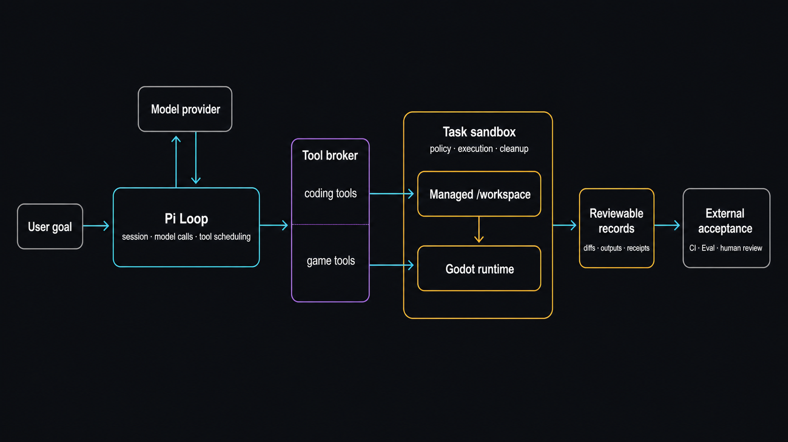

# ChronoRift

[English](README.en.md) · [工程设计导览](docs/portfolio.md) · [GN-1 案例](docs/case-studies/gn1-platform-alias.md) · [Godot Demo V2 切片](docs/case-studies/godot-demo-mob-orientation.md)

[](https://github.com/xiangzuodalao/ChronoRift/actions/workflows/ci.yml)
[](LICENSE)

**让 coding agent 从源码猜测走向可执行的 Godot 运行时证据。**

Pi 负责 Agent Loop；ChronoRift 使用固定版本的 Anthropic Sandbox Runtime（SRT）约束文件、命令和 Godot 操作，并向
Agent 返回 Build-bound runtime state、实际 diff 和 tool result。Agent 自由选择调查和修改策略，最终 acceptance 仍属于
项目 CI、独立 Eval 或人工 review。

> **结果优势 — GN-1：** 在相同源码、prompt、model、thinking、timeout 和共享工具下，coding-only candidate 的
> geometry oracle 为 `false`；ChronoRift Agent 查询真实 platform geometry 和 Shape identity 后产生不同候选，oracle
> 为 `true`。
>
> **跨项目验证 — Godot Demo V2：** 在第二个真实上游项目中，ChronoRift Agent 调用 13 次 V2 game tools，查询修改前
> 14 个、修改后 5 个 Mob state，候选通过独立 evaluator 3/3。Coding-only 也通过 3/3，因此本案例证明产品路径复用，
> 不证明总体修复优势。

**截至 2026-08-27：** `v0.4.0` 是当前 legacy release，Project Environment 是实验性 Preview。默认
`chronorift [goal]`、任意 Godot 项目支持和自动“修复成功”判定尚未实现。


_概念插图，用于表达产品母题；不是产品界面、运行截图或实验凭据。[查看 2560×1280 master](docs/assets/chronorift-hero-master.jpg)。_

## 两分钟看懂



ChronoRift **不重新实现 Coding Agent**。**Pi SDK owns the Agent Loop**：负责 LLM 调用、conversation/session、
tool scheduling、compaction 和普通终止，并调度常规 coding tools 与 ChronoRift `game_*` tools。
**ChronoRift owns the Harness / Runtime**：负责 private candidate workspace 与 Build identity、固定版本 SRT
执行、Godot staging、runtime evidence 和 patch handoff。Agent 自由选择如何调查、修改和重跑。

- **A · Agent debugging loop：** Source snapshot → 可写 Candidate Workspace / Build → Godot execution → runtime
  observation → Agent hypothesis → code patch / new Build。Observation 可包含 scene/node/resource identity、runtime
  state、physics/process/render clocks 及 coverage/loss；它们是调试信号，不是 evaluator verdict。
- **Execution boundary：** coding sandbox 可以修改 private candidate；Godot validation 使用从选定 candidate
  生成的不相交 Host stage，validation process 只读访问项目源码，并且看不到同一个可写 candidate tree。当前 Linux
  SRT 边界包含 Bubblewrap namespaces、seccomp、deny-network 及 timeout/output bounds，没有 ChronoRift 自定义
  cgroup quota。
- **B · Final trust path：** Agent turn 结束后，当前固定 GN-1 / Mob case 才进行 case-specific independent
  evaluation；evaluator 不参与 Agent 的修复决策。Patch handoff 另行把 Candidate Patch 应用到 fresh baseline，
  并用 SHA-256 验证重建的 source tree 与 patch bytes。它与 validation stage / evaluator 是两项独立检查，不是通用的
  “fresh replay → evaluator” 自动流水线。
- **Acceptance 在 Loop 外：** 两项检查汇成可审阅 evidence；SHA-256 绑定 bytes、检测损坏，但不是签名或正确性证明。
  `completed` 只表示 Loop 留下 candidate changes 与 execution records；最终 `accepted` / `rejected` 由项目 CI、
  外部 Eval 或人工 review 决定。

**核心价值：** execution consistency + isolation + runtime evidence + independently reviewable validation。

完整目标契约见 [架构文档](docs/architecture.md)；它描述 vNext 方向，不等于当前功能清单。

## Runtime evidence 改变候选：GN-1

GN-1 中，coding-only 产生了一个看似合理的宽度调整，但 candidate runtime 仍保留共享 Shape identity，case-level
oracle 为 `false`。ChronoRift Agent 查询了 realized geometry 和 resource identity，候选改为隔离共享 Shape resource，
oracle 为 `true`。

两个 fresh arm 固定 `endlessm/moddable-platformer` 的同一 commit/tree，并共享中性 prompt、model、thinking、timeout
和普通工具；`chronorift` arm 只增加四个 game tools 及其既有简洁 metadata。

| Arm           | Agent 可见的额外 runtime surface                              | Candidate 的 Host geometry observation                              | Case-level oracle |
| ------------- | ------------------------------------------------------------- | ------------------------------------------------------------------- | ----------------- |
| `coding-only` | 无                                                            | 四个 area width 均为 682 px，resource identity 仍共享               | `false`           |
| `chronorift`  | `game_capabilities`、`game_launch`、`game_stop`、`game_query` | area width 与 128/256/384/768 px 的 solid width 对齐，identity 分离 | `true`            |

这是一份从已有本地运行中事后选择的 **N=1 定性案例**，不是预注册实验，也不能估计成功率、因果关系、通用优势
或候选 acceptance。公开案例保留精确配置、候选 patch 和严格 evaluator 的缩减输出，不发布完整 transcript、绝对路径
或原始 Task/Session 标识；evaluator JSON 是现有脚本的原样摘要输出，不是为作品页重写的投影。

[阅读 GN-1 Platform Alias 案例 →](docs/case-studies/gn1-platform-alias.md)

## 第二项目复用：Godot Demo V2

在固定的 `godot-demo-projects/3d/squash_the_creeps` revision 上，公共 V2 loader、managed runtime、sandbox、lineage
和 game tools 完成了第二项目的端到端运行。

| 产品事实                   | 正式结果                                                     |
| -------------------------- | ------------------------------------------------------------ |
| Agent-visible runtime 使用 | 13 次 V2 game-tool call；initial 14 条、candidate 5 条 state |
| ChronoRift candidate       | 独立 Godot evaluator 3/3                                     |
| 第二项目 runtime 路径      | source、Build、Execution、patch、cleanup 均有绑定记录        |
| 比较性 Hero gate           | 未晋级；coding-only 也产生同义修复并通过 3/3                 |

Treatment 的完整增量包含四个 game-tool definitions 及其 metadata，以及两行中性的 discoverability appendix；这不是
tool-only comparison，结果不能归因于单独的 game tools。

本轮的价值是证明 ChronoRift 的 runtime 产品边界不只存在于 GN-1；它不承担比较优势结论。详细页完整保留两个原始
candidate patch 与 evaluator stdout，并汇总耗时、成本、本地 raw records 中的失败 tool response 和运行限制。

[阅读 Godot Demo Mob Orientation 案例 →](docs/case-studies/godot-demo-mob-orientation.md)

## 当前能做什么

| Surface                     | 现在可用                                                                                          | 重要边界                                                            |
| --------------------------- | ------------------------------------------------------------------------------------------------- | ------------------------------------------------------------------- |
| v0.4 legacy                 | 四个校准 Fixture、真实 Pi Session、固定 diagnosis workflow                                        | 不是 vNext 自由 Loop，也不是任意项目 runner                         |
| Project Environment Preview | 显式 `project preview`；source closure、sandbox、adapter publication/binding/reuse 的实验实现     | 历史 characterization 较窄；尚未成为默认入口或通用项目支持          |
| GN-1                        | 精确第三方项目、项目特定 adapter、两个 matched arms、公开 candidate patch 和 Host postflight 摘要 | 单项目、单 revision、单 prompt、单 pair；raw live output 仍只在本地 |
| Godot Demo Mob V2           | 第二个外部项目、state-only Adapter V2、完成的 fresh pair、公开 patch 与独立 evaluator             | 两组均 3/3；未晋级 Hero，也不证明比较优势或自动 onboarding          |
| Host sandbox                | Linux x86_64 上精确固定 SRT `0.0.74`；coding workspace 可写，Godot 使用 Host staging              | 默认禁网；不提供旧 broker 的 cgroup、容量或 Host-config 能力        |
| 历史 M3/M4/E2               | current HEAD 中的实现和命令已删除，只保留冻结档案                                                 | 不作为新产品切片模板，也不从档案恢复 producer 或一次性 Gate         |

### 还没有

- 默认 `chronorift [goal]` 与任意 Godot 项目的即开即用支持。
- 通用 ProjectAdapter authoring/migration、跨平台 Host、C#、GDExtension、native plugin、display、audio 或 GPU。
- 通用 source migration、multi-writer lease/CAS、conflict-safe apply 或长期 retention；current HEAD 也没有 generic
  Task resume/discard API。
- 在主产品路径中普遍可用的 checkpoint/fork/replay/compare；旧 M3 实现已从 current HEAD 删除。
- 自动 capture trigger、完整 engine snapshot、bit-exact replay、外部 telemetry attestation 或自动 acceptance。

## 三条审阅路径

### 1. 不安装：先判断工程思路

1. 阅读 [GN-1 案例](docs/case-studies/gn1-platform-alias.md)与 [Godot Demo V2 案例](docs/case-studies/godot-demo-mob-orientation.md)，核对配置、patch、运行记录与结论边界。
2. 阅读 [工程设计导览](docs/portfolio.md)，了解 Loop/Harness 分工、sandbox 和 DTO 边界。
3. 查看 [CI](https://github.com/xiangzuodalao/ChronoRift/actions/workflows/ci.yml) 的 offline、Godot 与 Host sandbox jobs。

### 2. 离线本地：验证默认 Gate

要求 Node.js `>=22.19`；`.nvmrc` 固定 `22.23.1`，pnpm 固定 `11.20.0`。

```bash
nvm use
corepack pnpm install
corepack pnpm check
```

`check` 运行 lint、Prettier check、strict TypeScript typecheck 和离线 deterministic tests，不需要 provider 凭据或网络。

如需体验当前 legacy 路径：

```bash
corepack pnpm godot:install
corepack pnpm godot:doctor
corepack pnpm fixtures
corepack pnpm demo:v04 -- --fixture frame-input-window
```

仓库 installer 固定官方 Godot `4.7.1`，当前只支持 Linux x86_64。这个 demo 是 v0.4 固定 Fixture workflow，不代表
vNext 产品形态。

### 3. 完整 Host：检查实验路径

Project Environment Preview、GN-1 和 Godot Demo slice 需要 Linux x86_64、精确 SRT `0.0.74`、Bubblewrap/`socat`/ripgrep
以及官方 Godot 4.7.1；两个 case runner 还需要精确外部 checkout 和真实 provider。前置条件和完整命令统一维护在
[开发与验证指南](docs/development.md)。

```text
corepack pnpm project preview -- [GOAL] --provider PROVIDER --model MODEL
corepack pnpm demo:platform-alias-ablation -- --arm coding-only|chronorift ...
corepack pnpm demo:mob-orientation-ablation -- --arm coding-only|chronorift-v2 ...
```

这些 live 命令不会 clone、修改或 apply 回用户 checkout。Agent 在私有的物理 candidate workspace 中获得读写权限；
Godot 验证则使用 Host 复制的独立 stage，项目源码只读，只有 `.godot/`、home、tmp 和 artifacts 可写，并在启动前后比较
source SHA-256。它们不会自动 commit、merge、push 或宣布修复成功。

## 安全与证据边界

- 用户 checkout、runtime/source text、Agent 输出、patch、Godot plugin 和 ProjectAdapter 都按不可信内容处理。
- vNext coding 与 Godot process 经过 SRT；网络使用 strict empty allowlist，默认拒绝。coding 可以写 candidate workspace，
  Godot process 看不到可写 candidate，并只能写 stage 中明确的 runtime 目录。
- Pi 凭据只允许 Host 模型路径使用，不能进入 repository、artifact、sandboxed command environment 或 Godot process。
- 外部、wire、tool 和 persisted DTO 要求显式版本与 strict runtime validation；内部 SRT process result 不额外包装
  自研 receipt framework。
- process result 保留 exit/timeout/cancellation、输出截断和 Godot stage source hash mismatch；不能把缺失观察写成成功。
- content hash 用于绑定 bytes 和发现损坏，不是签名、第三方证明或正确性证明。
- v0.4 的 Host process 不具备 vNext SRT 的 OS 隔离保证，二者不能混写。

## 常用命令

| 命令                                                       | 作用                                                         |
| ---------------------------------------------------------- | ------------------------------------------------------------ |
| `corepack pnpm check`                                      | 默认离线 Gate                                                |
| `corepack pnpm test:godot`                                 | Godot Addon、protocol 和 Project Environment 集成测试        |
| `corepack pnpm test:sandbox`                               | SRT coding 与真实 Godot/Preview Host conformance             |
| `corepack pnpm project preview -- ...`                     | 实验性 Project Environment 入口                              |
| `corepack pnpm demo:platform-alias-ablation -- --arm ...`  | GN-1 的一个 fresh arm；两个 JSON 再交给 standalone evaluator |
| `corepack pnpm demo:mob-orientation-ablation -- --arm ...` | Mob orientation 的一个 fresh arm；已公开 pair 不会自动重跑   |
| `corepack pnpm demo:v04` / `diagnose:v04`                  | 当前 legacy 离线 / 真实 provider 路径                        |

Host conformance 通过 `.github/scripts/run-srt-sandbox-conformance.sh` 运行；非 Linux x86_64、SRT 不是精确
`0.0.74`、缺少 Bubblewrap/`socat`/ripgrep/Godot 或 user namespace 不可用都属于 precondition failure。

## 文档地图

- [工程设计导览](docs/portfolio.md)：关键设计决策、五个代码入口和已知技术债。
- [GN-1 Platform Alias 案例](docs/case-studies/gn1-platform-alias.md)：一个可检查但不可外推的 runtime-observation pair。
- [Godot Demo Mob orientation](docs/case-studies/godot-demo-mob-orientation.md)：已完成、未晋级 Hero 的第二项目 V2 vertical slice。
- [目标架构](docs/architecture.md)：vNext 产品契约、rollout 和当前实现映射（重点看 §20/§21）。
- [Project Environment V1 RFC](docs/project-environment-v1.md)：数据模型、初始化/publication 状态机和 wire contract。
- [开发与验证指南](docs/development.md)：本地、Godot、Host sandbox 和 live provider 前置条件。
- [Godot Protocol v2](docs/godot-protocol-v2.md)：已实现的 legacy Host ↔ Addon wire。
- [`docs/evidence/`](docs/evidence/) 与 [`docs/benchmarks/`](docs/benchmarks/)：不可改写的历史归档；其结论不自动适用于当前 HEAD。

## License

ChronoRift 自有代码采用 [Apache License 2.0](LICENSE)。两个 case 的候选 patch 均派生自 MIT 许可的上游项目，归属和许可
单独记录在 [Third-Party Notices](THIRD_PARTY_NOTICES.md) 与案例目录中。
