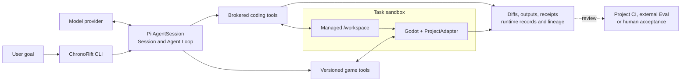

# ChronoRift

[English](README.en.md) · [工程设计导览](docs/portfolio.md) · [GN-1 案例](docs/case-studies/gn1-platform-alias.md)

[](https://github.com/xiangzuodalao/ChronoRift/actions/workflows/ci.yml)
[](LICENSE)

**面向 Godot 的 Agent Runtime Harness：Pi 负责 Agent Loop，ChronoRift 负责隔离执行、受控游戏工具和可追溯运行记录。**

ChronoRift 探索的是 coding agent 在交互式游戏运行时中的工程边界：Agent 可以自由读码、修改和验证；Harness
负责把文件、命令和 Godot 操作约束在声明的 Task 环境里，并返回实际 diff、tool result、runtime receipt、coverage、
loss 和 lineage。候选是否可接受，仍由项目 CI、独立 Eval 或人工 review 决定。

> **截至 2026-08-21：** `v0.4.0` 是当前 legacy diagnosis release；Project Environment 是实验性 Preview；
> GN-1 是固定外部项目上的一个 retrospective matched pair。默认 `chronorift [goal]`、任意 Godot 项目支持和
> 自动“修复成功”判定都尚未实现。


_概念插图，用于表达产品母题；不是产品界面、运行截图或实验凭据。_

## 两分钟看懂



- **Pi owns the Loop：** Session、模型调用、消息历史、tool scheduling、compaction 和普通终止。
- **ChronoRift owns the Harness：** Task workspace、sandbox policy、工具执行、资源 identity、记录和 cleanup。
- **Agent owns the strategy：** 如何调查、编辑、验证和解释结果，不要求固定工具顺序。
- **外部边界 owns acceptance：** `completed` 只表示 Loop 结束并留下可审阅候选，不等于 `verified` 或 `fixed`。

完整目标契约见 [架构文档](docs/architecture.md)；它描述 vNext 方向，不等于当前功能清单。

## 一个可审查案例：GN-1

GN-1 固定 `endlessm/moddable-platformer` 的精确 commit/tree，用同一中性 prompt、model、thinking、timeout 和共享
工具运行两个 fresh arm。`chronorift` arm 只增加四个 game tools 及其原有的简洁 metadata。

| Arm           | Agent 可见的额外 runtime surface                              | Candidate 的 Host geometry observation                              | Case-level oracle |
| ------------- | ------------------------------------------------------------- | ------------------------------------------------------------------- | ----------------- |
| `coding-only` | 无                                                            | 四个 area width 均为 682 px，resource identity 仍共享               | `false`           |
| `chronorift`  | `game_capabilities`、`game_launch`、`game_stop`、`game_query` | area width 与 128/256/384/768 px 的 solid width 对齐，identity 分离 | `true`            |

这是一份从已有本地运行中事后选择的 **N=1 定性案例**，不是预注册实验，也不能估计成功率、因果关系、通用优势
或候选 acceptance。公开案例保留精确配置、候选 patch 和严格 evaluator 的缩减输出，不发布完整 transcript、绝对路径
或原始 Task/Session 标识；evaluator JSON 是现有脚本的原样摘要输出，不是为作品页重写的投影。

[阅读 GN-1 Platform Alias 案例 →](docs/case-studies/gn1-platform-alias.md)

## 当前能做什么

| Surface                     | 现在可用                                                                                          | 重要边界                                                            |
| --------------------------- | ------------------------------------------------------------------------------------------------- | ------------------------------------------------------------------- |
| v0.4 legacy                 | 四个校准 Fixture、真实 Pi Session、固定 diagnosis workflow                                        | 不是 vNext 自由 Loop，也不是任意项目 runner                         |
| Project Environment Preview | 显式 `project preview`；source closure、sandbox、adapter publication/binding/reuse 的实验实现     | 历史 characterization 较窄；尚未成为默认入口或通用项目支持          |
| GN-1                        | 精确第三方项目、项目特定 adapter、两个 matched arms、公开 candidate patch 和 Host postflight 摘要 | 单项目、单 revision、单 prompt、单 pair；raw live output 仍只在本地 |
| Host sandbox                | Linux 上的 bubblewrap、cgroup、bounded Task storage、受控 toolchain/Godot Host 路径               | 需要明确 provision；设置 `cwd` 或 Git worktree 本身不构成隔离       |
| 历史 M3/M4/E2               | 保留兼容实现和冻结档案                                                                            | 不作为新产品切片模板；其 producer、validator 和一次性 Gate 已退役   |

### 还没有

- 默认 `chronorift [goal]` 与任意 Godot 项目的即开即用支持。
- 通用 ProjectAdapter authoring/migration、跨平台 Host、C#、GDExtension、native plugin、display、audio 或 GPU。
- 通用 source migration、multi-writer lease/CAS、conflict-safe apply、长期 retention 或失败 Task 的完整 resume。
- 在主产品路径中普遍可用的 checkpoint/fork/replay/compare；M3 仅有固定 Fixture 上的实验兼容实现。
- 自动 capture trigger、完整 engine snapshot、bit-exact replay、外部 telemetry attestation 或自动 acceptance。

## 三条审阅路径

### 1. 不安装：先判断工程思路

1. 阅读 [GN-1 案例](docs/case-studies/gn1-platform-alias.md)，核对配置、两个 patch 和局限。
2. 阅读 [工程设计导览](docs/portfolio.md)，了解 Loop/Harness 分工、sandbox 和 DTO 边界。
3. 查看 [CI](https://github.com/xiangzuodalao/ChronoRift/actions/workflows/ci.yml) 的 offline、Godot 与 Host sandbox jobs。

### 2. 离线本地：验证默认 Gate

要求 Node.js `>=22.19`；`.nvmrc` 固定 `22.23.1`，pnpm 固定 `11.20.0`。

```bash
nvm use
corepack pnpm install
corepack pnpm check
```

`check` 运行 lint、Prettier check、strict TypeScript typecheck 和离线 deterministic tests，不需要 provider 凭据或网络。

如需体验当前 legacy 路径：

```bash
corepack pnpm godot:install
corepack pnpm godot:doctor
corepack pnpm fixtures
corepack pnpm demo:v04 -- --fixture frame-input-window
```

仓库 installer 固定官方 Godot `4.7.1`，当前只支持 Linux x86_64。这个 demo 是 v0.4 固定 Fixture workflow，不代表
vNext 产品形态。

### 3. 完整 Host：检查实验路径

Project Environment Preview 和 GN-1 都需要显式 Host 配置、Linux namespace/cgroup、bounded Task storage、固定
toolchain/Godot identity；GN-1 还需要精确外部 checkout 和真实 provider。前置条件和完整命令统一维护在
[开发与验证指南](docs/development.md)。

```text
corepack pnpm project preview -- [GOAL] --provider PROVIDER --model MODEL
corepack pnpm demo:platform-alias-ablation -- --arm coding-only|chronorift ...
```

这些 live 命令不会 clone、修改或 apply 回用户 checkout；候选位于 Task-owned `/workspace`。它们也不会自动
commit、merge、push 或宣布修复成功。

## 安全与证据边界

- 用户 checkout、runtime/source text、Agent 输出、patch、Godot plugin 和 ProjectAdapter 都按不可信内容处理。
- coding/game tools 必须经过 Task sandbox broker；网络、Host 文件、凭据、端口、设备、display、audio 和 GPU 默认拒绝。
- Pi 凭据只允许 Host 模型路径使用，不能进入 repository、artifact、Task command environment 或 Godot process。
- 所有外部、wire、tool 和 persisted DTO 都要求显式版本与 strict runtime validation；跨 Task resource reference 必须拒绝。
- raw execution records 在运行时 append、终止时 seal；coverage 缺口、丢失、overwrite 和 clock uncertainty 不得隐藏。
- content hash 用于绑定 bytes 和发现损坏，不是签名、第三方证明或正确性证明。
- v0.4 的 Host process 不具备 vNext Task sandbox 的 OS 隔离保证，二者不能混写。

## 常用命令

| 命令                                                      | 作用                                                         |
| --------------------------------------------------------- | ------------------------------------------------------------ |
| `corepack pnpm check`                                     | 默认离线 Gate                                                |
| `corepack pnpm test:godot`                                | Godot Addon、protocol 和 Project Environment 集成测试        |
| `corepack pnpm test:sandbox`                              | 独立 coding sandbox Host conformance                         |
| `corepack pnpm test:vnext:godot-sandbox`                  | Godot sidecar、Preview 与 sandbox Host conformance           |
| `corepack pnpm project preview -- ...`                    | 实验性 Project Environment 入口                              |
| `corepack pnpm demo:platform-alias-ablation -- --arm ...` | GN-1 的一个 fresh arm；两个 JSON 再交给 standalone evaluator |
| `corepack pnpm demo:v04` / `diagnose:v04`                 | 当前 legacy 离线 / 真实 provider 路径                        |

Host conformance 只能通过 checked-in wrapper 或满足同等前置条件的环境运行；缺少 cgroup、Task storage 或固定 Host
路径属于 precondition failure，不是产品测试失败或成功。

## 文档地图

- [工程设计导览](docs/portfolio.md)：关键设计决策、五个代码入口和已知技术债。
- [GN-1 Platform Alias 案例](docs/case-studies/gn1-platform-alias.md)：一个可检查但不可外推的 runtime-observation pair。
- [目标架构](docs/architecture.md)：vNext 产品契约、rollout 和当前实现映射（重点看 §20/§21）。
- [Project Environment V1 RFC](docs/project-environment-v1.md)：数据模型、初始化/publication 状态机和 wire contract。
- [开发与验证指南](docs/development.md)：本地、Godot、Host sandbox 和 live provider 前置条件。
- [Godot Protocol v2](docs/godot-protocol-v2.md)：已实现的 legacy Host ↔ Addon wire。
- [`docs/evidence/`](docs/evidence/) 与 [`docs/benchmarks/`](docs/benchmarks/)：不可改写的历史归档；其结论不自动适用于当前 HEAD。

## License

ChronoRift 自有代码采用 [Apache License 2.0](LICENSE)。GN-1 的候选 patch 派生自 MIT 许可的上游项目，归属和许可
单独记录在 [Third-Party Notices](THIRD_PARTY_NOTICES.md) 与案例目录中。
