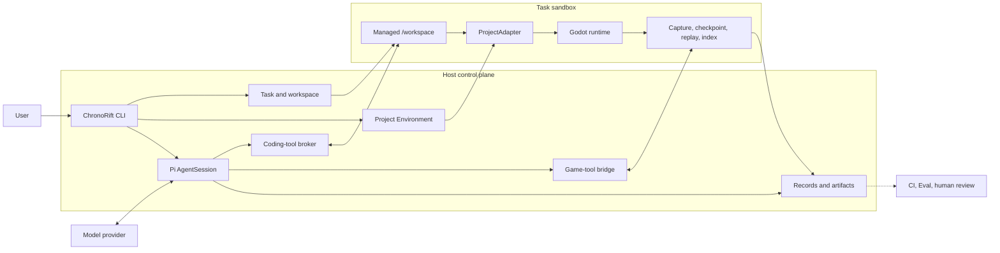

# ChronoRift Game-native Agent Harness 目标架构

> 本文是 vNext 产品契约、边界、术语和 rollout 的规范来源，不是功能清单。当前公开 release 仍是
> **ChronoRift v0.4.0 legacy diagnosis slice**；实际代码映射见 §21，下一垂直切片见 §20。
>
> Project Environment 的详细数据模型、状态机与独立 wire contract 见
> [Project Environment V1 RFC](project-environment-v1.md)；[Protocol v2](godot-protocol-v2.md) 只描述已实现的
> v0.3 Host ↔ Addon wire。Host/Gate 命令见 [开发与验证指南](development.md)。

## 1. 产品契约

ChronoRift 是基于 Pi SDK 的 **game-native Agent Harness**。ChronoRift 拥有 Harness；Pi 是嵌入的 Loop Engine。

> Harness 保证已授权的文件、命令和游戏操作在声明环境中被真实执行，并把真实输出、receipts、coverage、loss
> 和 lineage 返回给 Agent。Agent 自主调查、修改、验证和解释结果。ChronoRift 的成功表示 Loop 正常结束并留下
> 可审阅候选与执行记录，不表示系统从逻辑上证明 Bug 已修复。

“真实”只覆盖 Harness 可观察的边界：请求是否被接受、操作是否执行、runtime 返回什么、捕获了什么以及缺少什么。
它不保证项目或插件上报的内容完整，也不保证 Agent 最终叙述正确。

- `completed` 不是 `verified` 或 `fixed` 的同义词。
- diff、命令输出、tool result 和 raw runtime record 高于 Agent hypothesis 与 final prose。
- 测试、断言和可选 Contract 是 Agent 的验证手段，不是产品最高裁判。
- 用户、项目 CI、人类 review 或独立 Eval 决定是否接受候选修改。
- vNext 不产生 canonical diagnosis、fix verdict、Proposal、Claim Policy、Causal Capsule 或 Conclusion Gate。

## 2. 核心价值

基础 Godot 工具可以启动游戏、读取日志、查看 SceneTree、注入输入和截图。ChronoRift 只有提供难以临时拼装的
运行时状态原语，才有独立 Harness 的价值：

| 维度       | 基础 coding agent + Godot 工具 | ChronoRift 目标能力                                   |
| ---------- | ------------------------------ | ----------------------------------------------------- |
| 工作单元   | 当前进程和文件                 | 有 identity、lineage 和 coverage 的 Execution         |
| 失败历史   | 失败后读取日志                 | 有预算的 pre-failure rolling black box                |
| 状态恢复   | 重启场景                       | 带 manifest、fidelity 和缺失域的 checkpoint/restore   |
| 实验分支   | 手工重跑                       | 从 Execution/checkpoint/build/workspace fork          |
| 输入复现   | 再次模拟输入                   | phase-aware trace 与 requested/realized receipt       |
| 运行时查询 | 当前 SceneTree 或文本日志      | 可重建的 Runtime State Index                          |
| 跨运行比较 | 人工比较                       | 对齐 identity、clock、state 与 coverage 的描述性 diff |

这些原语回答“观察到了什么”和“已知差异是什么”。为什么发生、哪个机制成立以及修复是否正确，留给 Agent、项目验证、
外部 Eval 和人类 review。

## 3. 目标与非目标

### 3.1 目标

1. 让 Pi Agent 在隔离 workspace 中拥有正常 coding-agent 自由。
2. 为 Godot 提供有诚实边界的 capture、checkpoint、restore、fork、replay、query 和 compare。
3. 让工具按 capability 和资源依赖自由组合，不把调查步骤写入 Harness 状态机。
4. 保留执行、资源、安全拒绝、coverage、loss、lineage 和交付记录。
5. 通过窄、可验证的垂直切片逐步扩展项目结构支持。

### 3.2 非目标

- 不重新实现 Pi 的 Session、Agent Loop、模型调用、工具调度或 compaction。
- 不承诺任意 Godot 项目能零配置捕获私有状态或等价恢复完整引擎状态。
- 不把 Git worktree 当成 OS sandbox，也不让 Agent 直接修改用户 checkout。
- 不自动 commit、merge、push、发布或部署候选修改。
- 首发不覆盖 C#、GDExtension、native plugin、audio、跨平台 GUI、多人或多 Agent。
- 产品 Harness 不持有 hidden benchmark oracle，也不根据自己的输出给自己评分。

## 4. 不可违反的架构规则

以下规则使用 MUST 表示新实现不得绕过：

1. ChronoRift MUST 使用官方 Pi SDK；Pi 拥有 Session、Loop、模型调用、工具调度、历史、compaction 和普通终止。
2. Agent MUST 能使用已授权的普通 coding/game tools；Harness MUST NOT 强制固定调查顺序或全局 tool-phase machine。
3. 工具调用 MUST 依据 capability、资源、任务归属、预算和安全权限校验；缺少资源是局部错误，不是 workflow 错误。
4. 可恢复的工具失败 MUST 作为结构化结果返回 Agent；一次普通 tool error 不得自动终止 Session。
5. Runtime control MUST 同时记录 requested、realized、实际 clock position、量化、范围和已知副作用。
6. 源码、日志、runtime data、Godot strings、插件、模型输出和 patches MUST 视为不可信内容，不能改变 Host policy。
7. 外部、wire、tool 和 persisted DTO MUST 严格版本化并在每次读取时验证；unsupported capability 必须显式失败。
8. Execution records MUST 在运行中 append、终止后 seal；raw records 权威，派生索引可重建且不推断因果。
9. Checkpoint MUST 区分 `captured`、`reset`、`externally_controlled`、`unsupported` 和 `uncontrolled` 状态。
10. Restore success MUST 只表示声明状态被写回；未观察到 divergence 不能证明 equivalent start 或 bit-exact replay。
11. Fork MUST 允许 Agent 在授权范围内改变代码、adapter、probe、input、seed、settings 或 capture profile，并记录变化。
12. Compare MUST 只报告可观察差异、alignment uncertainty、coverage gap 和 confounder，不裁决因果、假设或修复。
13. Event loss、overwrite、sampling degradation、observer effect、clock uncertainty 和 first divergence MUST 可见。
14. Agent 结果 MUST 使用普通 Pi assistant 输出；不得要求唯一 submit tool、固定 Proposal 或 receipt 引用仪式。
15. 用户 checkout、Host credential、网络、端口、设备、display、audio 和 GPU MUST 默认隔离，授权必须 task-scoped。
16. 历史 raw artifact MUST 保持不可变；计划、实现和外部 Eval 事实 MUST 在文档中明确区分。

## 5. 系统总览



| 主体                  | 拥有的事实或决策                                                                                              |
| --------------------- | ------------------------------------------------------------------------------------------------------------- |
| Host control plane    | workspace、权限、实际 tool/process result、resource identity、append/seal、cleanup 和 publication enforcement |
| Pi                    | Session 与 Agent Loop 生命周期                                                                                |
| Agent                 | 调查、编辑、验证选择与最终说明                                                                                |
| Project/Godot/adapter | 不可信执行内容与项目语义 observation                                                                          |
| CI/Eval/reviewer      | 候选 acceptance 与产品评价                                                                                    |

Host 不背书 telemetry 是否代表完整世界、Agent 解释是否正确、某次测试是否排除回归，或 compare 差异是否具有因果意义。

## 6. 任务生命周期

目标流程是：

```text
discover project and freeze source/policy
→ create managed workspace and sandbox
→ create or restore one visible Pi AgentSession
→ initialize and publish a ProjectAdapter revision when needed
→ bind the Task at a turn boundary
→ run zero or more user goal turns
→ show assistant result, diff, executions, resources and security records
→ stop runtime processes and revoke temporary grants
→ retain Session/workspace/artifacts until continue, handoff, expiry or discard
```

Task 是一个交互上下文，拥有一个 Pi Session/workspace、environment turns、零到多个 goal turns 和精确 environment
binding。初始化失败必须 fail closed，不能执行排队目标。Publication、binding、失败 attempt、successor resume 和
recovery 的详细状态机由 [Project Environment V1 RFC](project-environment-v1.md) 定义。

一次 `session.prompt()` 返回只结束当前 turn。普通完成不会自动 commit、merge、push、apply 或删除候选和记录。

## 7. Task Workspace 与执行沙箱

### 7.1 Workspace 语义

Pi Session 的 `cwd` 是 Task-owned `/workspace`，不是用户正在编辑的 checkout：

- 每个 Task 有独立、可审阅、可丢弃的代码视图；
- Host refs、Git 配置和其他 worktree 不可由任务任意修改；
- Harness 能提取并 round-trip 验证 diff/patch；
- Host drift 只能触发显式 refresh/review，不能静默双向同步；
- game patch、adapter/probe publication 和 `.chronorift/` 始终分离；
- workspace 提供版本隔离，不被宣称为安全沙箱。

### 7.2 OS 边界

coding tools、构建脚本、项目 import 和 Godot 子进程必须经过 task sandbox broker：

- 只允许写 `/workspace`、Task temp 和 artifact paths；Host inputs 只读挂载并验证 canonical containment；
- 网络、Host ports、credential、devices、display、audio 和 GPU 默认关闭；
- 短期授权绑定 Task、主体、工具、目标和有效期，且不进入普通命令或 Godot environment；
- Godot 运行在无特权 namespace、独立 process group/cgroup 和明确 CPU、memory、process、time、output 限制中；
- 路径逃逸、symlink race、未授权进程和资源越界在执行前拒绝并记录 security event；
- requested sandbox 设置只有通过 preflight 并在 operation 时重验后才成为 realized fact。

Pi Host 可以在 sandbox 外读取用户 Pi credential store 调用模型；凭据不得进入 repository、artifact、Task command
environment 或 Godot process。设置 Pi `cwd` 或创建 Git worktree 都不等于完成 OS 隔离。当前 Host 约束与命令见
[开发与验证指南](development.md)。

## 8. Pi SDK 集成

ChronoRift 使用官方 Pi SDK 创建和恢复 AgentSession，不修改、fork 或 vendor Pi：

- 保留 Pi 默认 coding-agent prompt、Loop、history、compaction 和终止语义；
- 正常加载 workspace 中适用的 `AGENTS.md`、skills 和 context，但它们不能覆盖 Host policy；
- 只追加简短的 sandbox、game-tool、coverage 和 fidelity 环境说明；
- 通过受 sandbox broker 约束的 backend 提供 `read`、`bash`、`edit`、`write`、`grep`、`find` 和 `ls`；
- 用 strict custom tools 暴露 ChronoRift game/runtime capabilities；
- provider 和 model 在 command boundary 显式选择；只有 `*.live.test.ts` 可以在测试中访问 provider。
- 已安装 Pi package 的 source 与 types 是 SDK API 权威；版本保持 pinned，显式升级必须带兼容测试。

安全拒绝、资源不足、runtime crash 和 unsupported capability 作为结构化工具结果进入 Loop。用户取消、显式超时、
不可恢复的 Pi/provider failure 或 Host failure 才终止当前 turn。官方 SDK 文档见 [pi.dev](https://pi.dev/docs/latest/sdk)。

## 9. Project Environment 与 Runtime 资源模型

| 资源                           | 含义                                                                     |
| ------------------------------ | ------------------------------------------------------------------------ |
| `ProjectEnvironment`           | 一个 `project.godot` 对应的 project-local、跨 Task 复用环境              |
| `ProjectEnvironmentRevision`   | source、adapter、SDK/bridge、toolchain 与 conformance 的不可变项目级组合 |
| `ProjectAdapterRevision`       | Agent 生成的 manifest、GDScript package、capabilities 和 payload schemas |
| `ProjectInitializationAttempt` | 未必成功或发布的初始化/迁移 attempt                                      |
| `Task`                         | Pi Session/workspace、turns、binding 和 runtime artifacts 的交互上下文   |
| `EnvironmentBindingEpoch`      | Task 在安全 turn boundary 绑定的精确 environment/adapter revision        |
| `Build`                        | source、diff、adapter/probe、Godot/import 与 compatibility identity      |
| `Runtime`                      | 一个 Godot process 和其 negotiated capabilities                          |
| `Execution`                    | 从明确 Build、scene、config 和 trace 起点产生的运行记录                  |
| `CaptureWindow`                | rolling history 中被 pin 的窗口及 coverage/loss                          |
| `Checkpoint`                   | 某个 semantic barrier 上按 manifest 捕获的可恢复状态                     |
| `Trace` / `Branch`             | input/control timeline 与 lineage edge                                   |
| `Comparison`                   | 两个 Execution 的描述性 alignment 和 differences                         |

ID 是稳定、不透明的业务 identity，不是路径或 Session capability。每次引用都重新验证 schema、存在性、Task ownership
和授权。Execution manifest 绑定 task/workspace/source/diff/build、runtime/adapter/probe、launch/config、checkpoint/
trace、requested/realized controls、clocks、coverage/loss 和 parent lineage；它描述已知条件，不证明 determinism。

完整 Project Environment DTO、publication 和 binding 模型见 [Project Environment V1 RFC](project-environment-v1.md)。

## 10. Rolling Black Box

目标默认是低成本保留最近 10 秒、最多 600 ticks 的运行历史，包括 input、多个 clock domain、entity lifecycle、
结构化 errors、注册的 RNG/probe events 和轻量 state summaries。两项边界先到即淘汰旧数据，并记录 realized window。

每个 Task 的目标默认预算是 256 MB memory、1 GB disk、平均不超过基线 frame time 的 5%、单次 main-thread capture
不超过 2 ms；这些不是跨项目性能保证。Runtime 必须记录实际 overhead；超限时可以降采样或丢弃低优先级数据，但
必须保留 degradation、drop、overwrite 和 observer-effect receipt，也不得暂停游戏来伪装预算达标。

Rolling capture 支持 Agent 手动 pin；目标形态还支持 adapter 声明的有界自动 retention trigger。Trigger 只请求冻结
目标前后的窗口，是 retention hint，不是 Bug、Contract failure 或 root cause 的确认。若历史或 pre-failure
checkpoint 不可用，工具必须返回现有 timeline 与 coverage gap，不能把普通历史窗口冒充等价分叉起点。

## 11. Checkpoint 与 Restore

ProjectAdapter 可以明确不实现 snapshot module。此时只能重建 ChronoRift 控制的执行外壳：source/build、launch、
config、recorded trace、seed、logs 和 capture metadata；不得宣传为从失败瞬间等价分叉。

Snapshot 与 restore capability module 独立协商；snapshot 可以 implemented 而 restore 仍 unsupported。实现 snapshot
时，adapter 必须定义捕获字段、stable identity/incarnation、barrier、canonicalization/tolerance 和已知缺失域；实现
restore 时还必须定义 restore order、逐域结果与恢复后自检。每次 adapter/probe 变化形成新 revision，只影响后续
Build 和 Execution，不热替换已运行实例，也不追溯补全旧历史。

Checkpoint manifest 与 restore receipt 至少区分：

| 状态类别                | 含义                                   |
| ----------------------- | -------------------------------------- |
| `captured`              | 按声明 schema、barrier 和规则读取/写回 |
| `reset`                 | 恢复时重新初始化而非复制               |
| `externally_controlled` | 由 Harness 或外部授权主体设置          |
| `unsupported`           | adapter/runtime 明确不支持             |
| `uncontrolled`          | 未捕获或无法可靠恢复                   |

Receipt 绑定 checkpoint/current Build compatibility、逐域结果、before/after summaries、coverage gap、fidelity 和
validation output。“restore 成功”只表示声明状态被写回；first-tick divergence、首个不同字段/实体/事件和相关缺失域
必须保留。`fidelity` 是覆盖与恢复能力，不是模型置信度。

## 12. Fork、Replay 与控制

Agent 可以从已授权的 Execution、checkpoint、Build 或 workspace fork，并改变代码、adapter、probe、input、seed、
runtime settings 或 capture profile。requested change、realized change 和已知副作用进入 lineage；Harness 不评价实验
设计是否“只改一个变量”。

Trace 必须区分 process frame、physics tick、simulation time、Host monotonic time、press/release、target phase 和
realized phase。Godot GDScript 不提供无条件保持语义的引擎硬单步，因此 FPS/TPS、pause、time scale 和 input injection
都返回实际 receipt。Replay 可以观察相等或 divergence，不能预先承诺 bit-exact。

## 13. Runtime State Index

Runtime State Index 是从 raw Execution records 重建的查询视图。它可索引 entity stable ID/incarnation/lifecycle、
scene relationships、clock partial order、input、Signal/log/error、注册 state/transition/RNG、coverage/loss 和原始来源。

查询结果携带 source references 和 missing data。索引不包含 candidate/root cause、Harness-selected causal slice、下一
实验建议或 hypothesis confidence。只有 runtime correlation ID 直接支持的 `scheduled-by`、`spawned-by` 等关系可以作为
观测边保存；跨 Build 的 entity match 允许 `unmatched` 和 `ambiguous`。

## 14. Semantic Alignment 与 Compare

`compare(A, B)` 在两次 sealed Execution 的声明和 capture 范围内列出 source/build、runtime/adapter/probe、
checkpoint/fidelity、trace/controls、coverage/loss、entity match、state/event/timeline 和 first divergence differences。

Alignment 使用 stable identity、incarnation、clock、trace anchor 和 adapter semantic key；不可靠匹配不得强行合并。
当 Build、adapter、probe、coverage 或 checkpoint fidelity 不兼容时，Comparison 标记 `confounded` 或
`descriptive_only` 并列出混杂项。它不判断实验合理性、因果、hypothesis、Bug 或 fix correctness。

## 15. Agent 工具面

M3 的严格 V1 catalog 保留 16 个原子工具：

| 分组                | 工具                                                             |
| ------------------- | ---------------------------------------------------------------- |
| Discovery/Lifecycle | `game_capabilities`、`game_launch`、`game_status`、`game_stop`   |
| Capture/Observation | `game_capture_configure`、`game_capture_pin`、`game_query`       |
| Control             | `game_input`、`game_step`、`game_set_controls`                   |
| State/Lineage       | `game_checkpoint_create`、`game_checkpoint_restore`、`game_fork` |
| Trace/Compare       | `game_trace_create`、`game_trace_replay`、`game_compare`         |

Project Environment 使用独立、固定、版本化的核心 tool contract；ProjectAdapter 实现 capability modules，不生成项目
自定义 Pi tools。项目差异存在于 manifest、payload schema、resource identity 和 receipts 中。所有工具必须：

- 使用 strict versioned input/output，返回 resource IDs、receipts、coverage、cost 和 limitations；
- 明确返回 unsupported、policy denial、budget exhaustion、runtime crash、history unavailable 和 restore gap；
- 在资源依赖满足时允许任意排序和重复调用；并发冲突由局部锁或明确 busy/conflict 结果处理；
- 不要求 opaque-handle ceremony、全局 phase 或最终 Proposal。

具体 Project Environment tool contract 见 RFC §5.2；M4/E2 的历史窄 catalog 见 §21。

## 16. Artifact 与任务恢复

- `.chronorift/` 是 local-only 状态，不提交 Git；整个目录不得进入 source closure、patch、refresh 或 apply。
- Task Session、candidate、runtime 和失败 attempt 位于仓库外 bounded storage；项目级 environment revisions 单独计量。
- raw tool/runtime records 在运行中 append，seal 后不原地修改；final prose、diff 和 execution records 分开保存。
- schema 与 index 可以演进，但 immutable revision bytes 不改写；派生 view 绑定 source/result hash 与 lineage，并通过
  新 namespace 保留历史。
- artifact ID 不是路径；拒绝 absolute path、`..`、symlink escape、canonical escape 和 cross-Task reference。
- content hash 检测损坏并绑定内容，不是签名、外部 provenance 或同用户权限下的强防篡改。
- cleanup 未证明的 Execution 不得 seal；缺失 receipt 不能从“当前看起来干净”追认为历史 cleanup。
- 强 attestation 由独立 CI、签名或只写存储提供，不塞进本地 Harness 默认路径。

## 17. Godot Runtime 边界

vNext 使用 managed Addon/Autoload 和 runtime sidecar，不要求 Godot engine fork。Wire messages、hash、framing、
handshake 和 capability negotiation 严格版本化。Project Environment 的 wire contract 见 RFC；
[Protocol v2](godot-protocol-v2.md) 是 v0.3 Host ↔ Addon 协议，其中的 legacy verdict 术语不属于 vNext 产品语义。

每个 Runtime 使用独立 sidecar 和 Godot child，并共享同一 sandbox/network/PID/cgroup/resource boundary。Host 只通过
有界 framed channel 控制 sidecar；overflow、truncation、process error 和 cleanup failure 都进入记录。Host checkout
不在 sandbox 内执行；source snapshot、import cache、operation scratch 和 read-only managed overlay 分离。

ProjectAdapter、probe、项目 GDScript、`@tool` 和 EditorPlugin 是同一不可信 Godot principal。只读 overlay、content
hash 和一次性 handshake token 约束 identity 与意外 peer，但不隔离同进程恶意代码，也不证明 telemetry、Addon
provenance 或 adapter semantics。真正的权限边界是 OS sandbox。

必须诚实保留：

- GDScript 不能全局拦截任意 Signal、property 或未注册 RNG；
- physics internal、thread、Timer/Tween/coroutine 等状态默认不可恢复，除非 adapter 明确声明并实际覆盖；
- observation 只覆盖 allowlist、动态注册项和项目主动插桩，listener/serialization 自身可能改变时序；
- stdout/stderr、process exit 和 structured channel 是不同传感器；
- process frame、physics tick、simulation time、render completion 和 Host monotonic time 不可混用；
- unsupported control 必须拒绝或返回量化后的 realized value；
- Host 被 `SIGKILL`、掉电或内核终止时可能无法留下 cleanup receipt，残留由 Operator 处理且 Execution 不可 seal。

Headless 是默认。Render/display/GPU 以后可作为显式授权 Sensor；audio 不属于 V1。

## 18. 产品 Harness 与外部 Eval

| 产品 Harness                        | 外部 Eval / 项目 CI / review                      |
| ----------------------------------- | ------------------------------------------------- |
| 运行 Agent、sandbox 和 game tools   | 可以持有 hidden Bug、oracle 和评分规则            |
| 输出候选 patch、Session 与实际记录  | 评价 patch、行为、成本、可靠性和安全失败          |
| 不给自己的结果写 acceptance verdict | 不把 hidden oracle 或固定调查流程反向注入产品 API |

后续 benchmark 优先采用可复现的开源 suite；若缺少 checkpoint/fork 任务，再公开扩展规范。历史 v0.3 benchmark 是
旧固定 workflow 的工具消融，不是 vNext 产品契约，也不是与其他 coding product 的 head-to-head。

## 19. 依赖方向与模块职责

依赖保持向内：

```text
domain ← gamebranch ← runtime adapters ← CLI composition root
domain ← agent-protocol ← pi-harness / optional external bridge
```

- `domain` 无 I/O，不知道 Pi、Godot、Git、process、container 或 filesystem layout。
- `gamebranch` 只依赖 domain 和窄 ports，不导入 adapters 或 CLI。
- CLI 拥有 arguments、composition、lifecycle 和 display，不拥有 Agent strategy、causal interpretation 或 verdict。
- Pi 与 Godot-native types 不进入 engine-neutral packages；package 间只通过公开 `src/index.ts` 导入。
- 只有实现出现独立依赖与生命周期边界后才拆 package；不得按目标图创建空壳。

当前 package ownership 属于实现事实，统一列在 §21。

## 20. vNext 垂直切片 rollout

rollout 每次只增加一个主要不确定性维度：

| Slice    | 状态                                          | 单一增量                                                                                     |
| -------- | --------------------------------------------- | -------------------------------------------------------------------------------------------- |
| M3       | 实验性实现                                    | 单一 `frame-input-window` 上接通 sandbox、自由 Pi Loop、runtime primitives 和 patch 生命周期 |
| M4       | 实验性实现                                    | 冻结外部项目的 lifecycle-only onboarding                                                     |
| E2       | 实验性实现 + frozen plumbing evidence         | 在 M4 上增加 Timer/spawn semantic projection                                                 |
| PE-A     | implementation present + local Gate passed    | Author → Validate → Publish → Use                                                            |
| PE-B     | implementation present + local Gate passed    | dynamic entity/state/event identity propagation                                              |
| **PE-C** | **implementation present；Host Gate pending** | Narrow Source/Import Closure                                                                 |

M3/M4/E2 保持兼容和历史证据，不再作为“每个项目新增一个 profile”的产品扩展方式。Project Environment V1 是当前
产品主线；PE-A/PE-B 的详细 contract 与 Gate 在
[Project Environment V1 RFC](project-environment-v1.md) 和对应 evidence archive 中。

### 20.1 当前下一切片：PE-C Narrow Source/Import Closure（implementation present；Host Gate pending）

PE-C 保持 PE-B 的 exact Godot 4.7.1 GDScript/toolchain identity、headless、默认禁网、ProjectAdapter V2、dynamic observation 和
publication/binding 语义不变，只扩展主线所需的 source、import 与 target 边界：

1. 从 enclosing Git root 发现 `project.godot`。只有一个时自动选择；多个时要求 `--project-root` 明确选择，不能猜测。
2. closure 自动采用选中项目内 tracked 文件的最终工作树 bytes，包括 staged/unstaged dirty；untracked 只接受每次
   Preview/reuse 通过重复 `--include-untracked` 指定的精确文件。ignored、未选择的 untracked、`.git/` 和
   `.chronorift/` 不进入 closure。
3. `ProjectSourceClosureV1` 记录 HEAD、选中项目相对路径、规范排序的 path/mode/content identity/provenance、realized
   main scene、exact Godot version，以及遇到的 clean、已 materialize direct-submodule lineage。`SourceId` 只由这些
   规范事实决定，不含 Host 绝对路径。
4. multi-source 仅限选中项目与其已 materialize 的 clean direct-submodule set；不接受 recursive submodule、任意 sibling
   或 absolute source root。
5. materialize 到 `/workspace` 后、Agent 或 adapter 执行前重新冻结；identity 变化返回 `source_drift`，不能运行旧
   bytes。保持已有路径级敏感文件拒绝规则，不在本切片增加内容级 scanner。
6. 项目本地 GDScript addon、`@tool`、EditorPlugin 和 import 在现有 deny-network/deny-credential sandbox、fresh
   `.godot` cache 与 cleanup boundary 中执行；项目不能占用保留 overlay 路径
   `addons/chronorift_project_environment/**`。
7. Adapter 可以声明多个 launch target，但 publication 只验证 default target 与当前 `--launch-target`（若不同）。其余
   target 标为 `declared_unvalidated`，请求运行时返回 `target_not_validated`，不隐式扩大验证范围。
8. 同一 project-local namespace 内，同一 closure、显式 untracked 集合和已验证 target 得到同一 `SourceId` 并允许复用
   同一 environment revision；environment identity 仍是 project-local。`SourceId` 变化返回 `review_required`，不在 PE-C
   自动生成新 adapter revision。

PE-C Gate 必须按该单轴覆盖：

- offline 测试覆盖项目发现/选择、dirty/untracked canonicalization、路径无关 `SourceId`、drift、addon admission、target
  validation 状态、reuse/review，以及未 materialize LFS pointer、symlink、dirty/recursive submodule 的明确拒绝；已
  materialize 的 LFS 实体 bytes 仅按普通文件接纳，PE-C 不提供 LFS-aware 下载、lineage 或一致性保证；
- Godot Gate 覆盖本地 addon/`@tool` import、default + selected target；未验证 target 必须拒绝；
- 一个固定的真实外部项目完成 init → closure → adapter → run/observation → new-Session reuse，并在修改一个
  已选 tracked byte 后于 game execution 前返回 `review_required`；
- 默认 CI 使用 deterministic fake Agent；切片完成前另跑一次 opt-in real Pi。Host receipts 是本切片证据，不要求
  product-subject bundle、独立 validator、freeze tag 或全量 target × 三阶段 matrix。

PE-C 到此停止。完整 LFS、dirty/递归 submodule、directory symlink/cycle/race、内容级 secret marker 扫描、完整 quota
matrix、所有 target 的 vanilla/bridge/instrumented matrix、独立 bundle validator、product-subject git bundle 与全量
crash-cut 属于后续 hardening/conformance。source/adapter migration（PE-D）、failed-attempt resume（PE-E）、
multi-writer lease/CAS（PE-F）、Host refresh/apply（PE-G）、bundle（PE-H）和 project network policy（PE-P）仍按独立
切片推进。

### 20.2 后续单轴切片

| Slice | 后续增量                                                                                        |
| ----- | ----------------------------------------------------------------------------------------------- |
| PE-D  | source review、新 environment revision、compatibility failure 后的 adapter 更新与 SDK migration |
| PE-E  | sealed failed attempt 的 successor resume、budget increase、discard 与 retention                |
| PE-F  | lease/CAS conflict、multi-Session workspace、revision pin 和 binding epoch                      |
| PE-G  | Host drift、显式 refresh、game patch review/apply、conflict 与 `ApplyReceiptV1`                 |
| PE-H  | adapter bundle export/import；import 只创建重新验证的 untrusted candidate                       |
| PE-P  | project network preauthorization 到每 Task 精确 realized policy                                 |

Input、probe、alignment 和 render 等待真实依赖后再成为独立切片。全部晋升 Gate 完成前，目标
`chronorift [goal]` 不得写成已有默认入口。

## 21. 当前实现映射

本节把 **2026-08-14** 的 `main`/PE-C branch baseline 映射到目标架构。它只描述实际代码和已归档证据；计划仍由
§20 定义。

### 21.1 路径状态

| 路径     | 产品状态         | 实现与证据状态                                                                                                            | 主要缺口                                                           |
| -------- | ---------------- | ------------------------------------------------------------------------------------------------------------------------- | ------------------------------------------------------------------ |
| v0.4     | 当前公开 release | 四个 legacy Fixture、真实 Pi Session、固定诊断 workflow 和 Proposal/Verdict artifacts                                     | 与 vNext 自由 Loop 和非裁决契约不兼容                              |
| M3       | 实验性兼容路径   | 七个 broker-backed coding tools、16 个 game tools、sidecar、capture/checkpoint/fork/replay/index/compare、patch lifecycle | 只支持一个 Fixture；本文不声称 release-only live acceptance 已通过 |
| M4       | 实验性兼容路径   | external clean checkout、strict descriptor、四个 lifecycle tools、sandbox/import/patch/cleanup plumbing                   | 不提供 gameplay observation 或 acceptance                          |
| E2       | 实验性兼容路径   | 独立 semantic wire/Addon、11 tools、Timer/spawn projection；Host plumbing evidence 已冻结                                 | public-exposed task，不证明诊断、等价恢复、acceptance 或泛化       |
| PE-A     | 实验性 Preview   | DTO/store、SDK/wire/loader、initial publication/binding、exact Build、same/new Session use；local Gate passed             | clean single-root/single-target；非 protected evidence             |
| PE-B     | 实验性 Preview   | V2 manifest/wire、Execution-bound identity/incarnation、validated ring、dynamic trace/pin；local Gate passed              | 只证明一个 dynamic fixture；默认入口未晋升                         |
| **PE-C** | **下一切片**     | **implementation present；本 worktree default/Godot checks passed；external Host Gate pending**                           | §20.1 的 narrow Source/Import Closure                              |

M4/E2 evidence 在 [E2 archive](evidence/vnext-e2-public-exposed-r1/README.md)；PE-A 与 PE-B 的 exact bytes、hash、
timing、validator output 和 trust boundary 分别在 [PE-A archive](evidence/vnext-project-environment-pe-a-local-r1/README.md)
与 [PE-B archive](evidence/vnext-project-environment-pe-b-local-r1/README.md)。这些 content hashes 不是签名或外部
attestation。

### 21.2 当前 package 与 Addon ownership

| 模块                                | 当前职责                                                                                                  |
| ----------------------------------- | --------------------------------------------------------------------------------------------------------- |
| `apps/cli`                          | legacy 与 vNext command composition、Task/workspace/sandbox、Project Environment orchestration 和 display |
| `packages/domain`                   | engine-neutral identity、runtime/Project Environment DTO 和 strict schemas                                |
| `packages/gamebranch`               | legacy services 与 M3 capture/checkpoint/fork/replay/index/compare services                               |
| `packages/agent-protocol`           | SDK-neutral game-tool capabilities 和 strict contracts                                                    |
| `packages/pi-harness`               | Pi Session/Loop adapter、sandboxed coding tools、game-tool bridge 和 ProjectAdapter skill                 |
| `packages/godot-protocol`           | versioned Godot wire messages、payload validation、hash 和 framing                                        |
| `packages/godot-adapter`            | Godot process/runtime capability、sidecars、managed overlays 和 adapter binding                           |
| `packages/json-artifacts`           | legacy readers/writers、vNext Task/runtime records 和 Project Environment stores                          |
| `packages/mock-game`                | historical deterministic fixture                                                                          |
| `godot/addons/chronorift`           | M3 Protocol v2 probe/runtime hooks                                                                        |
| `godot/addons/chronorift_lifecycle` | M4 lifecycle-only Addon                                                                                   |
| `godot/addons/chronorift_semantic`  | E2 semantic Addon                                                                                         |
| `fixtures/godot-*`                  | legacy fixtures、M3 characterization 和 PE-A/PE-B conformance projects                                    |

没有实现依赖边界前，不创建 `world-model`、`game-contracts`、`worktree-manager` 或 `execution-sandbox` 空 package。

### 21.3 Gate 与已知缺口

默认 Gate 是 offline、deterministic、credential-free 的 `corepack pnpm check`。Godot、sandbox、Host、external
project 和 live Provider paths 都是额外显式 Gate，命令和前提统一在 [开发与验证指南](development.md)。列出命令不代表
当前 checkout 已运行它；实现状态只能引用实际输出或冻结 evidence。

当前主要缺口：

- PE-C 实现已接入，但 external Host Gate 尚无实际输出；不能把当前工作树检查写成真实外部项目的已验证能力。
- M3 的 16 个 game tools 仍只覆盖 `attempt_jump`、60/120 FPS/TPS 和最多 600 ticks，不代表通用输入或运行时支持。
- M4 的 selected-tree identity 只在 admission 与 operation endpoints 重验，不是 continuous immutable source
  attestation；retrospective phase/process output 使用 `last_sample_before_ingest` 和 Host monotonic envelope，不是逐
  chunk occurrence clock。
- `/tmp` 与 `/artifacts` 仍是 Task-shared writable views，只有 `/run/chronorift` stage 是 operation-private；残留状态
  必须作为 confounder 保留。
- 默认 `chronorift [goal]`、长期 retention、通用 failed-attempt resume、source migration 和 conflict-safe apply 尚无。
- Project Environment 只有两个 local real-Pi archives；它们不是 protected artifacts，也未完成三类结构矩阵与完整晋升。
- 自动 capture trigger、完整 engine snapshot、bit-exact replay、visual/audio/GPU 和其他 Host platforms 尚无。
- M4 的 crash-before-reconciliation execution 没有跨 command cleanup owner，不能追认 seal。
- adapter observation 与 game truth 同主体，产品不能证明 adapter 语义完整、fix correctness、success rate 或泛化。

当前 v0.4 的 `FrozenContractBundleV3`、`ClaimEvidencePolicyRegistry`、opaque handles、`DiagnosisProposalV4`、
`DiagnosisVerdictV3` 和固定 replay/intervention flow 是 legacy 可执行事实，不属于 vNext API。

## 22. 历史与迁移策略

- v0.1-v0.4 raw artifacts、schemas、benchmark material、reports、hashes、specs 和 tags 不改写。
- vNext 使用独立 namespaces，不把旧 Proposal/Verdict 重新解释成新 Task result。
- historical readers 可以保留；legacy write paths 不进入 vNext 默认命令。
- 默认入口只在实际晋升 Gate 完成后切换，随后 legacy commands 进入显式 maintenance namespace。
- 旧代码只有在 artifact 仍可审计、测试有替代且边界明确后才删除。
- 历史 r4 Gate 的负结果按原结论保留，见 [frozen evidence](benchmarks/v0.3.2-luna-r4/README.md)。其中 `generic`
  是同一 Pi Harness 内的工具可用性消融，不是通用 coding agent 或产品 head-to-head；结果不支持产品优势主张。

## 23. 决策记录

| 日期       | 决策                                                                                                                                          | 权威位置                                                |
| ---------- | --------------------------------------------------------------------------------------------------------------------------------------------- | ------------------------------------------------------- |
| 2026-08-06 | ChronoRift 拥有 Harness；Pi 拥有 Loop；产品交付可审阅记录而非 canonical verdict；runtime primitives 与 external acceptance 分离               | 本文 §§1–19                                             |
| 2026-08-12 | 一个 Godot project 对应一个 Project Environment；Agent 生成唯一 ProjectAdapter；Host validation/publication；按单轴 PE slices 推进            | [Project Environment V1 RFC](project-environment-v1.md) |
| 2026-08-14 | PE-C 收窄到 dirty closure、显式 untracked、项目选择、addon import、default + selected target、稳定 reuse/review boundary；其余 hardening 延期 | 本文 §20.1                                              |

这两个决策共同把 ChronoRift 定义为：**让通用 coding Agent 能安全操作、回退、分叉和比较游戏运行世界的专用
runtime substrate，而不是替 Agent 规定调查方法或替用户宣布真相的诊断 workflow。**
