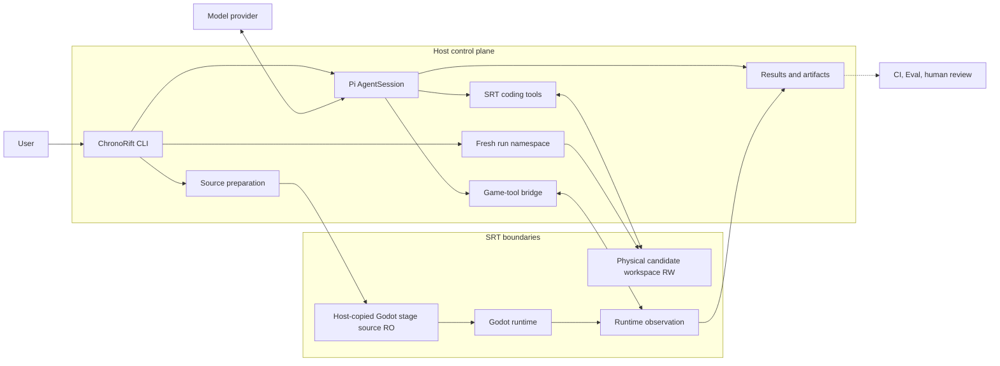

# ChronoRift Game-native Agent Harness 设计方向

> 本文记录 vNext 的设计方向、边界、术语和 rollout 历史，不是 current HEAD 必须逐项遵从的不可变契约，也不是功能
> 清单。个人作品项目优先采用满足当前产品路径的最小实现；旧设计若推动自研 framework 而没有当前价值，可以退役。
> 当前公开 release 仍是 **ChronoRift v0.4.0 legacy diagnosis slice**；实际代码映射见 §21，实验路径见 §20。
>
> Project Environment 的历史数据模型、状态机与 wire contract 见
> [Project Environment V1 RFC](project-environment-v1.md)；该 RFC 不再描述 adapter-free Preview。当前查询边界见
> §15/§20.5。[Protocol v2](godot-protocol-v2.md) 只描述已实现的
> v0.3 Host ↔ Addon wire。Host/Gate 命令见 [开发与验证指南](development.md)。

## 1. 产品契约

ChronoRift 是基于 Pi SDK 的 **game-native Agent Harness**。ChronoRift 拥有 Harness；Pi 是嵌入的 Loop Engine。

> Harness 保证已授权的文件、命令和游戏操作在声明环境中被真实执行，并把真实输出、receipts、coverage、loss
> 和 lineage 返回给 Agent。Agent 自主调查、修改、验证和解释结果。ChronoRift 的成功表示 Loop 正常结束并留下
> 可审阅候选与执行记录，不表示系统从逻辑上证明 Bug 已修复。

“真实”只覆盖 Harness 可观察的边界：请求是否被接受、操作是否执行、runtime 返回什么、捕获了什么以及缺少什么。
它不保证项目或插件上报的内容完整，也不保证 Agent 最终叙述正确。

- `completed` 不是 `verified` 或 `fixed` 的同义词。
- diff、命令输出、tool result 和 raw runtime record 高于 Agent hypothesis 与 final prose。
- 测试、断言和可选 Contract 是 Agent 的验证手段，不是产品最高裁判。
- 用户、项目 CI、人类 review 或独立 Eval 决定是否接受候选修改。
- vNext 不产生 canonical diagnosis、fix verdict、Proposal、Claim Policy、Causal Capsule 或 Conclusion Gate。

## 2. 核心价值

基础 Godot 工具可以启动游戏、读取日志、查看 SceneTree、注入输入和截图。ChronoRift 只有提供难以临时拼装的
运行时状态原语，才有独立 Harness 的价值：

| 维度       | 基础 coding agent + Godot 工具 | ChronoRift 目标能力                                   |
| ---------- | ------------------------------ | ----------------------------------------------------- |
| 工作单元   | 当前进程和文件                 | 有 identity、lineage 和 coverage 的 Execution         |
| 失败历史   | 失败后读取日志                 | 有预算的 pre-failure rolling black box                |
| 状态恢复   | 重启场景                       | 带 manifest、fidelity 和缺失域的 checkpoint/restore   |
| 实验分支   | 手工重跑                       | 从 Execution、checkpoint、build 或 workspace fork     |
| 输入复现   | 再次模拟输入                   | phase-aware trace 与 requested/realized receipt       |
| 运行时查询 | 当前 SceneTree 或文本日志      | 可重建的 Runtime State Index                          |
| 跨运行比较 | 人工比较                       | 对齐 identity、clock、state 与 coverage 的描述性 diff |

这些是长期可选 target，不是当前实现清单或新切片的前置条件。当前 Preview 提供无需 Adapter 的实时对象/属性检查与
Execution 内资源 identity；它没有采集窗口或可回看的历史。固定案例保留各自的观测路径。checkpoint、restore、fork、
replay、index 与 compare 仍是 planned。为什么发生、哪个
机制成立以及修复是否正确，留给 Agent、项目验证、外部 Eval 和人类 review。

## 3. 目标与非目标

### 3.1 目标

1. 让 Pi Agent 在私有 physical workspace 中拥有正常 coding-agent 自由，并通过 SRT 约束 Host 访问。
2. 当前为 Godot 提供 staged source read-only 的真实运行与 query；capture、checkpoint、restore、fork、replay 和 compare
   只在出现真实产品依赖时作为可选 target 实现。
3. 让工具按 capability 和资源依赖自由组合，不把调查步骤写入 Harness 状态机。
4. 保留执行、资源、安全拒绝、coverage、loss、lineage 和交付记录。
5. 通过窄、可验证的垂直切片逐步扩展项目结构支持。

### 3.2 非目标

- 不重新实现 Pi 的 Session、Agent Loop、模型调用、工具调度或 compaction。
- 不承诺任意 Godot 项目能零配置捕获私有状态或等价恢复完整引擎状态。
- 不把 Git worktree 当成 OS sandbox，也不让 Agent 直接修改用户 checkout。
- 不自动 commit、merge、push、发布或部署候选修改。
- 首发不覆盖 C#、GDExtension、native plugin、audio、跨平台 GUI、多人或多 Agent。
- 产品 Harness 不持有 hidden benchmark oracle，也不根据自己的输出给自己评分。

## 4. 稳定产品原则与可选 target

这些原则约束当前维护路径，但不要求保留旧 command、schema 或自研基础设施：

1. ChronoRift MUST 使用官方 Pi SDK；Pi 拥有 Session、Loop、模型调用、工具调度、历史、compaction 和普通终止。
2. Agent MUST 能使用已授权的普通 coding/game tools；Harness MUST NOT 强制固定调查顺序或全局 tool-phase machine。
3. 工具调用 MUST 验证当前 operation 实际使用的 capability、路径、资源归属和安全权限；缺少资源是局部错误。
4. 可恢复的工具失败 MUST 作为明确结果返回 Agent；一次普通 tool error 不得自动终止 Session。
5. 源码、日志、runtime data、Godot strings、插件、模型输出和 patches MUST 视为不可信内容，不能改变 Host policy。
6. 外部、wire、tool 和 persisted DTO MUST 严格版本化并在读取时验证；内部 process result 不必为了形式统一新增 schema。
7. vNext coding/Godot process MUST 使用 exact SRT `0.0.74`，默认禁网；初始化或 wrap 失败不得回退到 unsandboxed process。
8. coding workspace MUST 可写；Godot MUST 使用 disjoint Host stage，项目源码只读，只有 `.godot`/home/tmp/artifacts
   可写，并在运行前后比较 source hash。Preview 的原生导入准备是明确例外：使用另一个一次性可写副本，导入结束后
   校验普通源码未变及产物归属，再建立新的只读运行 stage；导入副本不得直接成为游戏运行目录。
9. Agent 结果 MUST 使用普通 Pi assistant 输出；不得要求唯一 submit tool、固定 Proposal 或 receipt 引用仪式。
10. 历史 raw artifact MUST 保持不可变；计划、实现和外部 Eval 事实 MUST 在文档中明确区分。

若未来实现 checkpoint/restore/fork/compare，它们仍须诚实描述 captured/missing state、first divergence、alignment 与
confounder，且不能裁决因果或修复正确；这些原则不要求 current HEAD 先建设对应 framework。

## 5. 系统总览



| 主体                  | 拥有的事实或决策                                                                     |
| --------------------- | ------------------------------------------------------------------------------------ |
| Host control plane    | physical workspace、SRT 权限、Godot staging、实际 process result、cleanup 和结果保存 |
| Pi                    | Session 与 Agent Loop 生命周期                                                       |
| Agent                 | 调查、编辑、验证选择与最终说明                                                       |
| Project/Godot/adapter | 不可信执行内容与项目语义 observation                                                 |
| CI/Eval/reviewer      | 候选 acceptance 与产品评价                                                           |

Host 不背书 telemetry 是否代表完整世界、Agent 解释是否正确、某次测试是否排除回归，或 compare 差异是否具有因果意义。

## 6. Fresh-run 生命周期

当前 Preview 流程是：

```text
discover project and freeze source/policy
→ allocate a new <state-root>/srt-tasks-v1/<digest> namespace
→ materialize its physical candidate workspace
→ create one visible Pi AgentSession for this command
→ provide ordinary coding tools and game_launch / game_query / game_stop
→ run the user's goal or interactive turns; launch Godot when the Agent requests it
→ show assistant result, diff and actual process/runtime results
→ stop runtime processes and delete operation-private Godot stages
→ retain the fresh-run result directory for review
```

当前 DTO 中的 `taskId` 表示一次 fresh run 的记录 identity，不是可由通用 `task` command 继续管理的长期交互对象。
每条 Preview/case command 都创建新的 `srt-tasks-v1` namespace 和 Pi Session。Preview 不初始化或发布 Adapter，
不加载、复用、迁移或删除旧 project-local environment state。它直接执行用户目标；无目标时只允许交互 TTY。
current HEAD 没有 generic Task lifecycle management API，包括 resume 或 discard。源码准备或 sandbox 失败必须
fail closed。GN-1/Mob 的固定 runtime 配置与交付边界另见 §20.2/§20.3。

一次 `session.prompt()` 返回只结束当前 turn。普通完成不会自动 commit、merge、push、apply 或删除候选和记录。

## 7. Physical workspace 与 SRT 边界

### 7.1 Workspace 语义

Pi Session 的 `cwd` 是 `<state-root>/srt-tasks-v1/<digest>` namespace 中名为 `workspace` 的 canonical physical
directory，不是固定的 sandbox 别名，也不是用户正在编辑的 checkout：

- 每次 fresh run 创建 mode `0700`、当前用户拥有且不与 source checkout 重叠的独立 namespace；
- Host refs、Git 配置和其他 worktree 不可由任务任意修改；
- Harness 能提取并 round-trip 验证 diff/patch；
- 原 checkout 不被 live command 修改或自动 apply；
- workspace 提供候选隔离，但真正的 Host 权限边界来自 SRT。

### 7.2 OS 边界

current HEAD 在 Linux x86_64 上精确固定 `@anthropic-ai/sandbox-runtime@0.0.74`：

- coding commands 可以读写该 run 的 workspace、home、tmp 和 artifact scratch，从而正常修 bug；
- Godot 不直接运行可写 candidate。Host 复制普通文件到 disjoint stage、拒绝 symlink/特殊文件/路径逃逸并叠加 managed
  overlay；SRT 允许读取 stage source，但只允许写 `.godot/`、home、tmp 和 artifacts；mutable candidate 对进程不可见；
- 两种 process 都使用 strict empty network allowlist，并从空白环境构造最小变量集；
- controller 保留 timeout、cancellation、process-group kill、stdout/stderr prefix 和 truncation；当前不提供 cgroup
  CPU/memory/PID quota、bounded-storage ledger 或 Host-config policy layer；
- Godot stage 在启动前计算 source SHA-256，进程完成后重算并返回 `sourceUnchanged`。Hash 不是签名或外部证明。

Pi Host 可以在 sandbox 外读取用户 Pi credential store 调用模型；凭据不得进入 repository、artifact、Task command
environment 或 Godot process。设置 Pi `cwd` 或创建 Git worktree 都不等于完成 OS 隔离。当前 Host 约束与命令见
[开发与验证指南](development.md)。

## 8. Pi SDK 集成

ChronoRift 使用官方 Pi SDK 创建 AgentSession，不修改、fork 或 vendor Pi：

- 保留 Pi 默认 coding-agent prompt、Loop、history、compaction 和终止语义；
- 正常加载 workspace 中适用的 `AGENTS.md`、skills 和 context，但它们不能覆盖 Host policy；
- 只追加简短的 sandbox、game-tool、coverage 和 fidelity 环境说明；
- 通过 SRT-backed port 提供 `read`、`bash`、`edit`、`write`、`grep`、`find` 和 `ls`；
- 用 strict custom tools 暴露 ChronoRift game/runtime capabilities；
- provider 和 model 在 command boundary 显式选择；只有 `*.live.test.ts` 可以在测试中访问 provider。
- 已安装 Pi package 的 source 与 types 是 SDK API 权威；版本保持 pinned，显式升级必须带兼容测试。

安全拒绝、资源不足、runtime crash 和 unsupported capability 作为结构化工具结果进入 Loop。用户取消、显式超时、
不可恢复的 Pi/provider failure 或 Host failure 才终止当前 turn。官方 SDK 文档见 [pi.dev](https://pi.dev/docs/latest/sdk)。

## 9. 当前 Runtime 资源与历史 Project Environment 模型

| 资源                                                | 当前或 planned 含义                                                                   |
| --------------------------------------------------- | ------------------------------------------------------------------------------------- |
| `ProjectEnvironment` / `ProjectEnvironmentRevision` | 历史项目接入模型；固定案例仍使用所需 revision DTO，新 Preview 不生成或复用它们        |
| `ProjectAdapterRevision`                            | 固定案例继续使用 checked-in Adapter；新 Preview 不需要项目 Adapter package            |
| `ProjectInitializationAttempt`                      | 历史初始化 attempt DTO；其 Preview producer 已退役                                    |
| `Task` / `taskId`                                   | 当前 DTO 名称：一次 fresh run namespace/Session/result 的 identity，不是通用 Task API |
| Inspection `Execution` / `objectRef`                | Preview：一次固定源码的 Godot 进程，以及该 Execution 内有效的弱对象引用               |
| `Build` / `Runtime` / `Execution`                   | 固定案例的 source、Godot process 与 launch-bound observation identity                 |
| `CaptureWindow` / `Checkpoint`                      | Preview 尚无；固定案例保留自己的 capture DTO，通用时间窗口与状态恢复待真实需求验证    |
| `Trace` / `Branch` / `Comparison`                   | planned：输入 timeline、fork lineage 与描述性 comparison                              |

ID 是稳定、不透明的业务 identity，不是路径或 Session capability。当前引用只验证实际使用的 schema、存在性和 fresh-run
ownership；maintained DTO 绑定各自需要的 source/Build/Execution/tool-call facts，不要求预先建设完整 lineage graph。

历史 Project Environment DTO、publication 和 binding 模型见 [Project Environment V1 RFC](project-environment-v1.md)。
Preview 使用独立 Godot Inspection V1 tool/wire contract，命令交付结果为 Preview JSON V2。

## 10. Rolling Black Box

§§10–14 保留长期可选 runtime primitives 的设计草案。它们不是当前 Preview 的实现事实、Gate 或切片前置条件；
下面的具体预算与协议模型尚未实现，也没有规定下一切片。只有维护产品路径出现真实依赖时才重新评估最小边界。

目标默认是低成本保留最近 10 秒、最多 600 ticks 的运行历史，包括 input、多个 clock domain、entity lifecycle、
结构化 errors、注册的 RNG/probe events 和轻量 state summaries。两项边界先到即淘汰旧数据，并记录 realized window。

每个 Task 的目标默认预算是 256 MB memory、1 GB disk、平均不超过基线 frame time 的 5%、单次 main-thread capture
不超过 2 ms；这些不是跨项目性能保证。Runtime 必须记录实际 overhead；超限时可以降采样或丢弃低优先级数据，但
必须保留 degradation、drop、overwrite 和 observer-effect receipt，也不得暂停游戏来伪装预算达标。

Rolling capture 支持 Agent 手动 pin；目标形态还支持 adapter 声明的有界自动 retention trigger。Trigger 只请求冻结
目标前后的窗口，是 retention hint，不是 Bug、Contract failure 或 root cause 的确认。若历史或 pre-failure
checkpoint 不可用，工具必须返回现有 timeline 与 coverage gap，不能把普通历史窗口冒充等价分叉起点。

## 11. Checkpoint 与 Restore

ProjectAdapter 可以明确不实现 snapshot module。此时只能重建 ChronoRift 控制的执行外壳：source/build、launch、
config、recorded trace、seed、logs 和 capture metadata；不得宣传为从失败瞬间等价分叉。

Snapshot 与 restore capability module 独立协商；snapshot 可以 implemented 而 restore 仍 unsupported。实现 snapshot
时，adapter 必须定义捕获字段、stable identity/incarnation、barrier、canonicalization/tolerance 和已知缺失域；实现
restore 时还必须定义 restore order、逐域结果与恢复后自检。每次 adapter/probe 变化形成新 revision，只影响后续
Build 和 Execution，不热替换已运行实例，也不追溯补全旧历史。

Checkpoint manifest 与 restore receipt 至少区分：

| 状态类别                | 含义                                   |
| ----------------------- | -------------------------------------- |
| `captured`              | 按声明 schema、barrier 和规则读取/写回 |
| `reset`                 | 恢复时重新初始化而非复制               |
| `externally_controlled` | 由 Harness 或外部授权主体设置          |
| `unsupported`           | adapter/runtime 明确不支持             |
| `uncontrolled`          | 未捕获或无法可靠恢复                   |

Receipt 绑定 checkpoint/current Build compatibility、逐域结果、before/after summaries、coverage gap、fidelity 和
validation output。“restore 成功”只表示声明状态被写回；first-tick divergence、首个不同字段/实体/事件和相关缺失域
必须保留。`fidelity` 是覆盖与恢复能力，不是模型置信度。

## 12. Fork、Replay 与控制

Agent 可以从已授权的 Execution、checkpoint、Build 或 workspace fork，并改变代码、adapter、probe、input、seed、
runtime settings 或 capture profile。requested change、realized change 和已知副作用进入 lineage；Harness 不评价实验
设计是否“只改一个变量”。

Trace 必须区分 process frame、physics tick、simulation time、Host monotonic time、press/release、target phase 和
realized phase。Godot GDScript 不提供无条件保持语义的引擎硬单步，因此 FPS/TPS、pause、time scale 和 input injection
都返回实际 receipt。Replay 可以观察相等或 divergence，不能预先承诺 bit-exact。

## 13. Runtime State Index

Runtime State Index 是从 raw Execution records 重建的查询视图。它可索引 entity stable ID/incarnation/lifecycle、
scene relationships、clock partial order、input、Signal/log/error、注册 state/transition/RNG、coverage/loss 和原始来源。

查询结果携带 source references 和 missing data。索引不包含 candidate/root cause、Harness-selected causal slice、下一
实验建议或 hypothesis confidence。只有 runtime correlation ID 直接支持的 `scheduled-by`、`spawned-by` 等关系可以作为
观测边保存；跨 Build 的 entity match 允许 `unmatched` 和 `ambiguous`。

## 14. Semantic Alignment 与 Compare

`compare(A, B)` 在两次 sealed Execution 的声明和 capture 范围内列出 source/build、runtime/adapter/probe、
checkpoint/fidelity、trace/controls、coverage/loss、entity match、state/event/timeline 和 first divergence differences。

Alignment 使用 stable identity、incarnation、clock、trace anchor 和 adapter semantic key；不可靠匹配不得强行合并。
当 Build、adapter、probe、coverage 或 checkpoint fidelity 不兼容时，Comparison 标记 `confounded` 或
`descriptive_only` 并列出混杂项。它不判断实验合理性、因果、hypothesis、Bug 或 fix correctness。

## 15. 当前 Agent 工具面

Preview 只增加三个 Godot Inspection V1 工具；输入与结果严格版本化，Pi metadata 从同一 canonical schema 派生。

| 工具          | 当前操作                                                                                                   |
| ------------- | ---------------------------------------------------------------------------------------------------------- |
| `game_launch` | import 并启动当前 candidate 的默认主场景，返回实际 source hash、engine version、Execution 和根对象         |
| `game_query`  | 读取当前 `children`、`properties` 或明确命名的 `values`；目标为主场景相对路径或该 Execution 的 `objectRef` |
| `game_stop`   | 停止指定 Execution，保存实际 process/log/source integrity 结果；重复停止返回已保存结果                     |

children/properties 使用 offset/limit（默认 100、上限 200）；values 一次接受 1–32 个属性名。Object/Resource 返回
引用并保留身份，可继续读取其属性；不会自动展开而丢失共享资源关系。弱引用失效后不可指向替代对象，也不延长资源
生命周期。每次查询记录实际 process frame、physics tick 和独立 Host 接收时间；不同分页不保证同一快照。

查询不是原子快照，property getter 是不可信项目代码，可能改变内存状态。普通标量、有界容器、Vector2/Vector3、
Color 与显式 int64 值受严格校验；不支持的类型、缺失属性、失效引用、截断和执行错误均明确返回。当前没有表达式、
方法调用、probe、历史窗口、pause/step/input 或 replay 工具。

Agent 仍自主选择 coding/game tools，没有固定调用顺序或最终 submit/Proposal。一个 Preview 只允许一个存活
Execution；停止后可以从最新 candidate 创建另一次执行。固定 GN-1/Mob 继续使用各自四工具契约；历史 16 工具
catalog 的保留类型不意味着新 Preview 提供那些能力。

## 16. 当前结果存储与历史 Artifact

- `.chronorift/` 是 local-only 状态，不提交 Git，不进入 source closure 或候选 patch；Preview 不消费旧环境状态。
- 当前 Preview 保存 Pi transcript、候选 diff 和每次执行的运行记录；不建立查询数据库、publication 或 freeze ledger。
- import/run 结果分别保留退出、超时、取消、有限日志及截断；source hash 校验和缺失的 process 结果不得伪装为成功。
- 原始运行记录与历史 raw artifacts 不原地改写；content hash 用于绑定 bytes 和检测损坏，不是签名或外部 attestation。
- ID 不是路径；接受项目相对内容的操作拒绝 absolute path、`..`、symlink/canonical escape 和跨 workspace 引用。
- 当前没有通用 Task resume/discard、storage quota 或长期 retention framework。固定案例继续使用其已有 TaskStore 与记录格式。

## 17. Godot Runtime 边界

vNext 使用 managed Addon/Autoload 和 runtime sidecar，不要求 Godot engine fork。Preview 使用独立的窄 inspection
wire：Host framed stdio → 沙箱内 sidecar → Godot observer，严格校验握手和请求/响应。固定案例的 Project Environment
wire contract 保留原契约，见历史 RFC；
[Protocol v2](godot-protocol-v2.md) 是 v0.3 Host ↔ Addon 协议，其中的 legacy verdict 术语不属于 vNext 产品语义。

每个 Runtime 使用独立 sidecar 和 Godot child，并共享同一 SRT sandbox 与禁网边界；当前没有自研 cgroup/resource quota。Host 只通过
有界 framed channel 控制 sidecar；overflow、truncation、process error 和 cleanup failure 都进入记录。Host checkout
不在 sandbox 内执行；source snapshot、import cache、operation scratch 和 read-only managed overlay 分离。

Preview 的 native import 在独立 SRT process 和一次性可写 source copy 中执行，candidate 始终隐藏、网络始终拒绝。
进程结束后 Host 拒绝普通源码/overlay 的新增、删除、内容或 executable 位变化；只允许对应原始文件的 `.import`、
GDScript/shader 的 `.uid`，以及 `.godot/imported/`、global script class cache 和 UID cache 进入新运行副本。
输出树拒绝软/硬链接、特殊文件、路径逃逸及超限；当前上限为 16,384 项/64 层、单文件 64 MiB/总 256 MiB。
这些是路径、文件类型、归属和大小检查，不是对 Godot-native 产物内容的可信性背书；引擎仍在 SRT 中解析这些不可信字节。
编辑器布局/日志不进入新副本。导入非零退出、超时、取消、stderr 中的 Godot ERROR 或 stderr 截断会阻止启动；
实际 import 输出在无 game process 时也保存。只读 run sidecar 不再二次 import，固定案例与 legacy 路径保持原样。

ProjectAdapter、probe、项目 GDScript、`@tool` 和 EditorPlugin 是同一不可信 Godot principal。只读 overlay、content
hash 和一次性 handshake token 约束 identity 与意外 peer，但不隔离同进程恶意代码，也不证明 telemetry、Addon
provenance 或 adapter semantics。真正的权限边界是 OS sandbox。

必须诚实保留：

- GDScript 不能全局拦截任意 Signal、property 或未注册 RNG；
- physics internal、thread、Timer/Tween/coroutine 等状态默认不可恢复，除非 adapter 明确声明并实际覆盖；
- Preview observation 只覆盖当前查询的可读对象/属性；固定 Adapter 的 observation 受自身声明范围限制，读取与序列化可能改变时序；
- stdout/stderr、process exit 和 structured channel 是不同传感器；
- process frame、physics tick、simulation time、render completion 和 Host monotonic time 不可混用；
- unsupported control 必须拒绝或返回量化后的 realized value；
- Host 被 `SIGKILL`、掉电或内核终止时可能无法留下 cleanup 结果，残留由 Operator 处理，不能补写为成功清理。

Headless 是默认。Render/display/GPU 以后可作为显式授权 Sensor；audio 不属于 V1。

## 18. 产品 Harness 与外部 Eval

| 产品 Harness                        | 外部 Eval / 项目 CI / review                      |
| ----------------------------------- | ------------------------------------------------- |
| 运行 Agent、sandbox 和 game tools   | 可以持有 hidden Bug、oracle 和评分规则            |
| 输出候选 patch、Session 与实际记录  | 评价 patch、行为、成本、可靠性和安全失败          |
| 不给自己的结果写 acceptance verdict | 不把 hidden oracle 或固定调查流程反向注入产品 API |

需要新的对照时，优先把候选 patch 交给可复现的外部 suite/Eval；不在产品树内重建 campaign、publisher 或 canonical
verdict。历史 v0.3 benchmark 是旧固定 workflow 的工具消融，不是 vNext 产品契约，也不是与其他 coding product 的
head-to-head。

## 19. 依赖方向与模块职责

依赖保持向内：

```text
domain ← gamebranch ← runtime adapters ← CLI composition root
domain ← agent-protocol ← pi-harness / optional external bridge
```

- `domain` 无 I/O，不知道 Pi、Godot、Git、process、container 或 filesystem layout。
- `gamebranch` 只依赖 domain 和窄 ports，不导入 adapters 或 CLI。
- CLI 拥有 arguments、composition、lifecycle 和 display，不拥有 Agent strategy、causal interpretation 或 verdict。
- Pi 与 Godot-native types 不进入 engine-neutral packages；package 间只通过公开 `src/index.ts` 导入。
- 只有实现出现独立依赖与生命周期边界后才拆 package；不得按目标图创建空壳。

当前 package ownership 属于实现事实，统一列在 §21。

## 20. vNext 垂直切片 rollout

rollout 是设计记录，不是 current HEAD 必须逐项实现的不可变契约。个人作品项目优先维护最小可运行产品路径；当旧 slice
要求自研基础设施而没有当前产品价值时，可以删除实现并保留历史证据。

| Slice / path                | 当前状态                                  | 当前含义                                                                    |
| --------------------------- | ----------------------------------------- | --------------------------------------------------------------------------- |
| SRT cutover                 | current implementation                    | 精确 SRT `0.0.74`；coding RW；Godot Host stage RO + 前后 source hash        |
| Project Environment Preview | 实验性通用检查入口                        | 无需 Adapter 的三工具路径、默认主场景、Execution 内对象与资源查询；见 §20.5 |
| GN-1                        | 实验性固定项目路径                        | External Project Runtime Observation + Narrow Ablation                      |
| Mob V2                      | 已完成 case-study runner                  | 第二项目复用公共 V2 loader/runtime；不证明比较优势                          |
| PE-A/PE-B/PE-C              | 历史 slice；保留被当前路径使用的底层      | 初始化/publication/reuse/conformance producer 与 campaign/Gate 已退役       |
| M3/M4/E2                    | current HEAD 已删除实现与命令；仅历史归档 | 不作为兼容 surface，也不为复现归档而恢复 producer、validator 或旧 Gate      |

SRT cutover 刻意退役了自研 sandbox broker、cgroup/storage ledger、Host-config schema 和复杂 receipt framework。
它在 Linux x86_64 上使用 strict empty network allowlist；Agent coding process 可以写私有物理 candidate workspace，
Godot 则只能读取 Host 复制的独立 stage 源码，并只能写 `.godot/`、home、tmp 和 artifacts。当前实现不宣称 cgroup
资源 quota、容量计量或外部 attestation。Project Environment 的历史详细设计仍见
[Project Environment V1 RFC](project-environment-v1.md)，旧运行结果只存在于对应历史归档。

### 20.1 历史 PE-C 封版边界

本小节保留 PE-C 当时的 slice contract 以解释冻结归档，不描述 current HEAD 的 sandbox 或命令实现。

PE-C 保持 PE-B 的 exact Godot 4.7.1 GDScript/toolchain identity、headless、默认禁网、ProjectAdapter V2、dynamic observation 和
publication/binding 语义不变，只扩展主线所需的 source、import 与 target 边界：

1. 从 enclosing Git root 发现 `project.godot`。只有一个时自动选择；多个时要求 `--project-root` 明确选择，不能猜测。
2. closure 自动采用选中项目内 tracked 文件的最终工作树 bytes，包括 staged/unstaged dirty；untracked 只接受每次
   Preview/reuse 通过重复 `--include-untracked` 指定的精确文件。ignored、未选择的 untracked、`.git/` 和
   `.chronorift/` 不进入 closure。
3. `ProjectSourceClosureV1` 记录 HEAD、选中项目相对路径、规范排序的 path/mode/content identity/provenance、realized
   main scene、exact Godot version，以及遇到的 clean、已 materialize direct-submodule lineage。`SourceId` 只由这些
   规范事实决定，不含 Host 绝对路径。
4. multi-source 仅限选中项目与其已 materialize 的 clean direct-submodule set；不接受 recursive submodule、任意 sibling
   或 absolute source root。
5. materialize 到当时的私有 physical workspace 后、Agent 或 adapter 执行前重新冻结；identity 变化返回
   `source_drift`，不能运行旧
   bytes。保持已有路径级敏感文件拒绝规则，不在本切片增加内容级 scanner。
6. 项目本地 GDScript addon、`@tool`、EditorPlugin 和 import 在现有 deny-network/deny-credential sandbox、fresh
   `.godot` cache 与 cleanup boundary 中执行；项目不能占用保留 overlay 路径
   `addons/chronorift_project_environment/**`。
7. Adapter 可以声明多个 launch target，但 publication 只验证 default target 与当前 `--launch-target`（若不同）。其余
   target 标为 `declared_unvalidated`，请求运行时返回 `target_not_validated`，不隐式扩大验证范围。
8. 同一 project-local namespace 内，同一 closure、显式 untracked 集合和已验证 target 得到同一 `SourceId` 并允许复用
   同一 environment revision；environment identity 仍是 project-local。`SourceId` 变化返回 `review_required`，不在 PE-C
   自动生成新 adapter revision。

PE-C 当时按该单轴做过 characterization：

- offline 测试覆盖项目发现/选择、dirty/untracked canonicalization、路径无关 `SourceId`、drift、addon admission、target
  validation 状态、reuse/review，以及未 materialize LFS pointer、symlink、dirty/recursive submodule 的明确拒绝；已
  materialize 的 LFS 实体 bytes 仅按普通文件接纳，PE-C 不提供 LFS-aware 下载、lineage 或一致性保证；
- Godot Gate 覆盖本地 addon/`@tool` import、default + selected target；未验证 target 必须拒绝；
- 一个固定的真实外部项目完成 init → closure → adapter → run/observation → new-Session reuse，并在修改一个
  已选 tracked byte 后于 game execution 前返回 `review_required`；
- 默认 CI 使用 deterministic fake Agent；real Pi 不属于本次冻结的 PE-C Gate。Host run metadata 是本切片记录，
  不包含 product-subject bundle、独立 validator 或全量 target × 三阶段 matrix。

PE-C 曾在 product subject `a119ec4f7a9a203d32db740b3dc4ffba7fc69ad0` 上运行固定外部项目的 CI Host Gate；
[PE-C CI r1 freeze](evidence/vnext-project-environment-pe-c-ci-r1/README.md) 保留 run metadata、精确接口 hash 与 trust
boundary。该 Gate 使用 deterministic fake Agent，因此不证明 real-Pi adapter 生成、Agent 调试、checkpoint/replay、
patch correctness、任意项目成功率或外部 attestation。PE-C 到此停止。

### 20.2 GN-1 External Project Runtime Observation

GN-1 只回答一个窄问题：在真实第三方项目调试中，Pi Agent 是否实际获取了普通源码/命令工具之外、
与 launch Execution 绑定的 Godot runtime observation，并在一个工具面消融中留下与对照可比的候选记录。固定
source 是
`endlessm/moddable-platformer@e78b339500dec8e480b33723c4156bf9b74cd25c`，tree
`9941cb045b3cd73c4554ca1de337a341b383590b`；该版本默认场景已包含不同宽度的 Platform 实例，不注入新的 Bug 或实验
场景。

```text
冻结外部 checkout → fresh-run private physical workspace → baseline runtime observation
                    → 正常 Pi coding-agent Loop → candidate diff → 新 Build 重跑 observation
```

本切片边界：

1. 使用一个 checked-in、项目特定的 ProjectAdapter V1，只向 Agent 暴露 `game_capabilities`、`game_launch`、
   `game_query` 和 `game_stop`；query 返回 realized Platform 配置、可见宽度、solid/area collision width 与 execution-local
   Resource instance identity，不返回 cause、expected value、patch hint 或 verdict。State projection 在首次采样以及值或
   semantic coverage 变化时发出记录，不重复保留逐帧相同快照。
2. 保留正常 Pi coding-agent Loop 和普通 coding tools。消融的两个 arm 共用中性 symptom prompt、`coding`
   environment profile、只含本 Task `taskId` 的 environment instruction profile，以及
   `read`/`bash`/`edit`/`write`/`grep`/`find`/`ls`/`godot_run`。`chronorift` arm 只增加四个 game-tool
   definitions 及其原有的简洁 discoverability metadata；不向共同 appendix 注入 domain、cause、patch hint、verdict
   或工具顺序。Session 原始 tool records 高于 Agent prose。
3. baseline 与 candidate observation 分别绑定精确 Build/Execution；candidate 在 fresh-run private workspace 中产生，
   输出完整 diff，不修改原 checkout，也不自动 commit、merge、push 或 apply。每次 Execution 使用私有 staging，admitted
   source 在 Godot import 前封为只读，只有 `.godot/` cache 可写；import diagnostics 不被改写成 candidate source。
4. 专用命令 `corepack pnpm demo:platform-alias-ablation -- --arm coding-only|chronorift --project ...
--provider openai-codex --model gpt-5.6-luna --thinking max` 每次只运行一个 fresh arm；两个 arm 的
   source、prompt、model/thinking、timeout 和共享 tool names 由 strict result 记录。该路径不创建 Project Environment
   revision，也不运行 Preview publication/reuse、V2 dynamic trace、capture、checkpoint/replay 或 evidence packaging。
5. standalone evaluator 先验证匹配配置、fresh-run namespace、physical workspace 与 Session identity、tool call 与 Build/Execution
   lineage、patch bytes/hash、cleanup 和 checkout cleanliness，再分别报告两个 arm 的 case-level oracle。它不选择
   winner，不把 Agent prose、单一 tool call、单一 diff 或候选启动失败转换为 canonical verdict。

GN-1 当前为 experimental implementation。2026-08-20 的本地 R2 matched pair 中，`coding-only` 的 geometry
oracle 为 `false`；`chronorift` 在修改前成功取得 launch-bound `platform_geometry` observation，其 candidate
geometry/identity oracle 为 `true`。记录仅在 local-only `.chronorift/`，未冻结为 evidence bundle 或 Gate；一个
项目、revision、prompt 和 pair 不证明候选 acceptance、通用 superiority、普遍因果性、成功率或任意项目泛化。

### 20.3 Godot Demo Mob Orientation V2 vertical slice

该切片绑定 `godot-demo-projects/3d/squash_the_creeps` 的精确父 commit/tree 和一个 checked-in 项目 Adapter，目标是
在 GN-1 之外复用公共 PE V2 loader/runtime，而不是扩建 benchmark 平台。Manifest V2 允许 state-only projection：
custom events 与 dynamic traces 可为空，最少 lifecycle/state record 为 1。当时的 conformance 路径要求正向观察
声明的 required record，并拒绝零记录、缺失 domain、loss 或 overwrite；该 Preview conformance producer 现已退役，
固定案例继续使用 checked-in、预验证 Adapter 及其 runtime 校验。

case runner 每次只接收 `coding-only|chronorift-v2` 的一个 fresh arm。两组共用纯源码、中性 Bug prompt、model、
thinking、timeout、普通编码工具、受限 `godot_run` 和 128 次共享 admission budget；common environment appendix
只含 opaque `taskId`。Treatment 的完整增量同时包括四个 V2 game-tool definitions 及其 metadata，以及两行
treatment-only discoverability appendix：预验证 Project Environment V2 可通过 `game_*` tools 使用；runtime records
是 observation 而非 verdict，调查和验证顺序仍由 Agent 决定。因此本 pair 是完整产品 intervention，不是 tool-only
comparison，结果也不得归因于单独的 game tools。

Agent 完成后，Host 才临时物化窄 evaluator，通过同一 Godot sandbox 连续执行三次，并在 patch extraction 前删除
evaluator 文件。standalone pair evaluator 只实现本 case 的预声明 Hero gate，不构成通用 verdict 或实验框架。

V2 runtime 同时移除了与 state-only Adapter 不相容的旧 PE-B Gate：query 返回当前 validated ring snapshot；stop
始终完成 shutdown/cleanup，证据缺口进入 persisted receipt 的 `incomplete`、failure 与 limitation，而不是把健康
execution 标成 poisoned。旧 receipt 仍会在缺少 durable pinned capture 时保留 `incomplete`，本切片不借机迁移公共 DTO。
persisted `succeeded` 仍沿用较窄的 PE-B evidence predicate；这里不宣称通用 state-only evidence-success 已完成迁移。

2026-08-24 的本机 fresh pair 按冻结顺序完成。`coding-only` 与 `chronorift-v2` 候选均连续通过独立 evaluator 3/3；
Treatment 在源码变化前后实际使用 V2 runtime state，共调用 13 次 game tools，run integrity 与 cleanup 均有效。由于
coding-only 同样成功，standalone evaluator 将 `heroPromoted` 记为 `false`。结果只证明共享 V2 runtime/sandbox/lineage
边界在第二个固定外部项目上跑通，不证明 treatment win、统计优势、自动 Adapter onboarding 或任意项目支持。

### 20.4 历史候选工作

| Slice | 后续增量                                                                                        |
| ----- | ----------------------------------------------------------------------------------------------- |
| PE-D  | source review、新 environment revision、compatibility failure 后的 adapter 更新与 SDK migration |
| PE-F  | lease/CAS conflict、multi-Session workspace、revision pin 和 binding epoch                      |
| PE-G  | Host drift、显式 refresh、game patch review/apply、conflict 与 `ApplyReceiptV1`                 |
| PE-H  | adapter bundle export/import；import 只创建重新验证的 untrusted candidate                       |
| PE-P  | project network preauthorization 到每 Task 精确 realized policy                                 |

这些条目是历史设计候选，不是 current HEAD 的承诺、Gate 前提或默认实施顺序。只有真实用户路径出现依赖时才重新评估；
不得为了满足本文恢复旧 framework。`chronorift [goal]` 仍不是当前已有入口。

### 20.5 Adapter-free Preview：通用对象检查

当前优化切片替换 `project preview` 的项目接入与 runtime composition：源码准入、私有 candidate、SRT、Pi Session
和候选 patch 继续保留，准备完成后直接执行用户目标或进入交互 TTY。旧初始化回合、managed Adapter authoring skill、
manifest finalization、conformance、publication/recovery、revision binding 与 reuse 退出 Preview 维护路径。

Agent 使用 §15 的三个工具检查正常启动的默认主场景。每次 launch 固定当时的 candidate，以公共 observer autoload
取得当前节点、属性和资源 identity；Host 在不与 mutable candidate 重叠的 stage 内运行 Godot。Agent 可先读取
CollisionShape2D 的 `shape` 引用，再读取 Shape 的 `size`，从而无需项目 Adapter 取得 GN-1 所需的尺寸与共享 identity。
产品代码不包含 Platform 路径、固定项目字段或 GN-1 结论；原 GN-1/Mob runner 与历史结果不迁移。

Preview 只支持默认主场景，移除 `--launch-target`；无目标时必须使用交互 TTY，非交互/JSON 调用要求目标。
命令结果升级到 `schemaVersion: 2`，包含 Session、候选 patch、执行记录位置与真实失败信息。`completed` 不要求
Agent 调用 game tool，也不表示项目通过验收。旧 `.chronorift/` 环境状态不读取、不迁移、不删除。

存储收缩为 transcript、候选 diff 和每次执行的运行记录/有界日志。退出、超时、取消、查询失败、输出截断与源码
完整性各自如实保存。新路径没有历史记录采集、probe、暂停、推进、输入、checkpoint/replay 或证据发布系统。
带时间窗口的调查仍需通过后续真实需求验证，本切片只建立通用当前状态观察；没有预定的下一 slice。

原生导入现已与只读运行分离（§17）：每次 launch 先完成一次性 import 和产物准入，再启动 run-only sidecar。
运行记录的 source hash 对应实际运行副本，包含生成的 `.import`/`.uid`，不包含可写 `.godot`；不能将该 hash 的变化
单独解释为 candidate 源码变化。没有新增 DTO、publication/cache-reuse framework 或 package。

实现复用既有 package、源码准入、SRT 与 framing 底层，新增窄 inspection DTO、wire/observer、Host runner 和 Pi bridge。
仅旧 Preview 使用的接入、发布、复用、conformance、runtime composition 及其专用测试已经删除；固定案例仍使用的
V1/V2 runtime、sidecar、validated ring、TaskStore、artifact internals 和安全测试保留。没有创建新 package，也没有重跑
或加强冻结实验结论。

## 21. 当前实现映射

本节把 **2026-09-05** 当前代码与已冻结证据映射到设计方向。它只描述实际实现和已归档证据；§20 不是不可变实施
清单，Git 分支或合并状态本身也不作为产品能力证据，实现存在不等于 live run 已通过。

### 21.1 路径状态

| 路径                        | 产品状态              | 实现与证据状态                                                                                       | 主要缺口                                                |
| --------------------------- | --------------------- | ---------------------------------------------------------------------------------------------------- | ------------------------------------------------------- |
| v0.4                        | 当前公开 release      | 四个 legacy Fixture、真实 Pi Session、固定诊断 workflow 和 Proposal/Verdict artifacts                | 不具备当前 SRT vNext 边界                               |
| Project Environment Preview | 当前实验性检查路径    | source closure、普通 Pi Loop、三个 inspection tools、独立 source stage、候选 patch 与执行记录        | 当前状态查询；无历史、probe、输入控制或任意项目兼容保证 |
| **GN-1**                    | **固定案例 runner**   | **固定项目 adapter、matched tool surface、private candidate diff 与 Host-staged postflight**         | 单项目/单 pair；local-only，未冻结；不证明通用优势      |
| **Mob V2**                  | **case-study runner** | **第二项目、state-only Adapter V2、fresh pair 与 sandboxed evaluator 已完成；两组均 3/3**            | 未晋级 Hero；不证明比较优势、自动 onboarding 或通用支持 |
| 旧 Task CLI 与 **M3/M4/E2** | **已从 HEAD 删除**    | **只在历史 tag/归档中存在；current code 不再提供其命令、coordinator、broker 或 runtime composition** | 不属于当前兼容 surface                                  |

M4/E2、PE-A、PE-B 与 PE-C 的旧 characterization 保存在 [E2 archive](evidence/vnext-e2-public-exposed-r1/README.md)、
[PE-A archive](evidence/vnext-project-environment-pe-a-local-r1/README.md)、
[PE-B archive](evidence/vnext-project-environment-pe-b-local-r1/README.md) 和
[PE-C CI r1 freeze](evidence/vnext-project-environment-pe-c-ci-r1/README.md)。当前 HEAD 已移除对应的 campaign、producer、
standalone validator 和一次性 Host Gate；归档只保留历史语义，content hash 也不是签名或外部 attestation。

### 21.2 当前 package 与 Addon ownership

| 模块                       | 当前职责                                                                                                             |
| -------------------------- | -------------------------------------------------------------------------------------------------------------------- |
| `apps/cli`                 | legacy/current CLI composition、私有 candidate workspace、薄 SRT controller、Godot staging、Preview/case runner      |
| `packages/domain`          | engine-neutral identity、Inspection V1 canonical schema、有界值及保留的 runtime/Project Environment DTO              |
| `packages/gamebranch`      | legacy services 与仍被维护路径使用的 engine-neutral lower layers                                                     |
| `packages/agent-protocol`  | SDK-neutral 工具定义；新 inspection metadata 从 canonical schema 派生，固定案例保留原契约                            |
| `packages/pi-harness`      | Pi Session/Loop、SRT-backed coding-tool port 与窄 inspection/fixed-case game-tool bridge；不再托管 Adapter authoring |
| `packages/godot-protocol`  | versioned inspection/固定案例/legacy wire messages、payload validation、hash 和 framing                              |
| `packages/godot-adapter`   | 通用 inspection observer、sidecar/wire client，以及固定案例仍使用的 Project Environment runtime/overlays             |
| `packages/json-artifacts`  | legacy readers/writers 与固定案例仍需的 TaskStore/共享 internals；项目 publication store 已删除                      |
| `packages/mock-game`       | historical deterministic fixture                                                                                     |
| `godot/addons/chronorift*` | legacy/历史及当前 Godot integration 使用的 Addon lower layers；不代表 M3/M4/E2 命令仍存在                            |
| `fixtures/godot-*`         | legacy 与当前 Godot integration fixtures                                                                             |

没有实现依赖边界前，不创建 `world-model`、`game-contracts`、`worktree-manager` 或 `execution-sandbox` 空 package。

### 21.3 Gate 与已知缺口

默认 Gate 是 offline、deterministic、credential-free 的 `corepack pnpm check`。`corepack pnpm test:godot` 验证 Godot
integration；`.github/scripts/run-srt-sandbox-conformance.sh` 在 provisioned Linux Host 上校验 exact SRT `0.0.74` 后运行
单一 `corepack pnpm test:sandbox`（coding 与真实 Godot/Preview）。live Provider paths 是额外显式入口。已退役的
PE/M4/E2 campaign 不再是当前 checkout 的 Gate；实现状态只能引用实际输出或明确标识的历史归档。

当前主要缺口：

- Preview 的通用对象检查是当前状态读取，没有 retained history、probe、pause/step/input 或 replay。查询期间游戏
  继续运行，分页不是稳定快照，getter 可能有副作用；它不能取回尚未采集或对象失效前的状态。
- 不同项目只共享 Godot 原生对象/属性接口，项目路径和有意义的字段仍由 Agent 调查选择。GN-1 型 Shape 查询可以
  无 Adapter 完成，不等于任意项目零配置理解，也不把两个固定案例的模型结果转换为新 Preview 的 live 证明。
- GN-1 只绑定一个冻结外部项目、项目特定 adapter 和一种 Platform geometry/resource observation；实验结果与
  外推边界见 §20.2。它不提供 adapter authoring、Project Environment reuse 或通用项目支持。
- Mob V2 只覆盖一个固定 revision、项目专用 Adapter 和一次 pair；Treatment 包含 game tools、tool metadata 与两行
  discoverability appendix，两组均 3/3，不能推出比较优势、自动 onboarding 或一般成功率。
- 当前 SRT 路径只支持 Linux x86_64，并精确固定 beta 版本 `0.0.74`。升级必须单独做 compatibility 与 Host conformance。
- coding workspace 允许写；Godot 每次复制 candidate 到独立 Host stage。该复制与前后 SHA-256 能发现 stage source
  变化，但不是签名、外部 attestation 或 candidate correctness 证明。
- sandboxed commands 默认完全禁网，当前没有 task-scoped domain allowlist。旧 cgroup CPU/memory/PID quota、容量 ledger、
  Host-config schema 和结构化 broker receipt 已退役，也不是 SRT cutover 的隐含能力。
- PE-C 的历史 characterization 只覆盖一个冻结外部项目和 deterministic fake Agent；当前开发不再围绕完整 campaign
  或 evidence bundle 扩张。
- 旧 Task CLI 与 M3/M4/E2 compositions 已删除。留在 lower layers、fixtures 或冻结档案中的类型/Addons 不构成活跃产品
  surface，也不恢复旧 checkpoint/fork/replay/compare 承诺。
- 默认 `chronorift [goal]`、长期 retention、通用 failed-attempt resume、source migration 和 conflict-safe apply 尚无。
- Project Environment 的旧 local/CI archives 是历史记录，不能替代当前产品验证或完整晋升。
- 自动 capture trigger、完整 engine snapshot、bit-exact replay、visual/audio/GPU 和其他 Host platforms 尚无。
- adapter observation 与 game truth 同主体，产品不能证明 adapter 语义完整、fix correctness、success rate 或泛化。

当前 v0.4 的 `FrozenContractBundleV3`、`ClaimEvidencePolicyRegistry`、opaque handles、`DiagnosisProposalV4`、
`DiagnosisVerdictV3` 和固定 replay/intervention flow 是 legacy 可执行事实，不属于 vNext API。

## 22. 历史与迁移策略

- v0.1-v0.4 raw artifacts、schemas、benchmark material、reports、hashes、specs 和 tags 不改写。
- vNext 使用独立 namespaces，不把旧 Proposal/Verdict 重新解释成新 Task result。
- historical readers 可以保留；legacy write paths 不进入 vNext 默认命令。
- 默认入口只在实际晋升 Gate 完成后切换，随后 legacy commands 进入显式 maintenance namespace。
- 旧代码只有在 artifact 仍可审计、测试有替代且边界明确后才删除。
- 历史 r4 Gate 的负结果按原结论保留，见 [frozen evidence](benchmarks/v0.3.2-luna-r4/README.md)。其中 `generic`
  是同一 Pi Harness 内的工具可用性消融，不是通用 coding agent 或产品 head-to-head；结果不支持产品优势主张。

## 23. 决策记录

| 日期       | 决策                                                                                                                                          | 权威位置                                                |
| ---------- | --------------------------------------------------------------------------------------------------------------------------------------------- | ------------------------------------------------------- |
| 2026-08-06 | ChronoRift 拥有 Harness；Pi 拥有 Loop；产品交付可审阅记录而非 canonical verdict；runtime primitives 与 external acceptance 分离               | 本文 §§1–19                                             |
| 2026-08-12 | 一个 Godot project 对应一个 Project Environment；Agent 生成唯一 ProjectAdapter；Host validation/publication；按单轴 PE slices 推进            | [Project Environment V1 RFC](project-environment-v1.md) |
| 2026-08-14 | PE-C 收窄到 dirty closure、显式 untracked、项目选择、addon import、default + selected target、稳定 reuse/review boundary；其余 hardening 延期 | 本文 §20.1                                              |
| 2026-08-14 | PE-C 在窄 CI Host Gate 后封版；当时拟转向完整 evidence 闭环                                                                                   | 本文 §20.1                                              |
| 2026-08-20 | 完整 evidence 闭环停止扩张；GN-1 收窄到固定外部项目的 game-native runtime observation，并增加只变更工具面的 matched ablation                  | 本文 §20.2                                              |
| 2026-08-21 | 退役 v0.3 benchmark/formal 及 PE/M4/E2 的 active campaign、producer、validator 和一次性 Host Gate；冻结归档保持原字节                         | 本文 §§20–22                                            |
| 2026-08-27 | Host sandbox 收敛到 exact SRT 0.0.74：coding candidate RW，Godot Host stage source RO + hash，默认禁网；删除旧 Task/M3/M4/E2 与自研 broker    | 本文 §§20–21                                            |
| 2026-09-05 | Preview 改为无需 ProjectAdapter 的三工具当前对象检查；移除初始化/publication/reuse，保留固定案例；时间窗口调查仍待验证                        | 本文 §15/§20.5/§21                                      |

当前实现把 ChronoRift 收敛为：**让 coding Agent 在私有 candidate 中修改代码，并在不允许验证进程改写源码的 Godot
stage 中获取运行时观察；它不替 Agent 规定调查方法，也不替用户宣布修复成功。**
