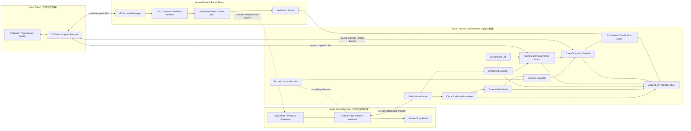
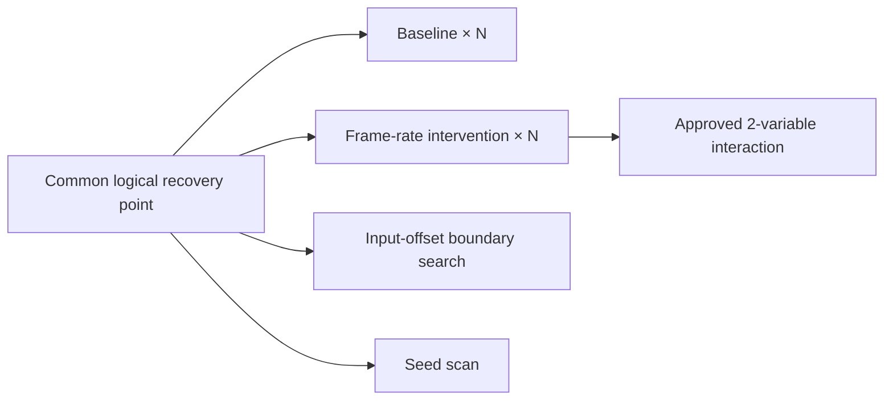

# ChronoRift Game-native Agent Harness 总体架构

> 状态：目标架构（Target Architecture）；决策日期：2026-08-04；当前实现：ChronoRift v0.3.2
> 开发中的受控 Godot 诊断/评测垂直切片。历史 V2 正式报告完整性有效、Gate 失败；
> V3 可靠性路径已实现；历史 C0/C1-004 报告虽各自为 ready，但强化 verifier 将其 V1
> linkage 归为 `legacy_only`。implementation-bound 的 C0/C1-005 均已 hardened-ready；新 formal
> campaign 尚未执行。
> 本文同时定义尚未实现的完整
> Godot、修复与验证能力。
>
> 关键词：Godot-first、Runtime Experiment、Game Contract、Checkpoint、Replay、Causal Evidence

## 1. 架构命题

ChronoRift 不是“给通用编码 Agent 增加几个 Godot 工具”，而是把游戏运行时变成一个可恢复、
可干预、可重复、可裁决的实验环境，再让 Agent 在这个环境里提出假设和候选修复。

它的核心价值不来自模型比 Claude Code 更聪明，也不来自 Pi SDK 本身。Pi SDK 负责 Agent
Loop、Session、模型调用与工具调度；ChronoRift 的壁垒来自通用代码 Agent 默认不具备的游戏
运行时基础设施：

1. 用可执行 Game Contract 表达设计意图和时序约束。
2. 从同一个逻辑世界起点创建 matched intervention 实验分支。
3. 把游戏状态、Signal、输入、生命周期、空间关系和日志编译为时空世界图。
4. 通过重复 replay 测量确定性，而不是假设游戏确定。
5. 用渐进式 probe 获取最小充分证据，而不是把全量帧日志发送给模型。
6. 把候选 patch、Git worktree、游戏构建、checkpoint 和验证结果绑定为一个可审计事实链。

ChronoRift 对外只作以下可验证承诺：

> 对已经安装 ChronoRift 插件、拥有版本化 Game Contract、且运行时能力满足对应 Contract
> 要求的 Godot Bug，ChronoRift 提供通用代码 Agent 在未采用等价运行时实验基础设施时默认
> 不能原生、稳定提供的可恢复实验、matched intervention evidence 和机器裁决闭环。

如果 Claude Code 或其他 Agent 接入完整的 ChronoRift 工具，它也能使用这些能力；优势属于
Harness，而不属于某个模型品牌。所谓“绝对优势”是需要通过同模型 head-to-head 基准验证的
产品假设，不是未经测试即可成立的宣传结论。

## 2. 与通用代码 Agent 的结构性差异

| 维度       | 通用代码 Agent 的默认工作单元 | ChronoRift 的工作单元                                      |
| ---------- | ----------------------------- | ---------------------------------------------------------- |
| 被调试对象 | 文件、命令和文本日志          | 带时钟、实体身份和 Contract 的运行中世界                   |
| 正确性来源 | 模型对代码和日志的解释        | Harness 对冻结 Game Contract 的机器评测                    |
| 复现       | 临时启动游戏并人工描述结果    | checkpoint + trace + seed + environment 的版本化 replay    |
| 实验       | Agent 自由修改参数后再次运行  | 共同祖先上的类型化干预和可比性检查                         |
| 时间       | 墙钟时间和日志顺序            | process frame、physics tick、模拟时间和偏序关系            |
| 状态       | 日志片段或临时 Inspector 读取 | 可查询的双层时空 Game World Graph                          |
| 非确定性   | 常被当成噪声或偶发失败        | 重复 replay、首次漂移和结果分布组成的确定性证书            |
| 上下文     | 原始日志、源码和截图          | 带出处、闭合窗口和限制条件的 Causal Capsule                |
| 修复判定   | 测试通过或模型认为已修复      | 原 Bug 复现、目标 Contract、边界矩阵和回归晶格             |
| 可恢复性   | Agent 对话与工作区状态        | Pi Session、Git、build、checkpoint、trace、branch 全部关联 |

## 3. 目标与边界

### 3.1 首要任务

首要胜负手是运行时 Bug 的完整闭环：

```text
复现 → 采集 → 违反 Contract → 编译证据 → 提出假设
    → matched intervention 实验 → 定位 → 隔离修复 → replay 验证
```

优先覆盖：

- 帧率、Timer、输入采样和调度相关的时序 Bug；
- Signal 连接、断开、顺序和缺失；
- Node/实体生命周期、对象池复用和场景切换；
- gameplay 状态机、任务状态和属性传播；
- 物理 tick、接触、碰撞边界和空间条件；
- 随机种子、异步资源加载和保存/恢复问题。

### 3.2 非目标

- 首版不支持无插件的黑盒诊断模式。
- 首版不覆盖 Shader、像素错误和纯视觉 UI Bug。
- 首版只实现单个本地 Godot 进程；多人能力只预留协议字段。
- 不修改或 fork Pi SDK。
- Agent 不直接编辑开发者当前工作区，也不拥有任意 shell。
- Harness 不自动授权最终 merge、发布或部署。
- 不承诺任意 Godot 项目都能达到字节级确定性或完整内存恢复。

视觉能力未来作为与 tick、camera、entity、checkpoint 对齐的可选 Sensor；它可以补充证据，
但不能覆盖 Game Contract 的最终裁决。

## 4. 不可违反的架构规则

以下使用 MUST 表示实现不得绕过的规则。

1. Game Contract MUST 携带版本、内容哈希、作者/审批者和适用范围，并且是 pass/fail 的最高
   权威。
2. Runtime 产生不可信观测，Harness 校验后产生事实和 verdict；Agent 只产生假设、实验提案和
   候选 patch。
3. Agent 自报 confidence MUST NOT 决定 `confirmed`；可信等级由 Harness 的证据门槛计算。
4. 每个结论 MUST 引用不可变 evidence、execution、evaluation 和 checkpoint；只有源码级 claim
   MUST 引用真实源码位置，其他结论使用 `source/config/resource/engine/external/unknown`
   等 typed locus。
5. 每个 BranchSpec MUST 在创建后不可变且具有可追溯共同祖先；Execution/EventLog 只能追加并在
   seal 后不可变；比较前 MUST 通过可比性检查。
6. 干预 MUST 类型化并记录 requested value、realized value、作用域和观测到的副作用；未实际
   施加的参数不得算作实验。
7. replay 分歧、事件丢失、背压、缓冲覆盖和时钟不确定性 MUST 成为 artifact，不能被规范化
   静默抹平。
8. 并发事件 MUST 保留偏序；展示层不得伪造一个不存在的全局因果顺序。
9. entity ID MUST 包含 incarnation/lifetime，避免对象池复用或场景重载后身份串联。
10. checkpoint MUST 声明 capture consistency model 和 adapter 语义 barrier，并携带覆盖
    范围、在途状态、缺失状态与恢复限制；不得伪称引擎全局静止。
11. BranchSpec、Execution/EventLog、evidence 和 certificate 等原始事实 MUST 只追加；状态转换写成
    事件。manifest/index 可以使用版本化 CAS head，但 MUST 保留历史版本；schema 升级通过
    派生视图完成并保留原始内容哈希。
12. 候选 patch MUST NOT 修改冻结的 Contract、评测器、ChronoRift 插件或测试基线来获得通过。
13. 所有 Agent 工具 MUST 受 capability、路径、调用次数、时间和运行成本预算约束。
14. 源码、日志、节点名和游戏文本 MUST 视为不可信数据，不能成为工具指令。
15. 证据不足时系统 MUST 返回 `inconclusive` 和下一项最小实验，不得强行输出根因。
16. 未修改版本未达到 Contract 预声明的确定性或统计复现门槛时，候选 patch MUST NOT 被
    宣称为有效修复。

## 5. 系统总览



最小可信计算基包括：

- 被测进程外冻结的 Contract bundle、审批根和 canonical evaluator；
- schema/sensor-health 校验、Clock & Identity Normalizer；
- verdict 所依赖的 deterministic World Graph reducer 和 Capsule verifier；或者由 Gate 直接从
  raw artifact 独立重算同一结果；
- artifact 身份、schema、哈希和 lineage 校验；
- 实验执行器、比较器和 Conclusion Gate；
- 权限策略和 Verification Gate。

游戏代码、运行时插件、遥测 payload、Agent、模型供应商、候选 patch 和持久化介质都不能单独
作为真相来源。Addon 产生的是带 sensor health 的“观测”，只有通过上述校验和 Contract
评测后才能成为 Harness 事实。项目仓库中的 Contract 文件只是来源；canonical frozen bundle
及其预期 hash/审批信息在被测进程外固定，Addon 只接收由 Host 编译的 probe plan。

Artifact 每次读取仍需重新校验。存储在同一用户权限下的 hash ledger 能检测意外损坏，不能
抵抗同权限恶意篡改；需要防篡改保证时，必须将 head hash 锚定到独立签名、CI attestation 或
外部只写存储。

## 6. 三个核心坐标系

### 6.1 Execution Fingerprint 与 Comparison Basis

每个实际 Execution 都有完整 `ExecutionFingerprint`：

```text
source commit + dirty patch/worktree hash
+ game build/import-cache hash
+ Godot version + platform + renderer/physics configuration
+ adapter/protocol/plugin version
+ Contract bundle hash
+ checkpoint descriptor + restore recipe + coverage hash
+ input trace hash + InputMap hash
+ all registered RNG domains
+ runtime controls and typed interventions
+ telemetry schema + probe/filter profile
```

strict replay 要求完整 fingerprint 相等。干预实验则使用三部分定义：

- `MatchSpec`：基线与候选必须相等的坐标；
- `InterventionSpec`：唯一允许不同的坐标及预期副作用；
- `ComparabilityResult`：运行后实际差异、realized value 和发现的混杂项。

因此 matched-pair 的两个 Execution fingerprint 本来就不同，但除 InterventionSpec 外的
Comparison Basis 必须相等。即使 fingerprint 完全相同，也不保证真实游戏产生相同结果；它
只定义应该被测量是否一致的条件。

### 6.2 World / Process / Peer

所有事件从第一版开始携带：

```text
worldId
processId
peerId?          # 首版为空，预留多人
entityId?
incarnation?
clock
sequence
```

单进程内按 clock domain 和 sequence 建立稳定顺序；未来跨进程只建立可证明的
happens-before 和逻辑时钟关系，不强行线性化。

### 6.3 Session / BranchSpec / Execution / ExperimentNode / CodeBranch

- 一个调查默认保持一个 Pi Session。
- 一个 Pi Session 可以创建多个不可变 BranchSpec；GameBranch 不会隐式分叉 Pi Session。
- 每次执行 BranchSpec 产生一个 append-only Execution，seal 后不可变。
- ExperimentNode 聚合同一实验条件下的一组重复 Execution。
- ExperimentEdge 表示两个节点之间的 InterventionSpec。
- 每个候选 patch 使用独立 Git worktree，即一个 CodeBranch。
- 一个 CodeBranch 可以关联多个 BranchSpec/ExperimentNode，用不同 checkpoint、seed 和运行
  条件验证同一 patch。

这三个分支维度必须显式关联，不能只靠目录名或 Agent 对话记忆。

## 7. Game Contract：设计意图的机器权威

Game Contract 是版本化、可哈希、可执行的声明式规则。自然语言或 Agent 可以生成 Contract
草案，但只有经过开发者审批并冻结的版本才具有裁决权。

canonical Contract 只在 Host 侧 evaluator 执行。Addon 可以用编译后的 probe plan 做环形缓冲
冻结或 provisional trigger，但它不能生成最终 pass/fail。

概念示例：

```yaml
id: gameplay.switch_opens_door
version: 2
authority:
  approved_by: gameplay-team
scope:
  scene: level/test_switch_door
  entities:
    switch: entity://fixture/switch
    door: entity://fixture/door
when:
  signal:
    source: $switch
    name: activated
then:
  eventually:
    property: $door.open
    equals: true
within:
  physics_ticks: 2
replay_policy:
  required_checkpoint_level: L1
  repetitions: 3
observation:
  required_probes:
    - signal_connections
    - property:door.open
```

Contract Engine 逐步支持：

- `always`、`never`、`eventually within` 等安全性和活性规则；
- Signal/输入/属性/生命周期事件序列；
- gameplay state machine 的合法转换；
- 空间、碰撞、接触和距离条件；
- 资源加载、场景切换和对象释放；
- 性能预算与 deadline；
- 精确比较、预声明容差和统计判定策略。

Contract 只能证明“本次运行违反了这个冻结版本的规则”。如果 Contract 本身陈旧或错误，
ChronoRift 不能据此声称产品设计意图必然错误。

## 8. 双层时空 Game World Graph

### 8.1 语义层

Agent 默认查询紧凑、稳定的语义层：

- 实体身份、incarnation 和生命周期；
- scene/resource 归属、parent/child、owner、subscriber 等关系；
- transform、速度、碰撞层、接触和空间邻接；
- gameplay 状态机及关键属性；
- 输入、Signal、日志、错误和异步任务；
- process/physics tick、模拟时间与偏序；
- 状态读取、写入、调度、生成和销毁关系。

### 8.2 Godot 原始层

语义节点保留可追溯的原始引用，例如 scene resource、相对 NodePath、脚本、方法、Signal、
Godot instance ID 和引擎版本。原始引用用于定位，不充当跨 replay 的稳定身份：

- NodePath 会因重命名、重挂载和场景实例化变化；
- instance ID 只在当前进程生命周期内有效；
- 静态节点优先使用项目显式 `chronorift_id`，可回退为 scene resource UID 与 owner 内相对路径；
- 动态实体由注册过的 spawn source、语义 key 和 spawn ordinal 做匹配；ordinal 在非确定性
  replay 中未必稳定，因此匹配结果必须带 confidence，并允许 `ambiguous`；
- 对象池复用时必须增加 incarnation。

### 8.3 边的证据等级

世界图禁止把“时间相邻”直接命名为因果关系。边必须区分：

- `observed-before`：只证明偏序；
- `signal-subscription`：证明存在订阅关系；
- `scheduled-by` / `spawned-by`：由运行时相关 ID 证明；
- `engine-guaranteed`：来自已知 Godot 调度语义；
- `contract-declared`：来自设计规则；
- `intervention-supported`：matched intervention evidence 支持该机制；
- `candidate-cause`：Agent 提议但尚未验证。

UI 可以展示一条线性事件链，但 canonical artifact 必须保留原始偏序和边的证据类型。

## 9. Godot Runtime Bridge

### 9.1 组成

Godot 接入包含两个不同组件：

1. `EditorPlugin`：安装、版本检查、Contract/Probe 配置和自动注册 Autoload。
2. `ChronoProbe` Autoload：在运行时负责握手、tick 标记、实体注册、输入、采集、
   checkpoint hook 和本地通信。

Godot 官方插件机制允许 EditorPlugin 自动注册 Autoload，因此项目接入不需要修改引擎源码。
插件安装以官方
[Making plugins](https://docs.godotengine.org/en/stable/tutorials/plugins/editor/making_plugins.html)
能力为基础。Autoload 必须尽可能早地注册；在它之前已经发生的初始化事件属于明确的观测盲区。

### 9.2 Host 与传输

TypeScript `godot-adapter` 负责：

- 在 `127.0.0.1` 启动临时 TCP server；
- 生成单次运行 token；
- 使用明确的 Godot binary、project、scene 和运行参数启动子进程；
- 完成协议版本和 capability 握手；
- 处理命令、事件、背压、心跳、stdout/stderr、进程退出和 artifact 落盘。

Runtime Autoload 作为 client 主动连接本地 Host。首版使用长度前缀的 JSON message，不把控制
协议混入 stdout；stdout/stderr 专门保留给早期日志和崩溃证据。Godot 官方
[StreamPeerTCP](https://docs.godotengine.org/en/stable/classes/class_streampeertcp.html)
与 [TCPServer](https://docs.godotengine.org/en/stable/classes/class_tcpserver.html)
提供跨平台基础。传输层由 port 隔离，未来可以替换为 binary codec 或其他本地通道。

每个消息 envelope 至少包含：

```text
protocolVersion, schemaVersion, requestId?
investigationId, worldId, processId, peerId?
clock, sequence, messageKind
payload, payloadHash
```

握手返回准确的 engine/build/platform 指纹和 capability set，例如：

```text
observe.scene_tree
observe.signal_allowlist
observe.property_sampling
control.input
launch.fixed_fps
checkpoint.L0
checkpoint.L1
checkpoint.L2
seed.registered_rng
```

不支持的能力必须明确拒绝，不得静默接受命令。

### 9.3 时钟、step 与进程隔离

首版每个 BranchSpec Execution 启动独立 Godot 进程，避免 Autoload、进程内缓存、deferred
call 和单例状态在实验间泄漏。磁盘 import cache、`user://`、系统服务和外部状态仍可能跨
Execution 共享，必须由 MatchSpec 固定或声明为缺失域。运行时区分：

- physics tick；
- idle/process frame；它不等同于真实 rendered/presented frame；
- simulation time；
- host monotonic time；
- wall-clock 仅用于审计，不参与确定性比较。

Godot `SceneTree` 暴露 `physics_frame`、`process_frame`、节点增删改名和 pause 状态，适合建立
观测边界，详见官方
[SceneTree](https://docs.godotengine.org/en/stable/classes/class_scenetree.html)。
Godot 命令行支持 `--headless` 与 `--fixed-fps`，适合 CI 和受控速率 replay，详见
[Command line tutorial](https://docs.godotengine.org/en/stable/tutorials/editor/command_line_tutorial.html)。

但是 GDScript 没有真正的引擎硬单步 API：

- `SceneTree.paused` 会停止物理、碰撞和部分 callback，它不是不改变语义的单步；
- `physics_frame` 在节点 `_physics_process()` 之前发出，不是完整 physics tick 的结束回执；
- 一个 idle frame 可能执行多个 physics tick；
- `physics_ticks_per_second` 是整数，不能承诺 Mock 中任意微秒 `deltaUs` 都可实现。

因此 Runtime port 不应假装执行了请求值，而要返回真实回执：

```text
StepReceipt {
  logicalTick
  idleFramesExecuted
  physicsTicksExecuted
  actualIdleDeltas[]
  actualPhysicsDeltas[]
  engineFrame
  physicsFrame
  phase
}
```

`launch.fixed_fps` 是整数进程启动参数，改变它意味着以新参数启动分支进程后恢复逻辑起点；
`runtime.physics_ticks_per_second` 和 `runtime.time_scale` 才是运行期控制。输入相位只允许
adapter 握手中声明的离散注入点。无法精确实现的请求必须拒绝或返回量化后的 realized value。
更强的 engine-level step 可能需要 GDExtension、自定义 MainLoop 或更深引擎能力，不属于首版。

### 9.4 输入注入

输入轨迹按 adapter 支持的离散 clock phase 安排，使用 `InputEventAction` 和
[`Input.parse_input_event`](https://docs.godotengine.org/en/stable/classes/class_input.html#class-input-method-parse-input-event)
注入。Trace 同时记录：

- InputMap hash；
- viewport/窗口条件；
- 按下和释放配对；
- requested/realized tick 与 phase；
- Godot 无法模拟的 OS 焦点、设备驱动或真实鼠标行为。

`Input.action_press()` 只改变查询状态，不触发完整 `_input()` 路径，不能作为默认 replay
注入方式。

### 9.5 可观测能力与限制

在 probe 成功连接之后，Addon 可以对其 allowlist 范围提供：

- SceneTree node added/removed/renamed；
- Contract allowlist 中 Signal 的连接和回调；
- tick 边界上的 allowlist 属性采样；
- 项目通过 `record_transition()` 主动上报的瞬时属性变化；
- 输入注入；
- 运行中且脚本系统仍可工作的日志/错误。

Host Process Supervisor 独立收集 stdout、stderr、日志文件、退出码、hang、signal 和 crash
backtrace；真正崩溃后不能依靠 GDScript 回调。结构化 runtime Logger 是版本和 capability
相关能力，不能成为所有 Godot build 的默认保证，详见官方
[Logging](https://docs.godotengine.org/en/stable/tutorials/scripting/logging.html)。

必须明确：

- Godot 没有 GDScript 全局“任意 Signal 已发出”hook，只能连接预先选择的 Signal；
- 任意属性也没有统一的高保真变化通知，边界采样会漏掉同 tick 内“改变后又恢复”；
- Resource、RID、线程对象和不在 SceneTree 的对象，除非项目主动注册，否则不可见；
- 子线程事件不能假设与主线程具有稳定全序；
- 新增 Signal listener 本身属于 observer effect；收到回调只证明该 probe 被 dispatch，不证明
  其他 subscriber 已执行，也不自动证明源代码级根因。

关键 Signal 和瞬时状态应使用显式项目 API，例如 `ChronoRift.emit_observed()` 和
`ChronoRift.record_transition()`。这种有意识的深度接入正是插件必装策略的一部分。

### 9.6 随机源

项目必须向插件注册 gameplay RNG 域。Godot 的 `RandomNumberGenerator` 可以保存 seed 和
内部 state，官方文档也明确其适合 replay 场景，详见
[Random number generation](https://docs.godotengine.org/en/stable/tutorials/math/random_number_generation.html)。
未注册的全局 RNG、第三方库随机源、物理线程和外部服务都进入 checkpoint 缺失列表。

## 10. 渐进式观测与观察者效应

### 10.1 三档采集

| Profile    | 用途           | 目标预算               | 数据策略                                           |
| ---------- | -------------- | ---------------------- | -------------------------------------------------- |
| Sentinel   | 常驻飞行记录器 | 平均 CPU ≤1%，固定内存 | Contract 关键事件、tick、生命周期和环形窗口        |
| Diagnostic | 定位候选根因   | 平均 CPU ≤5%           | Agent 请求的定向 Signal、属性、状态机和空间 probes |
| Forensic   | 短窗口深挖     | 按时间/字节硬限制      | 高频采样、调用相关、深状态和未来可选视觉 Sensor    |

百分比是项目验收目标，不是跨游戏的无条件保证。每个 profile 必须记录 capability 能提供的
指标及其数据来源。首版保证记录插件自身耗时、进程 RSS、idle/physics 帧时间、
`Performance` 可用指标、事件丢失/合并/覆盖/背压、缓冲占用和 Contract 命中率。

主线程/physics thread 的完整 p50/p95/p99 attribution、逐帧分配量和深度 profiler 数据只在
对应 debug/GDExtension capability 可用时记录；缺失时必须显示为 unavailable，不能填零。
Godot `Performance` 指标的范围和刷新限制见官方
[Performance](https://docs.godotengine.org/en/stable/classes/class_performance.html)。

Contract 关键事件不能被静默丢弃。发生丢失时，相应观察窗口标记为不完整，Conclusion Gate
必须降低结论或强制弃权。

### 10.2 渐进式闭环

```text
Sentinel ring buffer
  → Contract 触发或引擎异常
  → 冻结故障前后窗口
  → World Graph 增量归约
  → 编译第一份 Causal Capsule
  → Agent 请求最小新增 probe
  → 从同 checkpoint 以 Diagnostic profile replay
  → 聚合关联证据并保留各 Execution/profile 的来源
```

不同 profile 来自不同 Execution，不能把它们的事件拼成一条虚构 timeline；只能通过共同逻辑
起点、MatchSpec 和独立 Capsule 建立关联。

### 10.3 Observer-effect 对照

每次深度实验都包含 minimal-probe 对照分支。Harness 只在两个 profile 共同拥有的 canonical
projection 上比较事件顺序，同时比较帧时分布、内存和 Bug 命中率；Diagnostic 新增事件不会
被误判成游戏分歧。若 probes 改变结果，证据必须带 `observerEffectRisk`，并尝试更轻量 probe
或重复实验。该对照只能测量 Diagnostic 相对 Sentinel 的影响，不能证明 Sentinel 自身没有
观察者效应。

## 11. 分级 Checkpoint

| Level | 恢复方式                        | 典型用途                                 | 主要限制                                     |
| ----- | ------------------------------- | ---------------------------------------- | -------------------------------------------- |
| L0    | 新进程 + 场景重启 + 输入快进    | 无存档项目、最小 fixture                 | 慢，受早期非确定性影响                       |
| L1    | 游戏原生 save/load              | 已有保存系统的项目                       | 通常缺失 Timer、Signal 队列和瞬时物理状态    |
| L2    | ChronoRift participant 语义快照 | 已注册实体、状态机、RNG、pending effects | 依赖项目 adapter，不能覆盖全部引擎内部状态   |
| L3    | 引擎/进程级快照                 | 极难恢复的短窗口问题                     | 首版不支持；平台相关且可能包含不一致外部状态 |

Level 不是单一可信度排名。每个 checkpoint 都必须生成 `CheckpointCertificate`：

```text
level
captureConsistencyModel
adapterSemanticBarrier
environment/build/protocol fingerprints
coveredStateDomains[]
missingStateDomains[]
externalDependencies[]
rngDomains[]
pendingAsyncOperations[]
restoreRecipeHash
restoreValidation[]
portability
limitations[]
```

checkpoint 在 adapter 声明的语义 barrier 捕获，例如某个项目约定的 tick 边界并完成插件
缓冲复制；这不是 Godot 全局 quiescence。证书必须列出未排空的 deferred call、Timer、异步
加载、worker、网络和外部域。

L2 只恢复注册 `CheckpointParticipant` 控制的实体拓扑、值、RNG、引用、Signal connection、
timer 和 pending effects；普通 Timer 的内部精确相位、coroutine、SceneTreeTimer、Tween、
线程、网络和物理接触缓存不能自动恢复。恢复后必须校验语义 hash 和 coverage。
[`PackedScene.pack()`](https://docs.godotengine.org/en/stable/classes/class_packedscene.html)
不是完整运行时快照。

## 12. Determinism Lab：测量确定性

严格 replay 不是一次 digest 相等测试，而是一组重复实验：

1. 从相同 ExecutionFingerprint 重复运行 baseline。
2. 对 Contract 相关的 canonical semantic projection 做精确比较。
3. 对预声明容差字段做容差比较。
4. 保存原始分歧并定位 first divergence frontier。
5. 统计 Contract 结果、事件时间和状态值的分布。
6. 输出 `DeterminismCertificate`，标明稳定字段、随机字段、未控制来源和适用范围。

确定性分类不是全局标签，而是对投影和 Contract 的声明：

- `unmeasured`：尚未重复；
- `semantic-exact`：在证书记录的环境、样本数 N 和相关语义投影内观察到完全一致；
- `bounded-stochastic`：结果在预声明分布/容差内；
- `uncontrolled`：分歧超出模型，不能支撑强因果结论。

所有运行都保留 raw divergence。规范化只决定比较语义，不能删除原始异常。真实物理即使在
看似相同的运行条件下也不保证确定；跨平台或 Godot patch version 更不能假设 bit-exact
replay。因此 ExecutionFingerprint 定义 matched conditions，而不是确定性证明，参见官方
[Physics introduction](https://docs.godotengine.org/en/stable/tutorials/physics/physics_introduction.html)。

## 13. GameBranch 自适应因果实验图

GameBranch 从“timeline 的副本”升级为 append-only Experiment DAG。BranchSpec、sealed
Execution 和 ExperimentEdge 创建后不可变；ExperimentNode 聚合一组已执行 Execution：



首批干预类型：

- `launch.fixed_fps`、`runtime.physics_ticks_per_second`、`runtime.time_scale`；
- `input.tick_offset`、`input.interval`、`input.jitter_profile`；
- `rng.seed`、`rng.state`；
- 受 allowlist 保护的 checkpoint 状态；
- scene/build/platform 配置；
- probe profile；
- code patch。

默认策略是 matched-pair 单变量实验。证据不足时，Experiment Planner 可以在预算内执行重复
试验、二分边界搜索、seed 扫描和预先声明的两变量交互实验。

“只改变一个配置字段”不等于没有混杂。例如修改 frame delta 会同时影响 Timer、物理积分和
输入采样。因此每个 intervention 还要保存：

```text
declaredTarget
requestedValue
realizedValue
expectedSideEffects
observedEnvironmentDiff
comparisonPolicy
```

Comparability Gate 检查共同祖先、MatchSpec、Contract/probe 版本、实际干预和意外环境差异。
探索阶段的所有尝试都进入 artifact，但“完整记录”本身不能消除选择偏差：

1. adaptive search 只生成 exploratory hypothesis；
2. outcome、停止规则、重复次数和多重比较策略随后冻结；
3. 使用未参与搜索的新 seed/新重复集进行 confirmatory run；
4. 只有 confirmatory evidence 才能将机制升级为 confirmed。

报告区分 `contract-violation-confirmed`、`association-supported`、
`mechanism-supported` 和 `unique-root-cause-confirmed`，不得把一次干预命中直接描述为唯一
根因。

## 14. Causal Capsule

Agent 不直接消费完整 World Graph 或原始日志。Evidence Compiler 为一次 Contract 失败生成
紧凑、可扩展的 Causal Capsule：

```text
capsuleId
contract ref + frozen hash
closed observation window
trigger and expected deadline
relevant entities and incarnations
state diff, including unchanged/missing negative evidence
typed event/relationship subgraph
missing expected events
baseline and matched-intervention outcomes
checkpoint and determinism certificates
observer-effect and event-loss flags
source/build/branch/probe provenance
known limitations
next minimal probe candidates
```

编译过程：

```text
Raw runtime events
  → schema validation and identity normalization
  → incremental World Graph
  → Contract window evaluation
  → relevance/causal slicing
  → state and lifecycle diff
  → matched-intervention comparison
  → immutable Causal Capsule
```

Capsule 只陈述系统事实和规则违规。“某行代码是根因”属于 Agent hypothesis，只有经过
intervention 和 Conclusion Gate 才能升级为 Harness 结论。

## 15. Agent 与 Pi 边界

Pi SDK 继续负责 provider/model 选择与认证、Pi Session、Agent Loop、模型调用、工具执行和
Session 文件持久化。ChronoRift 不修改 Pi 源码。

新增 SDK-neutral `agent-protocol`，定义 `InvestigationApi`、`DiagnosisProposal` 和工具
DTO；`pi-harness` 只负责把这些 DTO 适配到 Pi。正式 `DiagnosisReport` 由 Harness 生成，
避免 Pi 层和 domain 出现两套漂移的权威报告。

Agent 工具分组：

- 证据：读取 Capsule、查询 World Graph、展开原始引用；
- 观测：建议 probe，查看成本和 event-loss；
- 实验：计划、fork、repeat replay、边界搜索、compare；
- checkpoint：查看能力和覆盖报告；
- 源码：受限 read/search；
- 修复阶段：向独立 worktree 提交结构化 patch；
- 验证：启动允许列表中的 build/Contract/regression action；
- 提交：`submit_diagnosis_proposal`，不能直接提交 canonical verdict。

上下文编译遵循“最小充分证据”：初始只发送 Capsule，源码和更深图查询按需返回并设字节/token
预算。Agent 必须引用本次工具返回的真实 ID，不能发明 branch、evidence 或运行结果。

游戏日志、源码注释和字符串中的提示都放在不可信数据区；它们不能改变 system policy 或提升
工具 capability。

## 16. Conclusion Gate 与强制弃权

`DiagnosisProposal` 明确区分：

- Observed facts：只能引用 Harness artifact；
- Hypotheses：Agent 的候选机制；
- Claims：希望升级为 probable/confirmed 的结论；
- Unknowns：尚未控制的变量；
- Next experiment：证据不足时的最小下一步。

Conclusion Gate 至少检查：

1. Contract authority 和 hash 是否冻结；
2. baseline 是否达到 Contract 声明的复现次数/命中率；
3. checkpoint coverage 是否满足该 Contract；
4. 是否存在关键事件丢失、时钟不确定或高 observer effect；
5. 比较分支是否具有共同祖先并通过 comparability；
6. 对 mechanism/root-cause claim，intervention 是否真实施加、隔离且结果支持候选机制；
7. evidence、evaluation、source 和 branch 引用是否完整；
8. 自适应实验预算与停止规则是否合规。
9. 机制级 claim 是否通过独立 confirmatory run，而不只是 exploratory search 命中。

前七项中 Contract authority、最低 checkpoint/replay 质量、关键数据完整性、comparability、
引用完整性，以及机制/根因 claim 所需的干预隔离，共同构成 Evidence Admissibility Gate。
任何最低条件缺失都必须是 `inconclusive`，不能降格为 `probable` 来绕过。

若 capability 不足、checkpoint 损坏或预算耗尽，Agent 可以不创建不可执行的实验，直接提交
包含 attempted actions、blockers、已有事实和 next minimum experiment 的弃权 proposal。

Agent 的 confidence 仅作为 proposal 元数据。Harness 根据 policy 生成：

- `confirmed`：通过 admissibility、预声明强门槛和需要的 confirmatory run；
- `probable`：已经通过最低 admissibility，但仍有未排除替代解释或未达到强门槛；
- `inconclusive`：缺少关键证据，并附下一项最小实验。

canonical report 还要分别记录 Contract violation、association、mechanism 和 root-cause
uniqueness 的 claim level，避免一个总状态掩盖不同证据强度。

## 17. 隔离修复与 Verification Lattice

修复能力只在诊断和 replay 稳定后开放：

1. Worktree Manager 从已记录的 source revision 创建独立 Git worktree。
2. Agent 只能修改允许列表路径，并受文件数、diff 大小和调用预算限制。
3. Contract、Harness evaluator、ChronoProbe、benchmark ground truth 和原始测试基线被冻结并
   记录哈希。
4. 为 baseline/candidate 创建独立 OS principal/namespace/container，使用只读源码挂载、
   最小可写 artifact/cache 目录、默认禁网、凭据剥离、CPU/内存/进程/时间限额和退出清理。
5. 所有 build script、Godot import/tool plugin 和游戏运行都在该隔离边界内执行；patch 构建
   产物获得新的 build hash。
6. baseline 与 patch build 使用相同的逻辑恢复起点；Checkpoint Compatibility Gate 验证旧
   snapshot 是否能在新 build 恢复。不兼容时生成经语义等价校验的新 checkpoint，不能强行
   复用旧二进制状态。

验证晶格按顺序执行：

1. **Reproduction Gate**：未修改版本达到 Contract 预声明的确定性或统计复现门槛。
2. **Target Gate**：patch 后目标 Contract 通过。
3. **Boundary Gate**：frame rate、seed、input jitter 边界矩阵通过。
4. **Behavior Gate**：已知因果锥之外的关键语义投影没有非预期变化。
5. **Regression Gate**：相关 Contract、headless 测试和性能预算通过。
6. **Integrity Gate**：冻结资产没有被修改，遥测质量没有降低。
7. **Review Gate**：输出可审阅 patch、证据和限制；默认由人类决定 merge。

因果锥之外没有观测到变化只能提供回归证据，不能证明绝对无回归；报告必须保留这一限制。
Agent 新增的测试可以作为候选材料，但不能成为该 patch 自己唯一的通过依据。

Git worktree 只隔离代码版本，不是安全沙箱。开发者显式关闭 OS/container 隔离时，Execution 必须
标记为 `unsafe-local-execution`，且不能宣称已满足不可信代码执行边界。

## 18. Artifact 与可恢复性

目标布局：

```text
.chronorift/
├── contracts/<bundle-hash>.json
├── checkpoints/<checkpoint-id>/
│   ├── descriptor.json
│   ├── certificate.json
│   └── adapter-owned/
├── traces/<trace-id>.json
├── investigations/<investigation-id>/
│   ├── manifest.json
│   ├── audit.jsonl
│   └── pi-sessions/*.jsonl
├── branches/<branch-id>/branch.json
├── executions/<execution-id>/
│   ├── events.jsonl
│   ├── world-deltas.jsonl
│   └── result.json
├── experiments/<experiment-id>.json
├── determinism/<certificate-id>.json
├── evidence/<capsule-id>.json
├── diagnoses/<report-id>.json
├── patches/<candidate-id>/
│   ├── patch.diff
│   ├── build.json
│   └── verification.json
└── migrations/<derived-view-id>.json
```

`branch.json` 保存不可变 BranchSpec；每次执行产生独立 Execution/EventLog，执行期只追加，
seal 后不可变。ExperimentNode 只引用一组 Execution。manifest 是可重建索引，其 CAS head
可以更新，但每个 revision 都要保留，不能覆盖掉历史事实。

Investigation manifest 关联：

- Pi Session/provider/model；
- Git commit、dirty patch 和 worktree；
- Godot binary、平台、renderer、physics backend、import cache 和 game build；
- adapter/protocol/plugin/schema 版本；
- Contract/probe bundle；
- checkpoint/coverage、trace、InputMap、seed/RNG domains；
- ExecutionFingerprint、MatchSpec、InterventionSpec、BranchSpec/Experiment DAG；
- evidence、diagnosis、patch 和 verification；
- 数据外发 audit。

JSON/JSONL 是首版实现，不是领域契约。原始 artifact 只追加；迁移器读取旧 schema、生成新
derived view，并保存 source hash、migration version 和结果 hash。

## 19. Local-first、安全与数据外发

Godot 进程、源码、checkpoint、原始遥测、视频和 artifact 默认全部留在开发机或 CI。
发给模型的数据必须经过 Egress Policy：

```text
LocalOnly     # 不得外发
ModelAllowed  # 可按原文外发
Redacted      # 脱敏后外发
Denied        # 工具不得读取
```

每次模型调用和工具结果记录 provider、model、payload hash、分类、脱敏规则、字节/token 数和
关联 artifact。Local-first 不等于零外发；Causal Capsule、源码片段和工具输出仍可能进入火山
模型服务，必须在审计中可见。

其他安全边界：

- bridge 只绑定 loopback，使用单次 token 和协议握手；
- loopback token 只防误连接，不能证明消息一定来自 Addon 而不是同一被测进程中的游戏代码；
  所有 payload 仍按不可信观测处理；
- baseline 与 patched build 的构建脚本、Godot import/tool plugin 和游戏进程都在默认禁网、
  无凭据、受资源限额的 OS/container 边界执行；
- artifact ID 不直接接受路径，所有路径经过 canonical containment；
- Agent 无权读取用户级 Pi 凭据；
- 外部日志和项目内容不能请求新增权限；
- build/test action 使用显式 allowlist；
- 超预算、协议不兼容、schema 未知或引用损坏时 fail closed。

## 20. 目标模块结构

保留现有 `domain ← gamebranch ← adapters ← CLI` 方向，在稳定边界上增加少量专用包：

```text
chronorift/
├── apps/
│   ├── cli/
│   └── benchmark-runner/
├── packages/
│   ├── domain/                 # engine-neutral IDs、clock、artifact DTO
│   ├── game-contracts/         # Contract AST、compiler、evaluator
│   ├── world-model/            # graph reducer、index、query、causal slice
│   ├── gamebranch/             # replay、experiment DAG、gates
│   ├── agent-protocol/         # SDK-neutral tools 与 DiagnosisProposal
│   ├── pi-harness/             # Pi SDK adapter
│   ├── godot-protocol/         # versioned wire schema/capabilities
│   ├── godot-adapter/          # process host 和 runtime ports
│   ├── json-artifacts/         # local append-only repository
│   ├── worktree-manager/       # Git candidate patch/lineage adapter
│   ├── execution-sandbox/      # build+run 的 OS/container isolation 与资源策略
│   └── mock-game/              # characterization fixture
├── integrations/
│   └── godot/addons/chronorift/
├── fixtures/
│   └── godot-switch-door/
└── benchmarks/
    └── godot-runtime-bugs/
```

不立即拆出更多小包。Experiment Planner、Determinism Lab、Conclusion Gate 和 Verification
Lattice 先作为 `gamebranch` 内部 service；只有依赖和生命周期稳定后才独立。

核心不能导入 Pi SDK、Godot Node/Variant/NodePath、JSON 文件布局或 Git 实现。Godot 原生类型
只能存在于 addon、wire protocol 或 adapter。

新 Runtime 能力使用窄接口组合，而不是继续向现有 `GameEnvironmentPort` 添加大量 optional
方法：

```text
ProcessLifecycleCapability
ObservationCapability
ProbeCapability
InputInjectionCapability
CheckpointCapability
SeedControlCapability
StepCapability
```

不支持的能力返回显式 capability error。当前 Mock 通过兼容 adapter 继续实现已有 frame-step
端口。Artifact persistence 同样拆成 WorldModel、Experiment、Determinism、Audit、Patch 和
Verification 等窄 repository port，避免现有大接口继续膨胀。

推荐依赖方向：

```text
domain ← game-contracts
domain ← world-model
game-contracts + world-model ← gamebranch
gamebranch ← godot-adapter / json-artifacts / worktree-manager / execution-sandbox
domain ← agent-protocol ← pi-harness
domain + gamebranch + agent-protocol ← GameBranch bridge
所有组件 ← CLI composition root
```

`godot-protocol` 只共享版本化 wire DTO，不把 Node 或 Variant 泄漏到 domain。

## 21. 当前实现映射与已知缺口

旧 Phase 1 的 `RunManifest`、`BranchRecord/BranchRun`、`EvidenceBundle` 与 `DiagnosisReport` 保留
兼容。v0.3 runtime/experiment 继续使用 schema v2，并提供 `FailureBriefV1`、
`EvidenceAccessReceiptV1` 与 `DiagnosisProposalV3`。已发布 campaign 的 Benchmark spec/result/report v2、
canonical hash 与 verifier 继续按原字节重验。当前 v0.3.2 campaign 新增独立的 Benchmark V3
schema/repository/runner；它不静默迁移、替换或覆盖任何 V2 artifact。

| 目标能力     | v0.3 当前锚点                                     | 已实现状态                                                                                                                                                                          | 下一步                                      |
| ------------ | ------------------------------------------------- | ----------------------------------------------------------------------------------------------------------------------------------------------------------------------------------- | ------------------------------------------- |
| Contract     | `FrozenContractV2`、content-addressed ID          | 四个 Fixture 各一个冻结 temporal property Contract                                                                                                                                  | 从真实项目提取最小 Contract bundle          |
| Runtime port | `GameEnvironmentPort`、Godot Protocol v2          | 独立 Godot 4.7.1 进程、能力握手、realized controls                                                                                                                                  | 仓库外真实项目验证 adapter API              |
| Checkpoint   | certificate + participant/state-provider registry | Fixture L2 语义恢复；entity Fixture 额外捕获 pending effects/sequence                                                                                                               | restore divergence characterization         |
| Replay       | sealed `V03ExecutionLog` + semantic digest        | confirmed 要求一次 matching strict replay                                                                                                                                           | 重复 replay 与 Determinism Certificate      |
| GameBranch   | immutable v2 BranchSpec + intervention            | baseline、两候选目录、最多两个单变量分支、canonical comparison                                                                                                                      | matched pair 边界搜索                       |
| Telemetry    | v2 typed event ledger                             | input/signal/delivery/property/lifecycle/spatial/pending-effect + health/clocks                                                                                                     | async/resource 与更细 input phase           |
| Evidence     | `EvidenceCapsuleV2`                               | Contract window 加递归 causal ancestors，保留 expected/actual 与 loss flag                                                                                                          | 通用 causal slice，不先实现完整 World Graph |
| Agent        | `FailureBriefV1` + 三组盲化 Pi tool flow          | byte-identical prompt；neutral source view；content-addressed receipt 由 Session-local `@rN` handle 引用；Pi 工具强制 sequential                                                    | egress audit 与 prompt-injection suite      |
| Verdict      | `DiagnosisProposalV3` → v0.3 Conclusion Gate      | 重验 receipt/candidate/replay/compare/lineage/mechanism；confidence 无裁决权                                                                                                        | 更一般机制策略                              |
| Benchmark    | V2 历史路径 + `BenchmarkSuiteSpecV3`              | V3 typed provider cause、结构化单调 progress、3+3 recovery、严格 terminal manifest、细分预算与 prose-free scoring proof 已实现；004 为历史 `legacy_only`，005 C0/C1 均为 `hardened` | V3 spec → freeze → formal                   |
| Artifact     | run repository + append-only benchmark ledger     | strict write-once path、attempt hash chain、终态恢复、raw-to-proof seal 与 sanitized publisher                                                                                      | 外部签名或 CI attestation                   |
| Patch        | 无                                                | 未实现                                                                                                                                                                              | 证据稳定后再引入 worktree/sandbox           |

v0.3 仍有以下明确限制：

1. 四个小型 Fixture 依赖显式插桩，不构成任意 Godot 项目的通用运行时模型。
2. checkpoint 不恢复物理内部、线程、异步、cache、外部服务或未注册 RNG。
3. confirmed 只要求一次 matching replay 与一项通过的单变量干预，不是完整 Determinism Certificate。
4. logical/process/physics/host clocks 已区分，但没有 rendered/presented frame，也不承诺精确单步。
5. Capsule 是 Contract window 与已记录 causal ancestors 的闭合切片，不是双层 World Graph。
6. source read/search 使用 neutral virtual view、调用预算和 access receipt，但尚无完整 egress audit 或
   OS sandbox。
7. 旧 Phase 1 覆盖写 artifact 留作兼容；v0.3 诊断使用 run-scoped write-once 路径，formal benchmark
   另用 append-only attempt ledger。
8. report hash/验证器可发现内部不一致，但不是 provider attestation，也不能抵抗同权限重写整个证据包。
9. 三次 repetition 没有 provider sampling seed；四个 Fixture 又参与实现校准，不能声称统计显著性或
   跨项目泛化。v0.3.1-r2 虽记录 2,527,181 tokens 与 146 次工具调用，但 32/36 cells 被底层连接错误
   主导，另外 4 个为工具流违规或进度超时，Gate 失败。V3 修复了错误归类与调度边界，
   当前已完成两次 Luna smoke，三份 `not_ready` C0、历史 `legacy_only` 004 以及 implementation-bound
   hardened-ready 005 C0/C1，但尚无 formal report，仍不能评价 treatment 差异。
10. 没有自动修复、worktree、Verification Lattice、视觉、多 Agent、容器或复杂 UI。

这些限制是目标架构与可执行 v0.3 之间的 backlog，不应描述成已经完成的能力。

## 22. 失败与降级策略

| 情况                      | Harness 行为                                    |
| ------------------------- | ----------------------------------------------- |
| 未安装插件                | 本架构下拒绝 game-native 诊断，不伪装为完整模式 |
| 协议或 schema 不兼容      | fail closed，保留握手 artifact                  |
| checkpoint 覆盖不足       | 降低可用 Contract 范围或返回 `inconclusive`     |
| replay 漂移               | 生成 divergence artifact，进入 Determinism Lab  |
| 关键事件丢失              | 使对应 observation window 无效                  |
| probe 改变 Bug 命中率     | 标记 observer effect，回退轻量 probe/repeat     |
| Contract 可能错误         | 只报告违反该 Contract，不自动修改它             |
| Agent 超时/拒绝/非法 JSON | 保留 Session 和实验，允许换模型恢复             |
| patch 构建失败            | 候选失败，不影响其他 worktree                   |
| 外部服务不可控            | 记录依赖并限制结论，不伪造 replay 等价          |
| 分支预算耗尽              | 停止扩展，返回已有事实和最有价值的下一实验      |

## 23. 分阶段落地

### ChronoRift v0.1：Mock 最小垂直闭环（已实现）

- strict TypeScript/pnpm monorepo，一个 switch-door Mock Fixture；
- content-addressed frozen Contract、checkpoint/restore 与 realized receipts；
- 原始 baseline、一个新 baseline replay、一个 one-tick input intervention；
- typed `signal_delivery`、sealed Execution、comparison 与 closed Evidence Capsule；
- 真实 Pi Session/Agent Loop，默认通过 deterministic faux model 离线运行；
- Agent Proposal 与 Harness Conclusion Gate 分离；typed mechanism assertion 逐字段重验，confidence
  不决定 verdict；
- write-once v0.1 JSON artifact 与跨进程 `replay --execution`。

验收：原始 baseline/replay 均 fail，唯一 intervention pass；引用完整时由 Gate confirmed；证据
不足时 inconclusive；伪造/跨 run 引用 fail closed。

### Phase 1.1：事实与安全继续加固

1. 为 checkpoint 增加 consistency、barrier、coverage、missing-state 与 nondeterminism 描述；
2. 从单次 replay 演进到重复 replay、稳定投影与最小 Determinism Certificate；
3. 把 v0.1 固定工具 DTO 演进为 SDK-neutral agent protocol，而不急于创建空包；
4. 完成调用/time/byte/token budgets、egress 分类/脱敏/audit 与 prompt-injection 测试；
5. 为 write-once artifact 增加 manifest/CAS head 历史和非破坏 schema migration；
6. 清理旧 Phase 1 confidence/report/branch 覆盖写路径，不把 legacy debt 带入 Godot Adapter。

验收：损坏、不完整或不稳定 artifact 都得到可诊断失败/弃权，且 v0.1 回归套件保持通过。

### Phase 1.2：在 Mock 上建立语义实验内核

1. entity/incarnation、clock domains 和跨帧关系；
2. Contract v2 与当前 TemporalInvariant 兼容器；
3. 流式 World Graph、Sentinel ring 和 Causal Capsule；
4. observation profile 与 observer-effect 报告；
5. 在 Mock 上验证重复 replay、精确语义投影和 Determinism Certificate 服务；
6. matched pair、边界搜索和 seed scan。

验收：先在 Mock 中验证新服务边界，避免一边调 Godot 协议一边重写核心语义。

### Phase 2：最小 Godot 垂直闭环

1. 固定准确 Godot patch version；
2. Godot addon/Autoload、TCP 握手和 capability discovery；
3. per-process headless/fixed-fps launch controls、真实时钟回执和 InputEvent 注入；
4. stable entity registry、allowlisted Signal/property/lifecycle；
5. Sentinel profile；
6. 先实现 L0，再实现 fixture 专用 L2；
7. Godot switch/door fixture 复用同一 Contract suite。
8. 建立 head-to-head benchmark scaffold 和第一批 fixture case。

验收：真实 Godot 进程完成 Contract → Capsule → fork → replay → canonical diagnosis，且采集
开销与 observer-effect 数据可见。

### ChronoRift v0.3：benchmark-first 多机制垂直切片（已实现）

- Protocol v2 与四个真实 Godot Fixture：Signal 顺序、frame/time、physics sampling、entity reuse；
- Contract/Trace/Execution/Capsule v2、Proposal v3、Failure Brief/access receipt 与 run-scoped write-once
  artifact；
- stable entity incarnation、lifecycle/spatial/pending-effect evidence、fixed FPS/physics TPS/Fixture
  control receipt；
- entity-reuse 使用跨 tick 延迟 effect：旧 incarnation target 在复用后被错误按 stable ID 解析；
- 每 Fixture 两个 allowlisted 单变量候选，Agent 最多运行两个；
- generic、evidence-only、chronorift-full 三组真实 Pi Session tool flow，prompt/Failure Brief byte-identical，
  source 使用 neutral virtual path，游戏与源码预算冻结；
- `BenchmarkSuiteSpecV2` 固定的 4 × 3 × 3 formal matrix、append-only attempt ledger、typed retry/resume、
  sanitized report、完整性验证与独立 grounded-success Gate；
- 默认 fake model 离线验编排；真实 provider report 非默认 CI gate。

验收：四个 full-arm fake-model Fixture 均 baseline fail、matching replay fail、正确单变量候选 pass，
由 Harness confirmed；高 confidence 缺少实验仍 inconclusive；v0.1/v0.2 回归保持通过。正式 GLM-5.2
36-cell execution 已从独立 freeze tag 完成并如实发布：报告完整性验证通过，但所有 cell 都在一次
baseline 后以 `proposal_missing` 结束，三组 grounded success 均为 0/12，Gate 失败。该结果验收了
formal ledger/publisher 的负结果路径，没有验收真实模型的诊断能力。

### Phase 2.5：非确定性与自适应实验

- 在真实 Godot 上实现重复 replay、首次漂移、稳定投影、容差和分布比较；
- 帧率边界二分、seed 扫描和受预算限制的两变量实验；
- checkpoint/determinism/observer-effect 进入 Conclusion Gate。

### Phase 3：隔离修复与验证

- Worktree Manager、Execution Sandbox、保护资产和受限 patch；
- build hash 与 BranchSpec/Execution 绑定；
- 七层 Verification Lattice；
- 输出可审阅 patch，不自动 merge。
- 运行包含修复与回归指标的完整 head-to-head 对照。

### Phase 4：后置能力

- tick/entity/camera 对齐的视觉 Sensor；
- coordinated multi-process checkpoint 和网络干预；
- 更大规模实验调度；
- 在证据证明需要后再评估 UI 和多 Agent。

## 24. Head-to-head 基准

ChronoRift 与通用 Agent 使用：

- 同一模型、provider、thinking level；
- 相同 token、墙钟时间和游戏运行预算；
- 同一源码版本与隐藏 Bug；
- 相同基础读码和运行权限；
- 相同的 Contract 设计意图文本，避免 ChronoRift 组独占答案提示；
- 统计插件安装、Contract 编写和 benchmark 维护成本。

v0.3 已设置三组：`generic`（raw runtime + replay/experiment）、`evidence-only`（Capsule + replay）
和 `chronorift-full`（Capsule + replay/experiment/canonical compare）。三组使用同一模型、byte-identical
prompt/Failure Brief、neutral `case/main.gd` source view、source call 预算，以及 baseline 1、replay 1、
intervention 2、总游戏执行 4 的冻结上限；tool availability 是唯一 treatment。隐藏 oracle 只在 Agent
提交后评分。v0.3 尚未衡量插件接入与 Contract 编写的人力成本，因此 formal report 最多证明这四个
校准 Fixture 上的诊断差异。

v0.3 主指标不是模型自报 confidence 或单独 mechanism accuracy，而是
`groundedSuccess = mechanismCorrect && canonical verdict == confirmed`。预注册 Gate 要求 full arm 至少
9/12 grounded successes、full 相对 generic 至少 +0.20，且 full incorrect confirmations 为 0。完整性
验证与 Gate 使用不同命令；有效负面/incomplete report 仍应发布。v0.3.1-r2 正式 GLM-5.2 report 已
发布并通过内部完整性验证，但 full 与 generic 均为 0/12，Gate 失败，因此没有可发布的优势结论。
本地 raw ledger 显示 32 个 `proposal_missing` 的底层 message 为 `Connection error`，另外 2 个
`invalid_tool_flow`、2 个 `progress_timeout`；sanitized formal report 本身不导出底层 message，不能把
公开 terminal code 强行归因为 provider 根因，也不能把非零 token aggregate 解释为有效 treatment 对比。

v0.3.2-luna 保持相同的 4 × 3 × 3 treatment 问题和 Gate，但用独立 Benchmark V3
身份修复评测基础设施：provider failure 保留阶段/code/status/retry class；progress 分开
fixture、model、tool、game 和 proposal；只有诊断进展前的 transient 故障可在 3 次 initial
attempts 与唯一 3-attempt recovery cycle 内重试。诊断进展后的 provider/超时/进程中断
均不重试且不计分。所有 Agent 工具 sequential，预算为 12 次调用、0 次工具错误和
0 个连续无语义进展结果；`@rN` receipt handle 只是 Session 内对已签发 receipt ID 的短引用。

当前这些修复已有离线回归，两次 Luna smoke 均以 5 次工具调用获得 Harness
`confirmed`，total tokens 为 30,828 / 30,039，`test:live` 通过。C0-001、C0-002 与 C0-003
均为 `not_ready` 并已原样保留；历史 C0/C1-004 六个 cells 都是零 tool errors、零无进展违规、
零 incorrect confirmation，但其 V1 linkage 在强化 verifier 下仅为 `legacy_only`，不能授权新
C1 或 freeze。implementation-bound 005 C0/C1 已完成：两阶段均 `ready`，verifier 的
`prerequisiteEligibility` 均为 `hardened`，C1 精确绑定 C0 report hash；六个 cells 均 mechanism correct，
且零 tool errors、零无进展违规、零 incorrect confirmation。machine spec、freeze tag 与正式
36-cell execution 仍是 pending。在 report/Gate 实际产生之前，不得声称 Luna 下的 game-native
treatment 优势已被验证。

Bug 集至少覆盖 frame/timer、Signal 生命周期和顺序、Node 复用与 scene reload、
physics/contact 边界、RNG、异步资源、input sampling 和 save/restore。

主要指标：

- 首次成功复现率；
- 根因定位准确率和错误根因率；
- 修复后 Contract 通过率和错误修复率；
- 独立机器 replay 成功率；
- 回归引入率；
- `inconclusive` 的校准质量；
- 人工介入次数；
- 从失败到首个可信 evidence 的时间；
- 模型 token、游戏运行次数和 telemetry 成本。

只有当 ChronoRift 在主要指标上显著领先，且接入成本可接受，才对外宣称 game-native 优势已被
验证。

## 25. Grill 决策记录

本架构依据本轮 `$grill-me` 明确选择：

1. v1 胜负手：运行时 Bug 闭环；
2. Godot 项目必须安装运行时插件；
3. 可执行 Game Contract 是最高裁决权威；
4. 确定性内核 + 非确定性包络；
5. 候选修复进入隔离 Git worktree；
6. Godot-first，核心保持可扩展；
7. 渐进式观测；
8. L0–L3 分级 checkpoint；
9. Harness 产出事实，Agent 产出假设；
10. 自适应因果实验图；
11. 分层 Verification Lattice；
12. 双层时空 Game World Graph；
13. 严格同模型 head-to-head 基准；
14. Sentinel ≤1%、Diagnostic ≤5% 的目标预算及 observer-effect 对照；
15. 单进程优先，协议预留 multiplayer；
16. 视觉作为后置关联 Sensor；
17. Local-first 控制面和外发审计；
18. 证据不足时强制 `inconclusive`。

这些决策共同限定了 ChronoRift：它首先是一个可信的游戏运行时实验系统，其次才是一个使用
大模型的编码 Agent。
