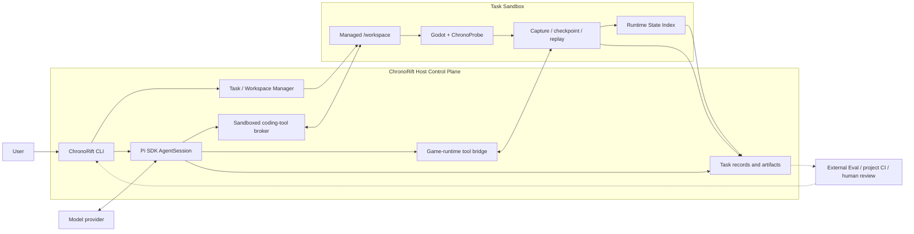

# ChronoRift Game-native Agent Harness 目标架构

> 状态：vNext 目标架构；决策日期：2026-08-06；当前可执行版本：ChronoRift v0.4.0。
>
> vNext 尚未实现。当前 v0.4 仍是受控诊断 workflow：它禁用通用 coding tools，要求固定的
> Capsule/replay/intervention/compare/proposal 流程，并由 Harness 产生 canonical verdict。本文定义的
> sandbox、自由 Pi Loop、rolling black box、Runtime State Index 和新 game tools 都是下一条垂直切片的
> 目标，不得描述成当前能力。
>
> v0.1–v0.4 schema、artifact、benchmark spec、ledger、报告与冻结 tag 保持不可变。新路径不会静默迁移、
> 覆盖或重新解释历史结果。

## 1. 产品契约

ChronoRift 是一个基于 Pi SDK 的 **game-native Agent Harness**。ChronoRift 拥有产品 Harness，Pi 是
ChronoRift 选择的 Loop Engine。

目标产品契约是：

> Harness 只保证 Agent 的文件、命令和游戏操作在受控环境中被真实执行，并把真实输出返回给 Agent；
> Agent 负责自主调查、修改代码、选择并运行验证手段，并根据结果迭代；任务结果由 Agent 根据实际工具
> 执行结果产生；ChronoRift 的成功表示 Agent Loop 正常完成、留下候选修改，并展示它实际执行过的命令、
> 游戏操作和验证结果，不表示系统已经从逻辑上证明 Bug 必然被彻底修复。

这里的“真实”有严格但有限的含义：ChronoRift 可以证明某个受控动作被请求、是否被执行、runtime
实际返回了什么、哪些数据被捕获以及哪些数据缺失；它不能保证游戏自身上报的内容正确，也不能保证
Agent 对工具结果的最终叙述正确。

因此：

- `completed` 是 Agent Loop 和交付生命周期状态，不是 `verified` 或 `fixed` 的同义词；
- 对要求修改代码的任务，候选 diff、实际工具记录和已执行验证结果是可审阅交付物；
- Agent 可以犯错、遗漏测试、误读日志或高估修复效果；用户通过 diff、命令输出、execution lineage 和
  项目自己的 CI/review 接受或拒绝结果；
- ChronoRift 产品路径不产生 `confirmed`、`probable`、`inconclusive`、canonical diagnosis 或
  canonical fix verdict；
- 项目测试、断言和未来可选 Game Contract 都是 Agent 可以调用的验证手段，不是 Harness 的最高权威；
- 协议、schema、权限、路径、资源和 requested/realized receipt 校验仍属于环境安全与真实性边界，
  不属于 Bug 结论验证。

## 2. 核心价值

普通 coding agent 加一个基础 Godot MCP，已经可以启动游戏、读取日志、查看 SceneTree、注入输入和截图。
ChronoRift 必须提供更难由普通工具临时拼装的运行时原语，否则没有理由成为独立 Harness。

| 维度       | 普通 coding agent + 基础 Godot 工具 | ChronoRift 目标能力                                               |
| ---------- | ----------------------------------- | ----------------------------------------------------------------- |
| 工作单元   | 当前进程和当前文件                  | 有身份、lineage 和 capture coverage 的 Execution                  |
| 失败历史   | 失败后才开始读日志                  | 有预算的 pre-failure rolling black box                            |
| 状态恢复   | 重启场景或重新操作                  | 带 manifest、fidelity 和缺失域的 checkpoint/restore               |
| 实验分支   | 手工重跑并修改参数                  | 从已授权 Execution/checkpoint/build/workspace 任意 fork           |
| 输入复现   | 再次模拟输入                        | 区分 tick/phase 的 trace replay 与 realized receipt               |
| 时间       | 日志顺序和墙钟                      | process frame、physics tick、simulation time、host monotonic time |
| 运行时查询 | 当前 SceneTree 或文本日志           | 可重建、可查询的 Runtime State Index                              |
| 跨运行比较 | 人工比较输出                        | 实体、时钟、状态和 coverage 对齐后的描述性 diff                   |
| 不确定性   | 常被隐含忽略                        | first divergence、uncontrolled state 和 observer effect 显式返回  |

ChronoRift 的创新命题是：

> Codex 式自主 coding-agent Harness
>
> - 游戏运行时 checkpoint/fork
> - phase-aware replay
> - 可查询的世界状态
> - 跨 Execution 的语义对齐与比较。

世界结构帮助 Agent 查询“发生了什么、何时发生、哪些状态不同”；为什么发生、哪个机制成立以及修复是否
正确，留给 Agent、项目测试、外部 Eval 和人类 review。

## 3. 目标与非目标

### 3.1 目标

1. 让 Pi Agent 在隔离 workspace 中拥有正常 coding-agent 自由：读码、搜索、执行命令、修改文件、运行
   测试以及调用 game-runtime tools。
2. 为 Godot runtime 提供有诚实边界的 capture、checkpoint、restore、fork、replay、query 和 compare。
3. 让工具能力可组合、可重复、可并发演进，不把某条诊断步骤写进 Harness 状态机。
4. 保留实际执行、资源消耗、安全拒绝、capture coverage、lineage 和结果，供 Agent 与用户审阅。
5. 先用一个窄的真实 Godot 垂直切片证明 game-native 原语，再扩展外部项目和公开 benchmark。

### 3.2 非目标

- 不重新实现 Pi 的 Session、Agent Loop、模型调用或工具调度。
- 不要求 Agent 按 Capsule → replay → intervention → compare → proposal 的固定顺序工作。
- 不由 Harness 生成根因、因果边、下一实验建议或 canonical verdict。
- 不承诺任意 Godot 项目都能零配置捕获 gameplay 私有状态。
- 不承诺 GDScript Addon 可以完整快照 physics internals、线程、coroutine、网络或外部服务。
- 不把 Git worktree 当成 OS sandbox，也不让 Agent 直接修改用户当前工作区。
- 不自动 merge、commit、push、发布或部署候选修改。
- vNext 首个切片不实现视觉诊断、多 Agent、多人游戏、跨机器分支或通用 Contract DSL。
- 产品 Harness 不持有 hidden benchmark oracle，也不根据自己的输出给自己评分。

## 4. 不可违反的架构规则

以下规则使用 MUST 表示实现不得绕过。

1. ChronoRift MUST 通过官方 Pi SDK 创建 `AgentSession`，由 Pi 执行模型调用、工具调度、消息历史、
   compaction 和 Loop 终止；ChronoRift 不得再实现第二套 Agent Loop。
2. Agent MUST 可以在任务 sandbox 内使用正常的 coding tools；Harness 不得因为诊断阶段或既定 workflow
   禁止本来已授权的动作。
3. Game tools MUST 按 capability、资源依赖和安全权限校验调用，而不是按全局 phase machine 校验。
   “checkpoint 不存在”是资源错误；“还没有先读 Capsule”不是合法的环境错误。
4. 工具失败 MUST 以可诊断结果返回 Agent，并在安全允许时让 Loop 继续；一次工具错误不得自动成为
   Session 终止条件。
5. Runtime control MUST 返回 requested value、realized value、作用范围、实际时钟位置和已知副作用；
   请求本身不是执行事实。
6. 外部数据、游戏日志、源码文本、节点名、资源字符串、插件输出与模型最终文本 MUST 视为不可信内容；
   它们不能提升 capability 或改变 sandbox policy。
7. Execution、checkpoint、trace、capture window 和 comparison MUST 带版本化 schema、稳定身份和
   lineage；外部及持久化数据每次读取都重新验证。
8. Checkpoint MUST 声明 captured、reset、externally-controlled、unsupported 和 uncontrolled 状态；
   未声明状态不得默认为相等或已恢复。
9. Restore success MUST 只表示已声明状态被成功写回；后续 replay 只能暴露所选投影和窗口内的
   divergence，即使没有观察到 divergence，也不能据此证明完整实验起点等价。
10. Fork MUST 允许 Agent 在权限和资源预算内改变任意代码、build、adapter、probe、input、seed 或运行
    参数，并把所有已知变化写入 lineage；Harness 不得替 Agent 禁止“设计不佳”的探索实验。
11. Compare MUST 只描述捕获范围内已知和可观测的差异、匹配歧义、coverage 差异与混杂项；它 MUST NOT
    声称某个差异导致了结果或某项假设已被证明。
12. Event loss、降采样、buffer overwrite、clock uncertainty、observer effect、restore 缺口和首个 replay
    divergence MUST 可见，不能被规范化静默删除。
13. Agent 最终结果 MUST 使用普通 Pi assistant 输出；Harness 不得要求固定 Proposal schema、receipt
    引用仪式或唯一 submit 工具来结束 Loop。
14. 用户当前工作区、宿主凭据和未授权网络 MUST 与 Agent 命令隔离；越权动作必须在执行前拒绝并记录
    结构化安全事件。
15. 历史 raw artifact MUST 保持不可变；新 schema 通过新 namespace 或派生只读视图演进。
16. 当前代码、目标设计和外部 Eval 结果 MUST 在文档中明确区分，计划能力不得写成已经实现。

## 5. 系统总览



ChronoRift 拥有 CLI、任务生命周期、sandbox policy、Pi composition、game tools、runtime substrate 和结果
展示。Pi 是 Loop Engine；Godot 项目、模型和 Agent 产生的修改都在不可信任务边界内。

Host control plane 对以下有限事实负责：

- 创建了哪个任务 workspace 和 sandbox；
- 哪个工具调用被接受、拒绝或执行；
- 命令的 exit code、stdout/stderr 和文件 diff；
- runtime 返回的消息、健康状态和 requested/realized receipt；
- artifact 的 schema、identity、lineage 和捕获覆盖。

它不对以下内容背书：

- 游戏遥测是否代表完整世界；
- Agent 的假设或最终报告是否正确；
- 某次 pass 是否证明修复无回归；
- 某个 compare 差异是否具有因果意义。

## 6. 任务生命周期

目标默认流程是：

```text
用户启动 chronorift 并提供项目与目标
→ CLI 解析项目、provider/model、sandbox 与 capture 配置
→ 创建任务级 managed workspace 和 execution sandbox
→ 准备 Godot Addon、项目配置与已声明 snapshot adapter
→ 使用 Pi SDK 创建 AgentSession
→ 启用 Pi coding tools、ChronoRift game tools、AGENTS.md 与 skills
→ 调用 session.prompt(user goal)
→ Pi Agent Loop 自主读码、执行、观测、实验、修改和验证
→ 模型输出普通最终结果，当前 turn 结束
→ ChronoRift 展示 diff、工具记录、Execution lineage 和资源/安全记录
→ 停止 Godot 与残留子进程，撤销临时网络/凭据授权
→ 保留 Session、workspace 和 artifact，直到用户继续、应用或显式清理
```

一次 `session.prompt()` 返回不关闭整个任务。用户可以在同一 Pi Session 和同一 managed workspace 中
继续追问。自动清理只针对运行进程和临时授权；任务代码与 artifact 采用显式 discard 或保留期策略。

## 7. Task Workspace 与执行沙箱

### 7.1 Workspace 语义

Pi Session 的 `cwd` 指向任务级 `/workspace`。它来自宿主项目的 Codex 式 managed Git workspace，
不是用户正在编辑的原始 checkout。具体 Git 物化机制可以按平台演进，但必须满足：

- 每个任务有独立、可审阅、可丢弃的代码视图；
- Agent 修改不会直接落入用户当前工作区；
- 宿主 refs、其他 worktree 和 Git 配置不能被任务命令任意修改；
- ChronoRift 能稳定提取 diff/patch，并在用户明确选择后 handoff/apply；
- worktree/workspace 是版本隔离机制，不被宣称为安全沙箱。

该产品语义参考 Codex 的
[managed worktrees](https://learn.chatgpt.com/docs/environments/git-worktrees)，但 ChronoRift 不依赖其
私有实现。

### 7.2 OS 边界

`bash`、`edit`、`write`、构建脚本和 Godot 子进程运行在 ChronoRift 管理的无特权容器或等价 Linux
namespace sandbox 中：

- 默认只允许写 `/workspace`、任务临时目录和 artifact 目录；
- 宿主文件系统默认不挂载；必要输入只读挂载并经过 canonical containment；
- 网络默认关闭；显式开启时只能访问任务配置的域名或服务 allowlist，并阻止局域网、link-local 和宿主
  管理端口；
- 用户凭据、SSH Agent、云 Token、浏览器数据和宿主环境变量默认不继承；
- 需要的短期凭据按任务、工具和目标服务授权，不进入游戏进程或普通命令环境；
- Godot 在同一任务 sandbox、独立进程组和 CPU/内存/进程/时间限制中运行；
- headless 是默认模式；图形、音频、GPU 和显示代理只按显式 capability 开放；
- 越界动作在执行前拒绝，写入结构化 security event，并作为工具错误返回 Agent。

Pi Host 可以在 sandbox 外使用用户的 Pi credential store 调用模型；工具子进程不得继承这些凭据。
这与 Codex 将 sandbox 作为自主行动技术边界的模式一致，参见
[Codex sandboxing](https://learn.chatgpt.com/docs/sandboxing.md)。

## 8. Pi SDK 集成

当前仓库固定使用 `@earendil-works/pi-coding-agent@0.83.0` 和
`@earendil-works/pi-ai@0.83.0`。已安装 package 的 source、types、docs 和 examples 是实现 API 的
权威；升级 Pi 必须单独执行兼容测试。

vNext 采用 Pi 官方推荐的 programmatic embedding：

- `ModelRuntime` 负责 provider/model 与用户 credential store；
- `createAgentSession()` 创建单个 Agent Session；需要 Session replacement 时使用
  `AgentSessionRuntime`，不自行复制其生命周期；
- `SessionManager` 持久化和恢复 Session；
- `DefaultResourceLoader` 加载项目 `AGENTS.md`、skills、extensions 和 context；
- `defineTool()` / `customTools` 或等价 extension API 注册 ChronoRift game tools；
- `session.subscribe()` 驱动进度、工具记录与结果 UI；
- `session.prompt()` 启动当前 turn，并由 Pi 决定正常 Loop 终止。

Pi 官方 SDK 文档见 [pi.dev](https://pi.dev/docs/latest/sdk)。

### 8.1 Prompt 与资源

- 保留 Pi 默认 coding-agent system prompt，不再用诊断 workflow 整段覆盖；
- ChronoRift 只追加短小环境说明：sandbox 边界、game tool 语义、fidelity、coverage 和缺失数据；
- 正常加载任务 workspace 中适用的 `AGENTS.md`；其内容不能改变 Host 或 sandbox policy；
- 正常启用 Pi skills；ChronoRift 可以提供 game-runtime debugging skill，介绍常见方法但不规定必选步骤；
- 工具描述只说明能力、输入、输出、权限、成本和失败行为，不使用 `call first`、`only after` 或
  `exactly once`；
- 项目内容或 runtime 文本不能覆盖 system/sandbox policy。

### 8.2 Coding tools

vNext 显式启用 Pi 提供的 `read`、`bash`、`edit`、`write`、`grep`、`find` 和 `ls`。其中 Pi 0.83.0
默认启用的是 `read/bash/edit/write`，其余工具由 ChronoRift 显式选择；所有工具的底层文件与命令操作都
必须指向任务 sandbox。单纯给 `createAgentSession({ cwd })` 传 workspace 路径不等于完成安全隔离；
具体 tool backend 必须受 sandbox broker 约束。

### 8.3 终止与失败

- 不提供唯一 `submit_diagnosis_proposal` 终止工具；
- 不因为第一次 tool error 自动 `abort()`；
- 安全拒绝、资源不足、runtime crash 和 unsupported capability 都作为结构化工具结果进入 Loop；
- 用户取消、显式超时、不可恢复的 Pi/provider failure 或 Host 自身失败才终止当前 turn；
- 最终 assistant 文本与实际工具记录分别保存，前者不能覆盖或改写后者。

## 9. Runtime 资源模型

vNext 使用少量稳定资源组织游戏运行历史：

| 资源            | 含义                                                             |
| --------------- | ---------------------------------------------------------------- |
| `Task`          | 一个用户目标、Pi Session、workspace 和 runtime artifact 集合     |
| `Build`         | source revision、workspace diff、Godot/import 配置与构建输出身份 |
| `Runtime`       | 一个正在运行或已终止的 Godot 进程及其 negotiated capabilities    |
| `Execution`     | 一次从明确 build/scene/config/trace 起点产生的实际运行记录       |
| `CaptureWindow` | rolling buffer 中被 pin 的时间窗口及覆盖/丢失信息                |
| `Checkpoint`    | 某个语义 barrier 上按 manifest 捕获的可恢复状态                  |
| `Trace`         | 输入与控制事件及其目标 tick/phase                                |
| `Branch`        | 从 Execution/checkpoint/build/workspace 派生的 lineage edge      |
| `Comparison`    | 两个 Execution 的描述性对齐与差异结果                            |

资源 ID 是稳定、不透明的业务身份，但不承担 Session capability 仪式，也不能被解释为文件路径。工具直接
返回资源 ID；每次使用仍验证任务归属、权限、schema 和存在性。

Execution 在运行中追加记录，终止后 seal。其 manifest 至少描述：

```text
task / workspace / source / diff / build
Godot / platform / runtime / addon / protocol
scene / launch parameters / environment controls
snapshot adapters / probes / capture policy
checkpoint or recovery recipe
input trace / registered RNG configuration
requested and realized controls
clock domains / observation coverage / loss
parent lineage
```

该 manifest 说明已知运行条件，不证明两次运行确定，也不作为 comparison Gate。

## 10. Rolling Black Box

Agent 尚未识别 Bug 时，ChronoRift 目标默认滚动保留最近 10 秒、最多 600 个 tick 的低成本黑匣子数据；
达到任一窗口边界时开始淘汰旧数据，并在 capture metadata 中记录实际生效的边界：

- 输入事件及 requested/realized tick/phase；
- process frame、physics tick、simulation time 与 host monotonic timeline；
- SceneTree 与已注册实体生命周期；
- 结构化日志、crash/hang/error；
- 已注册 RNG 的 seed/state 变化；
- 已启用 probe 事件；
- 周期性的轻量状态摘要。

这些值是首个切片的 Capture Policy 目标默认值，不是跨项目无条件性能保证。默认任务预算目标为：

- 内存最多 256 MB；
- 磁盘最多 1 GB；
- 平均运行开销不超过基线帧时间的 5%；
- 单次主线程采集不阻塞超过 2 ms。

Runtime 必须记录实际开销。超出预算时降低采样率、合并或丢弃低优先级数据，并保留 dropped/overwritten
标记；不能通过暂停游戏伪装满足预算，也不能静默隐藏任何通道的数据损失。

Capture Policy 决定 rolling data 与可恢复 checkpoint 的触发和采样策略，并综合项目预配置的 snapshot
adapter、当前 Execution 开始前已注册的 trigger，以及 Agent 针对后续 Execution 提交的通道和采样请求。
请求表达调查意图；runtime 在能力与上述预算内决定实际采集，并把 realized profile、降采样和丢失情况
返回给 Agent。

### 10.1 Freeze 与 pin

Ring buffer 自动冻结于可客观检测的异常，例如：

- crash、进程退出或 assertion failure；
- 主线程 hang/timeout；
- 结构化 engine error；
- 任务开始前已注册的 capture trigger 命中。

Gameplay 语义 trigger 由项目开发者、用户或 Agent 显式定义，只是“值得保存附近历史”的 capture hint。
Trigger 命中不表示 Bug 已确认、可选项目 Contract/测试失败或根因成立。

用户或 Agent 可以随时 pin 当前窗口。若关键历史已经覆盖，工具返回
`history_window_unavailable`，同时返回仍可用的 timeline、首个可见异常和 coverage gap；Agent 可以扩大
后续窗口、提高特定通道采样率或新增 trigger 后重新运行。

若失败前历史仍在，但没有可恢复 checkpoint，工具返回 `pre_failure_checkpoint_unavailable`，并附上仍
保留的 input trace、事件 timeline、首个可见异常和状态覆盖缺口。Agent 可以新增 probe 或 snapshot
adapter、提高后续采样率，再次运行并等待问题重现；系统不得把普通历史窗口冒充等价分叉起点。

## 11. Checkpoint 与 Restore

### 11.1 零 adapter 模式

这里的“零 adapter”只表示项目没有编写 snapshot adapter，不是无插件黑盒模式；它仍依赖
ChronoProbe/Host runtime bridge。此时 ChronoRift 只保证捕获自己控制且可重建的执行外壳：

- source/build identity；
- 启动场景、项目配置和运行参数；
- 已记录 input trace；
- seed 配置；
- 基础日志和 capture metadata。

它不保证任意 gameplay 私有字段、对象关系、Timer、pending effect、状态机或异步任务可恢复。零 adapter
模式可以支持重新启动和 trace replay，不能宣传为“从失败瞬间等价分叉”。

### 11.2 Snapshot adapter

项目开发者显式注册具有领域语义的 snapshot adapter，包括：

- 要捕获的私有字段和容差/规范化规则；
- 对象引用的稳定身份与 incarnation；
- capture barrier 和 restore 顺序；
- Timer、pending effect、状态机、RNG 和异步任务的重建逻辑；
- 恢复后自检以及已知缺失域。

Agent 可以在调查期间新增临时 adapter、probe 或序列化代码，但只对安装之后产生的 Execution 和
checkpoint 生效。它不能追溯补全首次失败，也不能在不同 build 之间假装同一 snapshot 自动兼容。

### 11.3 Manifest 与 receipt

Checkpoint 与 restore 后状态的一致性，只在同一 manifest 声明为 `captured` 的 domains、序列化、
canonicalization 和容差规则下定义。比较两个 coverage 或规则不同的 checkpoint 时，只能给出描述性结果；
除非双方的 captured domains 和规则一致，否则不能称为 checkpoint 相等。未覆盖状态必须列入 manifest；
缺少记录不能被解释为相等。

Checkpoint manifest 至少包含：

```text
source / build / runtime / adapter identity
capture consistency model and semantic barrier
captured domains and serialization rules
reset domains
externally controlled domains
unsupported domains
unknown or uncontrolled domains
restore dependency order
per-domain hashes and tolerances
known async or in-flight state
limitations and portability
```

Restore receipt 至少包含：

```text
checkpoint and current build identity
compatibility result
per-domain requested/restored/rejected status
before and after summary hashes
uncovered and uncontrolled domains
fidelity and deterministic boundary
restore validation output
```

“restore 成功”只表示 manifest 中声明的状态已按规则写回。后续 replay 可以发现所选投影和窗口内的
不等价；没有观察到 divergence 也不能证明完整实验起点等价。若第一个 tick 已分歧，Agent 必须收到：

- `registered_state_restored_but_equivalence_unestablished`；
- first divergence tick/phase；
- 首个不同字段、实体或事件；
- 可能相关的 uncovered/uncontrolled domains。

`fidelity` 是 coverage 与恢复能力等级，不是模型置信度，也没有任何等级暗示完整运行时等价。无法可靠
序列化或恢复的状态返回 `unsupported` 或 `uncontrolled`，并使该 checkpoint 不具备 equivalent-fork
资格；Agent 仍可把它用于 descriptive exploration。

## 12. Fork、Replay 与控制

### 12.1 Fork

Agent 可以从任何有效且已授权的 Execution、checkpoint、build 或 managed workspace/worktree 创建分支，
并改变：

- 代码和 build；
- snapshot adapter 或 probe；
- 输入及其 tick/phase；
- seed/RNG state；
- frame/physics/runtime 参数；
- capture profile；
- 项目自定义配置。

每项 requested change、realized change 和已知副作用都进入 lineage。Fork API 不宣称“只改变一个变量”，
也不因多变量实验而拒绝执行。

### 12.2 Replay

Trace 区分：

- process frame 与 physics tick；
- simulation time 与 host monotonic time；
- input press/release 配对；
- adapter 支持的离散注入 phase；
- requested 与 realized tick/phase；
- InputMap、viewport/window 和设备限制。

Godot GDScript 没有无条件保持语义的引擎硬单步。`fixed_fps`、physics tick rate、pause、time scale 和
输入注入都必须返回实际 receipt。Replay 可以观察相等或 divergence，不能预先承诺 bit-exact。

## 13. Runtime State Index

Runtime State Index 是从 raw execution records 派生、可重建的查询层。它保留：

- entity stable ID、incarnation 和生命周期；
- scene/resource 归属以及 parent/child/owner 等结构关系；
- process/physics/simulation/host clocks 和可证明偏序；
- 输入、Signal emission/delivery、日志、错误和已注册 transition；
- 已注册 gameplay 属性、状态机、pending effect 和 RNG；
- adapter 支持的 transform、碰撞、接触与空间 sample；
- capture profile、coverage、loss 和 observer-effect metadata；
- 到原始 runtime message、source/build 和 checkpoint 的引用。

Agent 可以按实体、时间窗口、事件类型、状态路径或 Execution 查询，而不必把整个事件流一次塞进模型上下文。
索引结果仍携带出处和缺失信息。

Runtime State Index 不包含：

- `candidate-cause`、`root-cause` 或 `intervention-supported` 结论；
- Harness 选择的 relevance/causal slice；
- 自动生成的“下一实验”；
- Causal Capsule；
- 对 Agent hypothesis 的置信等级。

确有 runtime correlation ID 证明的 `scheduled-by`、`spawned-by` 或 delivery link 可以作为观测关系保存，
但不得重命名为通用因果关系。跨 build 或非确定性运行中的实体匹配允许 `unmatched` 和 `ambiguous`。

## 14. Semantic Alignment 与 Compare

`compare(A, B)` 在两次 Execution 的声明和捕获范围内，真实列出所有已知、可观测的差异：

- source、workspace diff 和 build；
- runtime、addon、adapter、probe 和 capture policy；
- checkpoint、fidelity 和 uncovered state；
- trace、input、seed、RNG 和 runtime controls；
- observation coverage、loss 和 clocks；
- matched/unmatched/ambiguous entities；
- state、event、timeline 和 outcome differences；
- first divergence frontier。

对齐可以使用稳定实体身份、incarnation、clock、trace anchor 和 adapter-provided semantic key。对不可靠的
匹配不得强行合并。

当 build、adapter、probe、coverage 或 checkpoint fidelity 不一致时，Comparison 标记为
`confounded` 或 `descriptive_only` 并列出具体混杂项。该状态不阻止 Agent 读取结果或继续实验。

Compare 绝不判断：

- 实验设计是否合理；
- 某个差异是否导致结果；
- Agent hypothesis 是否成立；
- Bug 是否修复；
- 是否可以输出 canonical verdict。

## 15. Agent 工具面

目标工具按 capability 分组，确切名称在实现切片中以已安装 Pi types 为准：

| 分组        | 目标动作                                                              |
| ----------- | --------------------------------------------------------------------- |
| Discovery   | 查询项目、runtime、adapter、probe、checkpoint 与 capture capabilities |
| Lifecycle   | launch、status、stop runtime                                          |
| Capture     | pin history、配置后续 capture/trigger/probe                           |
| Observation | 查询 raw records 与 Runtime State Index                               |
| Control     | 注入输入、step、调整受支持 runtime controls                           |
| State       | create checkpoint、restore、fork                                      |
| Replay      | 创建/运行 trace replay、查看 first divergence                         |
| Compare     | 对齐两个 Execution 并读取描述性差异                                   |

工具契约必须：

- 使用 strict、versioned input/output schema；
- 返回稳定 resource ID、实际 receipt、coverage、成本和限制；
- 对 unsupported capability 明确失败；
- 允许 Agent 在资源依赖满足时任意排序和重复调用；
- 不把并发调用本身视为非法 tool flow；真实资源冲突由局部锁串行化，或返回明确的 busy/conflict 结果；
- 把安全拒绝、预算耗尽、runtime crash、history unavailable 和 restore gap 返回为可恢复错误；
- 不要求 Session opaque handles、access-receipt 引用仪式或最终 Proposal。

## 16. Artifact 与任务恢复

目标布局是实现指导，不是当前已存在的文件结构：

```text
.chronorift/
└── tasks/<task-id>/
    ├── task.json
    ├── workspace.json
    ├── security.jsonl
    ├── pi-sessions/
    ├── builds/<build-id>/
    ├── runtimes/<runtime-id>/
    ├── executions/<execution-id>/
    │   ├── manifest.json
    │   ├── events.jsonl
    │   ├── state-deltas.jsonl
    │   ├── stdout.log
    │   ├── stderr.log
    │   └── result.json
    ├── capture-windows/<window-id>/
    ├── checkpoints/<checkpoint-id>/
    ├── traces/<trace-id>.json
    ├── comparisons/<comparison-id>.json
    ├── patch.diff
    └── handoff.json
```

规则：

- `.chronorift/` 是本地运行状态，不提交 Git；
- raw tool/runtime records 在产生期间 append，seal 后不原地修改；
- final assistant text、candidate diff 和实际 execution records 分开保存；
- manifest/index 可以演进，但历史 revision 不静默覆盖；
- artifact ID 不是路径，所有文件访问经过 canonical containment；
- hash 可以检测意外损坏，不能抵抗同一用户权限下重写整个任务目录；
- 需要强防篡改时由外部 CI attestation、签名或只写存储提供，不塞进本地 Harness 默认路径。

## 17. Godot Runtime 边界

vNext 继续采用 Godot Addon/Autoload，不要求 engine fork。当前 Protocol v2 的握手、strict wire schema、
payload hash、loopback transport、能力协商、真实 controls、显式实体注册和 participant checkpoint 是可复用
基础，详见 [Godot Protocol v2](godot-protocol-v2.md)。

目标 Godot 边界必须诚实保留以下限制：

- GDScript 不能全局拦截任意 Signal 或属性变化；
- 只观测 allowlist、动态注册项和项目主动插桩；
- PhysicsServer 内部、Timer/Tween/coroutine、线程、外部服务、cache 和未注册 RNG 默认不可恢复；
- 新增 listener、采样和序列化本身可能改变时序；
- stdout/stderr、crash exit 和结构化 runtime channel 是不同传感器；
- process frame、physics tick、render/present 和 host time 不能混用；
- unsupported control 必须拒绝或返回量化后的 realized value。

视觉、音频和 GPU capture 以后可以作为与 camera/entity/tick 对齐的 Sensor 加入 Runtime State Index；首个
vNext 切片保持 headless，不以视觉能力扩大不确定性。

## 18. 产品 Harness 与外部 Eval

产品不裁决自己。目标边界是：

```text
ChronoRift product harness
  → 运行 Agent、sandbox 和 game-runtime tools
  → 输出候选 patch、Session 与真实执行记录

Independent Eval / project CI / human review
  → 从外部启动或读取 ChronoRift 任务
  → 可以持有 hidden Bug、预期行为和评分规则
  → 评价 patch、运行结果、成本与可靠性
```

外部 Eval：

- 不得把 hidden oracle 注入 Agent prompt 或产品 tool result；
- 不得反向要求产品 API 使用某条固定调查顺序；
- 可以评分最终 patch、公开测试、隐藏测试、runtime 复现、资源成本和安全失败；
- 后续优先采用可复现的开源 benchmark；若缺少 game-runtime checkpoint 类任务，再公开扩展规范；
- benchmark 选型与正式运行是后期里程碑，不是 vNext 首个切片的默认完成 Gate。

历史 v0.3 Benchmark V2/V3 是旧受控诊断 workflow 的工具消融，继续作为工程历史保留。它们不是 vNext
产品契约，也不是 Codex/Claude Code 产品 head-to-head。

## 19. 依赖方向与模块职责

继续保持依赖向内，不因重构创建一组空 package：

```text
domain ← gamebranch ← runtime adapters ← CLI composition root
domain ← agent-protocol ← pi-harness / optional external bridge
```

目标职责映射：

| 现有模块                  | vNext 目标职责                                                                               |
| ------------------------- | -------------------------------------------------------------------------------------------- |
| `apps/cli`                | 参数、用户目标、task composition、结果展示；不拥有实验策略或结论                             |
| `packages/domain`         | engine-neutral Task/Execution/Checkpoint/Trace/Comparison DTO 与 strict schema               |
| `packages/gamebranch`     | capture、checkpoint、fork、replay、Runtime State Index、alignment/compare 的纯服务与窄 ports |
| `packages/agent-protocol` | SDK-neutral game-tool capability 与 DTO；删除 Proposal/Verdict/opaque-handle workflow        |
| `packages/pi-harness`     | 薄 Pi SDK host、tool binding、Session events 与 prompt appendix；不拥有 Tool Flow FSM        |
| `packages/godot-protocol` | versioned Godot wire messages、hash 与 framing                                               |
| `packages/godot-adapter`  | Godot process/runtime capability、Addon staging、snapshot/probe adapter binding              |
| `packages/json-artifacts` | task/runtime record adapter以及历史 v0.1–v0.4 只读兼容                                       |
| `packages/mock-game`      | 历史 characterization；不作为 vNext 产品能力证明                                             |
| `godot/addons/chronorift` | ChronoProbe、capture hooks、entity/state registration、runtime channel                       |
| `fixtures/godot-*`        | 真实 Godot characterization；vNext 首先只迁移 `frame-input-window`                           |

Task workspace 与 execution sandbox 是首个切片的真实生命周期边界。先以窄 port 和一个实现落地；只有依赖、
平台和清理语义经过测试后才决定是否拆成新 package。不要仅为匹配旧目标目录图创建
`worktree-manager` 或 `execution-sandbox` 空壳。

Pi、Godot `Node`/`Variant`、JSON 文件布局、Git/container 实现不得泄漏进 domain。各 package 通过公开
`src/index.ts` 导入，不 deep-import 私有实现。

## 20. 首个 vNext 垂直切片

唯一迁移 Fixture 是现有 `fixtures/godot-frame-input-window`。它模拟角色离开平台后的跳跃输入窗口错误，
已经包含适合语义 snapshot 的 `jumping`、`leftFrame` 等状态。

首个切片的用户目标是：让一个自由 Pi Agent 调查并修改该时序 Bug。ChronoRift 不告诉 Agent 固定步骤，
也不要求它提交机制 Proposal。

完成条件：

1. CLI 为 Fixture 创建隔离任务 workspace 和 sandbox。
2. Pi 使用官方 SDK 创建 Session，并拥有正常 coding tools 与无阶段 game tools。
3. Rolling black box 可以 pin 失败窗口，并报告 coverage、降采样和 loss。
4. Fixture snapshot adapter 可以创建带 manifest/fidelity 的 checkpoint。
5. Agent 可以从 checkpoint fork，改变输入 tick/phase 后 replay。
6. Runtime State Index 可以查询实体、时钟、输入、状态和相关 runtime events。
7. Compare 可以对齐 Execution，并输出描述性差异、ambiguity 与 confounders。
8. Agent 可以修改代码、运行自主选择的验证，并留下可审阅 patch。
9. Session、workspace 和 artifacts 可以继续、handoff 或显式清理。
10. 路径逃逸、宿主凭据、未授权网络和越界进程操作被执行前拒绝并记录。
11. 新路径不存在 Proposal、Claim Policy、Causal Capsule、Conclusion Gate 或 canonical verdict。
12. 离线测试覆盖成功、restore failure、first-tick divergence、history unavailable、capture budget degradation
    和 security denial。
13. `corepack pnpm check` 通过；真实模型 smoke 与开源 benchmark 暂不作为默认 Gate。

按以下依赖顺序推进；每个实现 PR 或里程碑仍只引入一个主要不确定性维度：

1. 先建立 task workspace/sandbox，并让 Pi coding tools 安全运行，复用现有 Godot execution；
2. 再把现有 frame-input runtime 能力暴露成无状态机的 game tools；
3. 加入 rolling capture、pin、trigger 和预算退化；
4. 加入 Fixture snapshot adapter、checkpoint manifest 和 restore receipt；
5. 加入 trace fork/replay 与 first-divergence reporting；
6. 从 raw records 派生 Runtime State Index；
7. 在 Index 与 manifest 基础上加入 descriptive compare；
8. 最后完成 patch/result handoff，并删除新路径对旧 verdict workflow 的依赖。

其他三个 Godot Fixture 只保持历史兼容，不同时迁移。

## 21. 当前实现映射

本节把当前仓库映射到目标架构；它区分 2026-08-07 的 v0.4 legacy、实验性
**vNext coding-loop slice** 与尚未实现的 game-native 闭环。coding slice 已有公开 Task CLI 和 Pi 接线，
但没有 Godot runtime/game tools，仍不是 vNext release。

| 能力           | 当前公开 v0.4                                            | 实验性 vNext coding-loop slice                                          | 仍需实现                                                   |
| -------------- | -------------------------------------------------------- | ----------------------------------------------------------------------- | ---------------------------------------------------------- |
| Pi SDK         | 真实 `createAgentSession`，但服务于 legacy 固定 workflow | 官方 SDK、默认 Loop/compaction/resources、持久化 Session                | 接入 game tools 与完整 runtime records                     |
| Agent 自由度   | 受限诊断 tools、固定 prompt/顺序、一次 Proposal          | 自主七个 coding tools、普通 assistant result，无 Harness tool order     | coding/game tools 自由组合                                 |
| Source/Fixture | 四个 legacy Fixture                                      | 只信任 clean Git 中 strict `frame-input-window` manifest 与冻结 tree    | 外部项目授权、更多 Fixture 与能力协商                      |
| Workspace      | Fixture staging，无候选修复 worktree                     | 私有 workspace、Host baseline、suspend/resume/show/export/discard       | 外部项目授权与长期保留策略                                 |
| OS sandbox     | opaque handle，不是进程隔离                              | Pi coding tools 已接 bwrap/cgroup/rlimit broker；默认隔离网络/Host      | 接入 Godot；部署 Host 仍须提供经过 preflight 的 delegation |
| Task artifacts | legacy run/proposal/verdict stores                       | Task config、Agent turns、Pi Session、operation/security/export ledgers | runtime records、展示增强与保留策略                        |
| Patch          | 无候选代码修改或 handoff                                 | binary patch、round-trip 校验、create-new public export                 | 用户 acceptance/apply UX                                   |
| Godot runtime  | 四个显式插桩 Fixture、Protocol v2、Godot 4.7.1           | 未接入 Godot                                                            | 先迁移 frame-input-window 到自由 game tools                |
| Checkpoint     | Fixture participant snapshot                             | 无新增实现                                                              | 通用 manifest/receipt/fidelity 与 adapter 接入契约         |
| Replay/Capture | legacy input/control/telemetry，无目标 rolling buffer    | 无新增实现                                                              | phase-aware trace、rolling pin/trigger、first divergence   |
| Query/Compare  | typed event/capsule；compare 被 verdict Gate 使用        | 无新增实现                                                              | Runtime State Index 与独立 descriptive compare             |
| Product result | Proposal → Harness Verdict                               | assistant result 与真实 turn/tool/patch records 分离                    | 加入 Execution lineage 与 runtime records                  |
| Release/Eval   | v0.4 与冻结的 legacy benchmark                           | 无 vNext release；M1 不是产品 benchmark 结论                            | 可用垂直切片与独立、后置、优先开源的 Eval Suite            |

默认单元 Gate 仍是离线的 `corepack pnpm check`。真实 sandbox boundary 与七个 broker-backed Pi tools 必须另外运行
`corepack pnpm test:sandbox`，且不得 skip；CI 或本地 Host 需要预先提供空、可写、已启用 `cpu`、`memory`、
`pids` controller 的 delegated cgroup v2 root，并通过 `CHRONORIFT_TEST_CGROUP_ROOT` 传入。仓库 CI 的
`.github/scripts/run-sandbox-conformance.sh` 负责建立一次性 delegation。没有该 Host 条件，只能说明默认
离线测试通过，不能声称真实 bwrap+cgroup boundary 已验证。

当前 v0.4 仍实现并测试 `FrozenContractBundleV3`、`ClaimEvidencePolicyRegistry`、opaque handles、
`DiagnosisProposalV4`、`DiagnosisVerdictV3`、固定 replay/intervention flow 和 write-once verdict artifact。
它们是 legacy 可执行事实，不属于 vNext 目标。

## 22. 历史与迁移策略

- v0.1–v0.4 raw artifact、schema、benchmark material、报告、hash、spec、selection 和 tag 不改写；
- 新执行路径使用独立 schema/namespace，不把旧 Proposal/Verdict 洗成新 Task result；
- 历史 reader 可以继续存在，旧 write path 不进入 vNext 默认命令；
- vNext 验收后，README 默认入口转向新 Harness，旧诊断和 benchmark 命令标记为 legacy/maintenance；
- 旧代码只有在历史 artifact 仍可审计、相关回归测试有替代且边界明确后才删除；
- 不为了兼容旧 CLI 把固定 workflow、receipt ceremony 或 claim taxonomy 带入新 API。

历史 r4 唯一 36-cell execution 已完整发布并通过报告完整性 verifier，但预注册产品 Gate 失败：generic
和 full grounded success 都是 6/12，full 相对 generic 的增益为 0。`generic` 是同一 Pi Harness 的工具
消融，不是 Codex 或 Claude Code 产品对照。该负结果继续作为旧架构的工程证据保留，不能支持
game-native treatment 优势结论；详见
[v0.3.2-luna-r4 evidence workspace](benchmarks/v0.3.2-luna-r4/README.md)。

## 23. 决策记录

本轮架构重构明确选择：

1. ChronoRift 拥有 Harness，Pi 是内嵌 Loop Engine；
2. 产品契约采用 Codex 式可审阅交付，不承诺 Harness 证明修复正确；
3. Agent 在 task sandbox 内拥有高自由度 coding/game tools；
4. Workflow 放进用户 prompt、`AGENTS.md` 或 skill，不进 Harness phase machine；
5. 验证手段由 Agent 自主选择，产品评分由外部 Eval/CI/human 承担；
6. 核心 game-native 原语是 rolling capture、checkpoint/restore/fork、replay、query 和 compare；
7. 保留世界的可查询结构，删除系统替 Agent 作出的因果解释；
8. Checkpoint 只对声明状态负责，restore 成功不代表实验起点等价；
9. Fork 允许任意已授权变化，Compare 只公开差异与混杂项；
10. 零 adapter 模式只重建执行外壳，深度语义恢复需要项目 snapshot adapter；
11. 产品不要求 Game Contract；Contract 以后只能作为可选验证工具；
12. 首个 vNext 切片只迁移 `frame-input-window`；
13. 历史 v0.1–v0.4 证据保留，但不再决定新产品 API；
14. 后期 Eval 优先采用开源 benchmark，并与产品 Harness 单向分离。

该边界把 ChronoRift 定义为：**让通用 coding Agent 能安全操作、回退、分叉和比较游戏运行世界的专用
runtime substrate，而不是替 Agent 规定调查方法或替用户宣布真相的诊断 workflow。**
