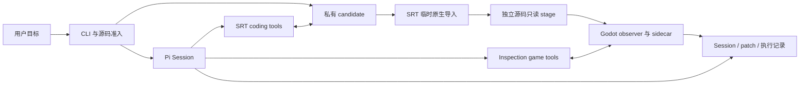

# ChronoRift 当前架构

ChronoRift 使用 Pi SDK，让 Agent 在私有 candidate 中修改代码，并通过受隔离的 Godot 执行获取运行时观察。
本文描述当前实现、模块职责和限制。使用命令与 Host 前提见[开发指南](development.md)，协作细节见
[Multi-Agent](multi-agent.md)，旧 Host ↔ Addon wire 见 [Protocol v2](godot-protocol-v2.md)。

## 1. 职责与结果语义

| 主体                       | 职责                                                                       |
| -------------------------- | -------------------------------------------------------------------------- |
| Pi SDK                     | Session、Agent Loop、模型调用、工具调度、历史、重试、compaction 和普通终止 |
| Agent                      | 决定调查、委派、编辑、验证步骤，解释观察和未覆盖项                         |
| ChronoRift Host            | 源码准入、私有 workspace、工具权限、SRT、Godot staging、资源生命周期和记录 |
| Godot / 项目代码           | 执行游戏逻辑，提供不可信的对象、属性与项目 observation                     |
| 用户 / 项目 CI / 独立 Eval | 决定候选修改是否满足验收要求                                               |

`completed` 表示 Pi Loop 正常结束，不表示调用过游戏工具、通过验收或证明修复正确。候选 diff、实际工具结果和
runtime records 优先于 Agent 的最终文字；测试通过也是有范围的证据。Preview 不生成 canonical diagnosis 或 fix verdict。

项目源码、日志、Godot strings、插件、模型消息和 patch 都不能改变 Host policy。Hash 绑定实际字节、检查变化，
不构成签名、外部 attestation 或项目语义正确性的证明。产品 Harness 不持有隐藏验收 oracle。

## 2. Preview 执行路径

入口是 `project preview`。有目标时直接进入普通 Pi Loop；无目标时要求交互 TTY，非交互或 JSON 调用返回
`goal_required`。每次命令创建新的 Session 和 `<state-root>/srt-tasks-v1/<digest>` namespace；不复用上次 candidate。

源码准备使用所选 Git project 的当前 tracked 工作树字节，包括 staged/unstaged 修改；只有显式列出的 untracked
文件进入 source closure，ignored 文件和未选中的 untracked 文件不进入。Host 验证路径和文件类型后物化 candidate，
Pi 的 `cwd` 是其中的 canonical physical workspace。原 checkout 不被运行命令修改。

每次 `game_launch` 从当时的 candidate 捕获源码，完成原生导入和产物准入后创建新的只读运行 stage。
后续 candidate 修改不会更新已启动的游戏。Agent 自主决定是否启动、查询、停止或再编辑，没有固定调查阶段机。

结束时 Host 清理运行资源并保留结果目录。普通完成不自动 commit、merge、push、apply 或删除候选。
当前没有通用跨命令 Task resume/discard API；`taskId` 是 fresh-run 的记录 identity。
Preview 不生成、发布、复用或迁移 ProjectAdapter，也不读取或删除旧 project-local environment state。

主要入口：[`project-environment-preview.ts`](../apps/cli/src/vnext/project-environment-preview.ts)、
[`source-preflight.ts`](../apps/cli/src/vnext/source-preflight.ts)、
[`task-paths.ts`](../apps/cli/src/vnext/task-paths.ts)。

## 3. Pi 集成与工具边界

[`vnext-session.ts`](../packages/pi-harness/src/vnext-session.ts) 使用官方、固定版本的 Pi SDK 创建和恢复 Session，
保留默认 coding-agent prompt、Loop、compaction 与终止语义。ChronoRift 只添加工具及环境说明，不自行重建模型循环。
适用的项目指令、skills 和 context 可以进入 Session，但不能覆盖 Host 权限。

Agent 通过 SRT-backed port 使用 `read`、`bash`、`edit`、`write`、`grep`、`find` 和 `ls`。
游戏工具 metadata 从 canonical schema 派生；外部输入、wire 和 persisted DTO 在边界严格校验并按需版本化。
工具只校验本次操作所需 capability、路径、资源存在性与 ownership，不要求预先形成完整 lineage graph。

安全拒绝、资源不足、runtime crash 和 unsupported capability 返回明确工具结果。一次普通工具错误不自动结束 Session；
用户取消、超时、不可恢复的 provider 或 Host failure 按实际终止原因记录。Provider/model 在命令入口选择，凭据留在 Host。
已安装 Pi 的 source/types 是集成接口依据；升级 SDK 需要兼容验证。

## 4. 当前游戏工具

| 工具          | 实际行为                                                                                          |
| ------------- | ------------------------------------------------------------------------------------------------- |
| `game_launch` | 导入并运行当前 candidate 的默认主场景，返回 source identity、engine version、Execution 和根对象   |
| `game_query`  | 读取当前 `children`、`properties` 或明确命名的 `values`，目标为主场景相对路径或执行内 `objectRef` |
| `game_stop`   | 停止指定 Execution，保存 process/log/source integrity 结果；重复停止返回已保存结果                |

Children/properties 分页默认 100、上限 200；values 接受 1–32 个属性名。Object/Resource 返回引用并保留执行内身份，
可继续查询属性，不会展开成副本而丢失共享关系。弱引用不延长对象寿命，失效后不会绑定替代对象。
每个代理最多一个存活 Execution；停止后可以从最新 candidate 再次启动。

查询记录实际 process frame、physics tick 和独立 Host 接收时间。游戏在查询时继续运行，分页不是原子快照，
property getter 可能有副作用。缺失属性、失效引用、不支持的值、截断和执行错误都明确返回。
当前没有表达式、方法调用、probe、历史窗口、pause/step/input 或 replay 工具。

实现分为 [`inspection-game-tools.ts`](../packages/pi-harness/src/inspection-game-tools.ts) 的 Pi bridge、
[`godot-inspection-runtime.ts`](../apps/cli/src/vnext/godot-inspection-runtime.ts) 的 Host 生命周期，以及
[`packages/godot-adapter`](../packages/godot-adapter/src/index.ts) 的 observer、wire client 和 sidecar。
Host 使用有界 framed stdio 与沙箱内 sidecar 通信，sidecar 再连接 Godot observer；握手与请求/响应均严格校验。

## 5. Workspace 与 SRT 隔离

当前受支持 Host 是 Linux x86_64，精确固定 `@anthropic-ai/sandbox-runtime@0.0.74`。
每次运行的私有 namespace 为 mode `0700`，由当前用户拥有，与 source checkout 分离。
工作树隔离不等于 OS sandbox；实际进程权限由
[`srt-sandbox-controller.ts`](../apps/cli/src/vnext/srt-sandbox-controller.ts) 提供。

- Coding process 可以读写自己的 workspace、home、tmp 和 artifact scratch。
- Godot 不直接运行可写 candidate。Host 复制普通文件到独立 stage，拒绝路径逃逸、危险链接与特殊文件，叠加受管 overlay。
- Run stage 的项目源码只读，只有 `.godot/`、home、tmp 和 artifacts 可写；mutable candidate 对游戏进程不可见。
- 两种 process 都使用 strict empty network allowlist，从空白环境构造最小变量集；Host 模型凭据不进入工具环境。
- SRT 初始化或 wrap 失败即失败，不回退到无沙箱执行。

Controller 保留 timeout、cancellation、process-group kill、stdout/stderr 有界前缀及 truncation。
[`godot-validation-stage.ts`](../apps/cli/src/vnext/godot-validation-stage.ts) 在运行前后比较源码 SHA-256，
返回实际 `sourceUnchanged`。当前没有 cgroup CPU/memory/PID quota、容量 ledger 或外部 attestation。

项目代码、`@tool`、插件和 observer 同处不可信 Godot 进程。只读 overlay 与握手 token 不能隔离同进程恶意代码，
也不能证明 telemetry 完整；真正的权限边界是 OS sandbox。Host 被 SIGKILL、掉电或内核终止时可能没有 cleanup 结果，
残留需由 Operator 处理，不能补记为成功清理。

## 6. 原生导入与配置兼容

[`godot-import-preparation.ts`](../apps/cli/src/vnext/godot-import-preparation.ts) 在独立 SRT process 和一次性可写
副本中完成 native import。Candidate 始终隐藏、网络始终拒绝；该副本不会直接成为游戏运行目录。
Host 验证导入后的普通源码与产物，再构建新的只读 run stage。

导入使用 Host 空编辑器场景，临时关闭 editor UI plugins 和提前加载翻译；运行副本恢复原始配置。
普通 `override.cfg` 保留 InputMap、主场景与用户 autoload，Host inspection 设置按 feature-qualified 设置优先级叠加。
自定义 override 链、禁用 override、受管 autoload 覆盖和 `project.binary` 绕过均拒绝。

普通源码/overlay 的新增、删除、内容或 executable 位变化会阻止启动。允许进入新副本的产物限于经验证的
`.import`、对应 GDScript/shader 的 `.uid`、`.godot/imported/`、global script class cache 和 UID cache。
CSV 翻译是受限例外：原始 CSV 表头 locale、导入声明、路径与 data-only Translation/OptimizedTranslation 资源须一致；
已 tracked 的派生翻译也要验证原声明和资源后才允许重新生成，不能仅按 `.translation` 后缀放行。

输出树拒绝软/硬链接、特殊文件、路径逃逸及超限：最多 16,384 项、64 层、单文件 64 MiB、总量 256 MiB。
编辑器布局和日志不成为运行源码。导入非零退出、超时、取消、错误或 stderr 截断阻止启动。
只有首次扫描缺失 editor texture metadata 的精确诊断允许在完整性检查后复查一次，两次共用同一 timeout；
其他 ERROR 或复查 ERROR 仍失败。首次诊断保存在可选 `importBootstrap` 中；无 game process 时也保存最终 import 输出。

自定义 `EditorImportPlugin`、显式 .NET/native 依赖仍不支持。可选 `.cs` 文件仅作为惰性源码保留，动态加载结果由
实际 Godot 输出决定。Preview 支持已验证的官方标准 Linux Godot 4.7.1、4.3 和 4.2.2；记录真实 executable version/hash，
每次 launch 检查版本 pin。Managed installer 和固定案例/legacy 仍保持原版本限制。
运行 hash 包含实际 stage 中生成的 `.import`/`.uid`，不含可写 `.godot`；其变化不能单独证明 candidate 源码变化。
更细的资源格式、引擎版本与 Host 前提见[开发指南](development.md)。

## 7. Adaptive Multi

`project preview --multi-agent` 将现有 Session 作为 Root。
[`agent-supervisor.ts`](../apps/cli/src/vnext/agent-supervisor.ts) 管理任务树、worker 进程、邮箱、执行名额与取消；
[`project-multi-agent.ts`](../apps/cli/src/vnext/project-multi-agent.ts) 组合独立 worktree、工具与结果。
每个代理使用独立 Pi Session。Worker 从父代理创建时的当前源码生成独立 detached Git worktree；follow-up 和驻留重载继续使用原 worktree。
父代理使用 `read_agent_patch` 审阅冻结 diff，再用 `apply_agent_patch` 显式接收最新已结束轮的修改。同一文件有冲突时不写入任何修改。

Root 与 worker 都可使用 `spawn_agent`、`list_agents`、`send_message`、`followup_task`、`wait_agent` 和
`interrupt_agent`。Adaptive 策略允许 0 worker；只有可独立完成、能替代 Root 后续工作的具体子任务才委派。
Root 整合有证据的结果，针对缺口复查并验证最终候选；不完整重复 worker 已完成的调查。
Worker 应交付结论、证据与未覆盖项后结束 turn，不通过循环 wait 保持在线；后续任务使用 `followup_task`。

普通消息只进入邮箱，不启动闲置轮；消息在 Pi 原生响应/工具批次边界消费。Busy followup 由 worker ACK 确认合入
当前轮或由 Host 分配新轮。普通 `agent_end` 后仍可能重试，Host 以 `agent_settled` 判断该轮结束。
Fork 只复制允许的背景文本，不复制父请求用量；保留已结束 Session 不等于跨命令恢复。

默认预留 Root 名额，最多 3 个活跃 worker；CLI `--max-agents` 允许 1–4。等待也占名额，满额直接返回资源不足。
闲置且无待处理消息/IPC 的 worker 可以按 LRU 卸载并沿原 Session 重载。受控实验可另外限制创建总数、深度和模型配置。
默认 worker 每轮 10 分钟/64 次执行，团队 256 次；Host `executionLimits` 可显式调整。协作控制和 `game_stop` 不计执行预算；`apply_agent_patch` 消耗团队执行预算。

每个 worktree 的 coding 操作、子代理源码快照、patch 接收与 launch 源码捕获使用自己的锁，不同代理的 coding 可并行。
Git 元数据存放在各自 sandbox scratch，Host baseline、冻结结果和其他代理的目录不可见；用户 checkout 不变。
每个代理只能控制自己的 execution、临时目录和取消范围。

Headless 在 Root 完成后停止其他 writer，等待清理后提取 Root 最终 patch，不因迟到消息自动续跑 Root。
TUI 中后台 worker 可继续运行，Root 下次用户轮消费邮件；正常退出通过 Pi `session_shutdown` 清理并保存结果。
策略、上下文继承、名额和 telemetry 的完整语义见 [Multi-Agent](multi-agent.md)。

## 8. 资源 identity 与记录

| 名称                                       | 当前含义                                                                    |
| ------------------------------------------ | --------------------------------------------------------------------------- |
| `taskId`                                   | 一次 fresh-run 的 namespace、Session 和结果 identity；不是通用持久 Task API |
| Inspection `Execution` / `objectRef`       | 一次固定源码的 Godot 进程，以及仅在该执行内有效的弱对象引用                 |
| 固定案例 `Build` / `Runtime` / `Execution` | 原有 source、process、launch-bound observation identity                     |
| Project Environment / Adapter revision DTO | 固定案例或历史 reader 仍使用的版本化数据，不由新 Preview 自动生成或复用     |

ID 不是路径或权限凭据；操作验证 schema、存在性和 fresh-run ownership。固定案例 V1/V2 manifest 与 wire 的合同仍在
[`packages/godot-protocol`](../packages/godot-protocol/src/index.ts)，相关 DTO 在
[`project-environment.ts`](../packages/domain/src/project-environment.ts)。旧初始化 DTO 的存在不表示其 producer 仍运行。

普通 Preview 输出 V2，显式单代理预算使用 V5；多代理输出 V6，记录 `workspaceMode: "worktree"`、实际 limits 和团队计数。旧 V4/V5 共享 workspace schema 保留用于历史记录。
旧 Preview V1/V3 和 `agents.v1.json` 保留原义。当前记录包含 Session、候选 patch、执行路径、有界日志和实际失败信息；
多代理另存 `agents.v3.json`、worker turns、邮箱投递/消费和用量归属。所有 writer 停止后才提取并 round-trip 校验 patch；
清理或提取失败时 candidate 是否变化可为未知，不能填成“未修改”。

Import/run 分别保留退出、超时、取消、日志截断与源码完整性。模型请求记录 SDK stream 边界起止和状态；
coding telemetry 记录请求、申请锁、拿锁、完成时间和单调时钟 lock wait。不同代理的累计时间会重叠，不能直接相加为关键路径。
SDK 请求耗时不是纯模型计算时间，也不逐次拆解 HTTP 重试。

用量只累计每个 Session 最后可用快照一次；fork 背景不复制父费用，新请求实际处理背景仍计自己的 tokens。
取消或未完整结束的 Session 保留 usage incomplete；SDK cost 是价格表估计，不是 provider 账单。
原始结果与已发布证据不原地改写。当前不建立查询数据库、publication、长期 retention 或 storage quota framework。

## 9. 模块职责

依赖方向为 `domain ← gamebranch ← runtime adapters ← CLI`，Agent-facing 路径为
`domain ← agent-protocol ← pi-harness / CLI bridge`。Engine-neutral packages 不导入 Pi 或 Godot-native 类型，
包间通过公开 `src/index.ts` 导入。

| 模块                                                                 | 职责                                                                                 |
| -------------------------------------------------------------------- | ------------------------------------------------------------------------------------ |
| `apps/cli`                                                           | CLI composition、源码准入、私有 candidate、SRT、staging、Preview/固定 case lifecycle |
| `packages/domain`                                                    | 无 I/O 的 identity、Inspection canonical schema、有界值与保留的 runtime DTO          |
| `packages/gamebranch`                                                | Legacy services 与仍被维护路径使用的 engine-neutral ports/lower layers               |
| `packages/agent-protocol`                                            | SDK-neutral 工具定义，Inspection metadata 从 canonical schema 派生                   |
| `packages/pi-harness`                                                | Pi 集成、SRT coding port、inspection/固定案例工具 bridge；Loop 仍归 SDK              |
| `packages/godot-protocol`                                            | Inspection、固定案例和 legacy wire、payload validation、hash 与 framing              |
| `packages/godot-adapter`                                             | Observer、sidecar/client，以及固定案例 Project Environment runtime/overlay           |
| `packages/json-artifacts`                                            | Legacy readers/writers、固定案例 TaskStore 与共享 internals                          |
| `godot/addons/chronorift*`、`fixtures/godot-*`、`packages/mock-game` | 当前 integration 与历史 deterministic fixtures 所需的 Addon 和测试资源               |

## 10. 固定案例与 legacy

安装后的 `crf [goal]` 默认进入实验性 Preview；省略 goal 时打开 Pi TUI。模型默认值只读取 Pi Host 用户配置，
交互界面允许先 `/login`，通过 `/model` 保存选择；项目配置不能覆盖 Host 默认模型。发行包包含 CLI 和独立 worker，
Godot 可在首次交互启动时下载到用户缓存，沙箱仍按原边界 fail closed。安装方式见[安装指南](installation.md)。
仓库内的开发 CLI 继续保留显式 Preview、固定项目案例和 v0.4 legacy diagnosis 入口。
Legacy `demo`、`diagnose` 和 replay 使用自己的固定 workflow、Proposal/Verdict 与记录格式，不具备当前 Preview 的 SRT 保证。
这些词不能套用到 Preview 的普通 assistant output。[Protocol v2](godot-protocol-v2.md) 仍说明被维护的旧 wire 合同。

GN-1 使用 checked-in ProjectAdapter V1 观察固定 Platform geometry/resource identity；Mob 使用 state-only Adapter V2。
两者保留原有四工具、loader/runtime、TaskStore、validated ring、artifact internals 和安全检查，不进行通用 Adapter authoring。
其 command composition 分别见 [`platform-alias-demo.ts`](../apps/cli/src/vnext/platform-alias-demo.ts) 与
[`mob-orientation-ablation.ts`](../apps/cli/src/vnext/mob-orientation-ablation.ts)。案例不等于任意项目兼容承诺。

旧 Task CLI、M3/M4/E2 composition，以及 Preview 的 Adapter 初始化、conformance、publication、reuse producer 已退役。
保留的类型和 Addon 只服务仍在用的路径与历史读取，不要求恢复旧 campaign 或 Gate。
历史证据保留原义：[E2](evidence/vnext-e2-public-exposed-r1/README.md)、
[PE-A](evidence/vnext-project-environment-pe-a-local-r1/README.md)、
[PE-B](evidence/vnext-project-environment-pe-b-local-r1/README.md)、
[PE-C](evidence/vnext-project-environment-pe-c-ci-r1/README.md)。

## 11. 限制、验证与证据

Preview 只查询存活执行的当前可读对象/属性，没有 retained history、checkpoint/restore、fork 或 compare。
项目路径与有意义的字段仍需 Agent 调查；观察及序列化可能影响时序，也不能取回对象消失前未采集的状态。
Process frame、physics tick、simulation time、render completion 与 Host time 必须区分。

Preview 使用 headless backend，不保证 window-system API、visual/audio/GPU、跨平台 Host 或任意 Godot 项目支持。
通用 source migration、向用户 checkout 安全处理冲突的 apply/merge、长期恢复和完整 engine snapshot 都尚未提供。
显式接收 patch 不证明 Root 已充分审阅 worker 修改；并行工作量、worker 完成或成功 launch 都不能替代精确候选的独立验收。

验证入口为 `corepack pnpm check`、`corepack pnpm test:godot` 和
`.github/scripts/run-srt-sandbox-conformance.sh`。默认检查离线、无凭据；真实 provider 调用是单独授权入口。
这些命令的存在不代表当前 checkout 已通过，实际运行结果与缺失前提需分别报告。

实验结论保留在对应材料中，架构实现不把一个 pair 写成成功率或通用优势：

- [GN-1](case-studies/gn1-platform-alias.md)、[Mob](case-studies/godot-demo-mob-orientation.md) 和
  [City Builder](case-studies/city-builder-preview.md)：固定源码、工具面、候选与观察边界。
- [Adaptive Multi](case-studies/adaptive-multi-v1.md)、[功能任务预检](case-studies/godot-feature-multi-v1.md) 和
  [提高预算后的功能对照](case-studies/godot-capacity-multi-v1.md)：含失败、未启动、用量缺口和未显示加速的结果。
- [历史 r4 benchmark](benchmarks/v0.3.2-luna-r4/README.md)：原负结果不改写；其 generic arm 是同一 Harness 内的工具消融，
  不是其他 coding product 的 head-to-head。
