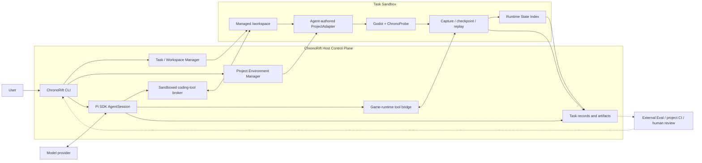

# ChronoRift Game-native Agent Harness 目标架构

> 状态：vNext 目标架构；决策日期：2026-08-06；当前可执行 release：ChronoRift v0.4.0。
>
> 当前 v0.4 仍是受控诊断 workflow：它禁用通用 coding tools，要求固定的
> Capsule/replay/intervention/compare/proposal 流程，并由 Harness 产生 canonical verdict。仓库源码另外包含
> 只面向 `frame-input-window` 的实验性 M3 vNext vertical slice，包括 sandbox、自由 Pi Loop、16 个 game
> tools、managed runtime sidecar、rolling capture、checkpoint/restore/fork/replay、Runtime State Index、
> descriptive compare 与外部 release acceptance 实现。M3 不是新的公开 release，也不能描述成任意 Godot
> 项目能力或修复正确性证明；本文不声称尚未实际运行的 Gate 或 live acceptance 已通过。
>
> **Project Environment V1 / PE-A Preview 当前是 implementation present；下一实现切片是 PE-B Dynamic
> Projection（planned，尚未实现）**。PE-A 已实现显式 Preview、ProjectAdapter SDK/wire/loader、初始化、
> authoritative conformance、crash-safe publication/binding、post-edit exact Build、new-Session reuse、durable runtime
> evidence 与独立 validator。默认离线、真实 Godot、下层 Linux Host 与 deterministic fake-Pi Gate 已通过；
> 开发候选已有一次本地 Luna/max 输出，但它不绑定本次 baseline commit。针对冻结 product tree 重新取得并复验
> create-new bundle 后，状态才升级为 `implementation present + local Gate passed`。该范围只覆盖一个冻结
> clean/single-root fixture，不代表通用外部项目支持或默认入口晋升。
>
> v0.1–v0.4 schema、artifact、benchmark spec、ledger、报告与冻结 tag 保持不可变。新路径不会静默迁移、
> 覆盖或重新解释历史结果。

## 1. 产品契约

ChronoRift 是一个基于 Pi SDK 的 **game-native Agent Harness**。ChronoRift 拥有产品 Harness，Pi 是
ChronoRift 选择的 Loop Engine。

目标产品契约是：

> Harness 只保证 Agent 的文件、命令和游戏操作在受控环境中被真实执行，并把真实输出返回给 Agent；
> Agent 负责自主调查、修改代码、选择并运行验证手段，并根据结果迭代；任务结果由 Agent 根据实际工具
> 执行结果产生；ChronoRift 的成功表示 Agent Loop 正常完成、留下候选修改，并展示它实际执行过的命令、
> 游戏操作和验证结果，不表示系统已经从逻辑上证明 Bug 必然被彻底修复。

这里的“真实”有严格但有限的含义：ChronoRift 可以证明某个受控动作被请求、是否被执行、runtime
实际返回了什么、哪些数据被捕获以及哪些数据缺失；它不能保证游戏自身上报的内容正确，也不能保证
Agent 对工具结果的最终叙述正确。

因此：

- `completed` 是 Agent Loop 和交付生命周期状态，不是 `verified` 或 `fixed` 的同义词；
- 对要求修改代码的任务，候选 diff、实际工具记录和已执行验证结果是可审阅交付物；
- Agent 可以犯错、遗漏测试、误读日志或高估修复效果；用户通过 diff、命令输出、execution lineage 和
  项目自己的 CI/review 接受或拒绝结果；
- ChronoRift 产品路径不产生 `confirmed`、`probable`、`inconclusive`、canonical diagnosis 或
  canonical fix verdict；
- 项目测试、断言和未来可选 Game Contract 都是 Agent 可以调用的验证手段，不是 Harness 的最高权威；
- 协议、schema、权限、路径、资源和 requested/realized receipt 校验仍属于环境安全与真实性边界，
  不属于 Bug 结论验证。

## 2. 核心价值

普通 coding agent 加一个基础 Godot MCP，已经可以启动游戏、读取日志、查看 SceneTree、注入输入和截图。
ChronoRift 必须提供更难由普通工具临时拼装的运行时原语，否则没有理由成为独立 Harness。

| 维度       | 普通 coding agent + 基础 Godot 工具 | ChronoRift 目标能力                                               |
| ---------- | ----------------------------------- | ----------------------------------------------------------------- |
| 工作单元   | 当前进程和当前文件                  | 有身份、lineage 和 capture coverage 的 Execution                  |
| 失败历史   | 失败后才开始读日志                  | 有预算的 pre-failure rolling black box                            |
| 状态恢复   | 重启场景或重新操作                  | 带 manifest、fidelity 和缺失域的 checkpoint/restore               |
| 实验分支   | 手工重跑并修改参数                  | 从已授权 Execution/checkpoint/build/workspace 任意 fork           |
| 输入复现   | 再次模拟输入                        | 区分 tick/phase 的 trace replay 与 realized receipt               |
| 时间       | 日志顺序和墙钟                      | process frame、physics tick、simulation time、host monotonic time |
| 运行时查询 | 当前 SceneTree 或文本日志           | 可重建、可查询的 Runtime State Index                              |
| 跨运行比较 | 人工比较输出                        | 实体、时钟、状态和 coverage 对齐后的描述性 diff                   |
| 不确定性   | 常被隐含忽略                        | first divergence、uncontrolled state 和 observer effect 显式返回  |

ChronoRift 的创新命题是：

> Codex 式自主 coding-agent Harness
>
> - 游戏运行时 checkpoint/fork
> - phase-aware replay
> - 可查询的世界状态
> - 跨 Execution 的语义对齐与比较。

世界结构帮助 Agent 查询“发生了什么、何时发生、哪些状态不同”；为什么发生、哪个机制成立以及修复是否
正确，留给 Agent、项目测试、外部 Eval 和人类 review。

## 3. 目标与非目标

### 3.1 目标

1. 让 Pi Agent 在隔离 workspace 中拥有正常 coding-agent 自由：读码、搜索、执行命令、修改文件、运行
   测试以及调用 game-runtime tools。
2. 为 Godot runtime 提供有诚实边界的 capture、checkpoint、restore、fork、replay、query 和 compare。
3. 让工具能力可组合、可重复、可并发演进，不把某条诊断步骤写进 Harness 状态机。
4. 保留实际执行、资源消耗、安全拒绝、capture coverage、lineage 和结果，供 Agent 与用户审阅。
5. 先用一个窄的真实 Godot 垂直切片证明 game-native 原语，再扩展外部项目和公开 benchmark。

### 3.2 非目标

- 不重新实现 Pi 的 Session、Agent Loop、模型调用或工具调度。
- 不要求 Agent 按 Capsule → replay → intervention → compare → proposal 的固定顺序工作。
- 不由 Harness 生成根因、因果边、下一实验建议或 canonical verdict。
- 不承诺任意 Godot 项目都能零配置捕获 gameplay 私有状态。
- 不承诺 GDScript Addon 可以完整快照 physics internals、线程、coroutine、网络或外部服务。
- 不把 Git worktree 当成 OS sandbox，也不让 Agent 直接修改用户当前工作区。
- 不自动 merge、commit、push、发布或部署候选修改。
- vNext 首个切片不实现视觉诊断、多 Agent、多人游戏、跨机器分支或通用 Contract DSL。
- 产品 Harness 不持有 hidden benchmark oracle，也不根据自己的输出给自己评分。

## 4. 不可违反的架构规则

以下规则使用 MUST 表示实现不得绕过。

1. ChronoRift MUST 通过官方 Pi SDK 创建 `AgentSession`，由 Pi 执行模型调用、工具调度、消息历史、
   compaction 和 Loop 终止；ChronoRift 不得再实现第二套 Agent Loop。
2. Agent MUST 可以在任务 sandbox 内使用正常的 coding tools；Harness 不得因为诊断阶段或既定 workflow
   禁止本来已授权的动作。
3. Game tools MUST 按 capability、资源依赖和安全权限校验调用，而不是按全局 phase machine 校验。
   “checkpoint 不存在”是资源错误；“还没有先读 Capsule”不是合法的环境错误。
4. 工具失败 MUST 以可诊断结果返回 Agent，并在安全允许时让 Loop 继续；一次工具错误不得自动成为
   Session 终止条件。
5. Runtime control MUST 返回 requested value、realized value、作用范围、实际时钟位置和已知副作用；
   请求本身不是执行事实。
6. 外部数据、游戏日志、源码文本、节点名、资源字符串、插件输出与模型最终文本 MUST 视为不可信内容；
   它们不能提升 capability 或改变 sandbox policy。
7. Execution、checkpoint、trace、capture window 和 comparison MUST 带版本化 schema、稳定身份和
   lineage；外部及持久化数据每次读取都重新验证。
8. Checkpoint MUST 声明 captured、reset、externally-controlled、unsupported 和 uncontrolled 状态；
   未声明状态不得默认为相等或已恢复。
9. Restore success MUST 只表示已声明状态被成功写回；后续 replay 只能暴露所选投影和窗口内的
   divergence，即使没有观察到 divergence，也不能据此证明完整实验起点等价。
10. Fork MUST 允许 Agent 在权限和资源预算内改变任意代码、build、adapter、probe、input、seed 或运行
    参数，并把所有已知变化写入 lineage；Harness 不得替 Agent 禁止“设计不佳”的探索实验。
11. Compare MUST 只描述捕获范围内已知和可观测的差异、匹配歧义、coverage 差异与混杂项；它 MUST NOT
    声称某个差异导致了结果或某项假设已被证明。
12. Event loss、降采样、buffer overwrite、clock uncertainty、observer effect、restore 缺口和首个 replay
    divergence MUST 可见，不能被规范化静默删除。
13. Agent 最终结果 MUST 使用普通 Pi assistant 输出；Harness 不得要求固定 Proposal schema、receipt
    引用仪式或唯一 submit 工具来结束 Loop。
14. 用户当前工作区、宿主凭据和未授权网络 MUST 与 Agent 命令隔离；越权动作必须在执行前拒绝并记录
    结构化安全事件。
15. 历史 raw artifact MUST 保持不可变；新 schema 通过新 namespace 或派生只读视图演进。
16. 当前代码、目标设计和外部 Eval 结果 MUST 在文档中明确区分，计划能力不得写成已经实现。

## 5. 系统总览



ChronoRift 拥有 CLI、任务生命周期、sandbox policy、Pi composition、game tools、runtime substrate 和结果
展示。Pi 是 Loop Engine；Godot 项目、模型和 Agent 产生的修改都在不可信任务边界内。

Host control plane 对以下有限事实负责：

- 创建了哪个任务 workspace 和 sandbox；
- 哪个工具调用被接受、拒绝或执行；
- 命令的 exit code、stdout/stderr 和文件 diff；
- runtime 返回的消息、健康状态和 requested/realized receipt；
- artifact 的 schema、identity、lineage 和捕获覆盖。

它不对以下内容背书：

- 游戏遥测是否代表完整世界；
- Agent 的假设或最终报告是否正确；
- 某次 pass 是否证明修复无回归；
- 某个 compare 差异是否具有因果意义。

## 6. 任务生命周期

目标默认流程是：

```text
用户在包含 project.godot 的项目目录启动 chronorift，可同时提供目标
→ CLI 自动发现项目、显式展示 provider/model，并冻结 source closure 与 sandbox capability
→ 创建任务级 managed workspace 和 execution sandbox
→ 使用 Pi SDK 创建或恢复同一个可见 AgentSession
→ 加载正常 coding tools、AGENTS.md、skills、ProjectAdapter SDK 与环境工具
→ 若 Project Environment 尚未 ready，Agent 在独立初始化 turn 中读取项目并生成唯一 ProjectAdapter
→ 初始化 turn 正常返回后 Harness 冻结 candidate，执行 authoritative conformance，并在 fully materialized revision 后原子切换 current pointer
→ 若用户目标已排队，在同一 Session 的下一个 turn 调用 session.prompt(user goal)
→ Pi Agent Loop 自主读码、执行、观测、实验、修改和验证
→ 模型输出普通最终结果，当前 turn 结束
→ ChronoRift 展示 diff、工具记录、Execution lineage 和资源/安全记录
→ 停止 Godot 与残留子进程，撤销临时网络/凭据授权
→ 保留 Session、workspace 和 artifact，直到用户继续、应用或显式清理
```

Task 是一个交互工作上下文，拥有一个 Pi Session/workspace、环境 turn 与零到多个用户 goal turn；每个 turn 记录
purpose、预算和精确 environment binding。初始化 turn 和用户目标 turn 是两条独立记录；前者正常结束时只有存在绑定当前 source、SDK、toolchain 与
conformance 的 ready Project Environment revision，才算初始化成功。Agent prose 或某个固定 submit tool 都不能
替代该事实。首次初始化失败时命令 fail closed，不执行排队目标；未发布 candidate、Pi Session 与失败记录可以在
有界 Task storage 中显式 resume；resume 创建 successor attempt，不修改 sealed failure。Publication 后 Task 追加
精确 `EnvironmentBindingEpoch`，排队 goal 只能在该 epoch 之后进入下一 prompt。一次普通 `session.prompt()` 返回不关闭整个任务，用户可以在同一 Pi Session 和
同一 managed workspace 中继续追问。自动清理只针对运行进程和临时授权；任务代码与 artifact 采用显式 discard
或保留期策略。

## 7. Task Workspace 与执行沙箱

### 7.1 Workspace 语义

Pi Session 的 `cwd` 指向任务级 `/workspace`。它来自宿主项目的 Codex 式 managed Git workspace，
不是用户正在编辑的原始 checkout。具体 Git 物化机制可以按平台演进，但必须满足：

- 每个任务有独立、可审阅、可丢弃的代码视图；
- Agent 修改不会直接落入用户当前工作区；
- 宿主 refs、其他 worktree 和 Git 配置不能被任务命令任意修改；
- ChronoRift 能稳定提取 diff/patch，并在用户明确选择后 handoff/apply；
- Host source drift 只触发可见的 refresh/review，不与 managed workspace 静默双向同步；
- 游戏 patch、ProjectAdapter/probe diff 与 `.chronorift/` environment publication 始终分离；
- worktree/workspace 是版本隔离机制，不被宣称为安全沙箱。

该产品语义参考 Codex 的
[managed worktrees](https://learn.chatgpt.com/docs/environments/git-worktrees)，但 ChronoRift 不依赖其
私有实现。

### 7.2 OS 边界

`bash`、`edit`、`write`、构建脚本和 Godot 子进程运行在 ChronoRift 管理的无特权容器或等价 Linux
namespace sandbox 中：

- 默认只允许写 `/workspace`、任务临时目录和 artifact 目录；
- 宿主文件系统默认不挂载；必要输入只读挂载并经过 canonical containment；
- 网络默认关闭；显式开启时只能访问任务配置的域名或服务 allowlist，并阻止局域网、link-local 和宿主
  管理端口；
- 用户凭据、SSH Agent、云 Token、浏览器数据和宿主环境变量默认不继承；
- 需要的短期凭据按任务、工具和目标服务授权，不进入游戏进程或普通命令环境；
- Godot 在同一任务 sandbox、独立进程组和 CPU/内存/进程/时间限制中运行；
- headless 是默认模式；图形、音频、GPU 和显示代理只按显式 capability 开放；
- 越界动作在执行前拒绝，写入结构化 security event，并作为工具错误返回 Agent。

Pi Host 可以在 sandbox 外使用用户的 Pi credential store 调用模型；工具子进程不得继承这些凭据。
这与 Codex 将 sandbox 作为自主行动技术边界的模式一致，参见
[Codex sandboxing](https://learn.chatgpt.com/docs/sandboxing.md)。

M3 的 managed Godot Task 还要求 Host 预置一个独立、canonical 的 `taskStorageRoot` filesystem mount。只接受
`tmpfs`、`ext4` 或 `xfs`，整个 filesystem 的总容量不得超过 1 GiB、总 inode 不得超过 131072；
`runtimeRoot` 必须是该 mount 的 canonical 严格子目录，不能等于 mount、位于 source tree 中或经过 symlink。
这是 workspace、Task records、runtime records、临时目录和 sandbox artifacts 共享的 aggregate hard cap，
不是给每个 Task、Runtime 或 Execution 各发一份预算。release-only live 的 Agent 与 evaluator 可以在同一个
mount 下使用不同 runtime root，因此也共同消耗这一总量。requested mount path 只有通过 filesystem identity、
容量和 inode preflight，并在 resume/operation 前重新匹配 frozen capability 后，才能作为 realized storage
边界记录。CLI 分别用 `--task-storage-root` / `CHRONORIFT_TASK_STORAGE_ROOT` 与 `--runtime-root` /
`CHRONORIFT_RUNTIME_ROOT` 接收这两个边界；不能把 mount 本身直接当成 `runtimeRoot`。

## 8. Pi SDK 集成

当前仓库固定使用 `@earendil-works/pi-coding-agent@0.83.0` 和
`@earendil-works/pi-ai@0.83.0`。已安装 package 的 source、types、docs 和 examples 是实现 API 的
权威；升级 Pi 必须单独执行兼容测试。

vNext 采用 Pi 官方推荐的 programmatic embedding：

- `ModelRuntime` 负责 provider/model 与用户 credential store；
- `createAgentSession()` 创建单个 Agent Session；需要 Session replacement 时使用
  `AgentSessionRuntime`，不自行复制其生命周期；
- `SessionManager` 持久化和恢复 Session；
- `DefaultResourceLoader` 加载项目 `AGENTS.md`、skills、extensions 和 context；
- `defineTool()` / `customTools` 或等价 extension API 注册 ChronoRift game tools；
- `session.subscribe()` 驱动进度、工具记录与结果 UI；
- `session.prompt()` 启动当前 turn，并由 Pi 决定正常 Loop 终止。

Pi 官方 SDK 文档见 [pi.dev](https://pi.dev/docs/latest/sdk)。

### 8.1 Prompt 与资源

- 保留 Pi 默认 coding-agent system prompt，不再用诊断 workflow 整段覆盖；
- ChronoRift 只追加短小环境说明：sandbox 边界、game tool 语义、fidelity、coverage 和缺失数据；
- 正常加载任务 workspace 中适用的 `AGENTS.md`；其内容不能改变 Host 或 sandbox policy；
- 正常启用 Pi skills；Project Environment V1 目标提供与 SDK version 绑定的 `project-adapter` skill，解释 adapter contract、示例和
  validator，但不规定必选工具顺序；
- 工具描述只说明能力、输入、输出、权限、成本和失败行为，不使用 `call first`、`only after` 或
  `exactly once`；
- 项目内容或 runtime 文本不能覆盖 system/sandbox policy。

### 8.2 Coding tools

vNext 显式启用 Pi 提供的 `read`、`bash`、`edit`、`write`、`grep`、`find` 和 `ls`。其中 Pi 0.83.0
默认启用的是 `read/bash/edit/write`，其余工具由 ChronoRift 显式选择；所有工具的底层文件与命令操作都
必须指向任务 sandbox。单纯给 `createAgentSession({ cwd })` 传 workspace 路径不等于完成安全隔离；
具体 tool backend 必须受 sandbox broker 约束。

### 8.3 终止与失败

- 不提供唯一 `submit_diagnosis_proposal` 终止工具；
- 不因为第一次 tool error 自动 `abort()`；
- 安全拒绝、资源不足、runtime crash 和 unsupported capability 都作为结构化工具结果进入 Loop；
- 用户取消、显式超时、不可恢复的 Pi/provider failure 或 Host 自身失败才终止当前 turn；
- 最终 assistant 文本与实际工具记录分别保存，前者不能覆盖或改写后者。

## 9. Project Environment 与 Runtime 资源模型

vNext 使用少量稳定资源组织项目环境与游戏运行历史：

| 资源                           | 含义                                                                                                |
| ------------------------------ | --------------------------------------------------------------------------------------------------- |
| `ProjectEnvironment`           | project-local、跨 Task 复用的 adapter/toolchain/conformance 环境                                    |
| `ProjectEnvironmentRevision`   | reviewed source、adapter、SDK/bridge、toolchain 与 conformance 的不可变组合                         |
| `ProjectAdapterRevision`       | Agent 生成的唯一 adapter package 与 capability/payload schema identity                              |
| `ProjectInitializationAttempt` | 可恢复但未必发布的 Agent 初始化/迁移 attempt                                                        |
| `Task`                         | 一个交互工作上下文：一个 Pi Session/workspace、环境 turns、零到多个 goal turns 与 runtime artifacts |
| `EnvironmentBindingEpoch`      | Task 在安全 turn boundary 绑定的精确 environment/adapter revision                                   |
| `Build`                        | source、adapter/probe、workspace diff、Godot/import 与 compatibility 身份                           |
| `Runtime`                      | 一个正在运行或已终止的 Godot 进程及其 negotiated capabilities                                       |
| `Execution`                    | 一次从明确 build/scene/config/trace 起点产生的实际运行记录                                          |
| `CaptureWindow`                | rolling buffer 中被 pin 的时间窗口及覆盖/丢失信息                                                   |
| `Checkpoint`                   | 某个语义 barrier 上按 manifest 捕获的可恢复状态                                                     |
| `Trace`                        | 输入与控制事件及其目标 tick/phase                                                                   |
| `Branch`                       | 从 Execution/checkpoint/build/workspace 派生的 lineage edge                                         |
| `Comparison`                   | 两个 Execution 的描述性对齐与差异结果                                                               |

资源 ID 是稳定、不透明的业务身份，但不承担 Session capability 仪式，也不能被解释为文件路径。工具直接
返回资源 ID；每次使用仍验证任务归属、权限、schema 和存在性。

Execution 在运行中追加记录，终止后 seal。其 manifest 至少描述：

```text
task / workspace / source / diff / build
Godot / platform / runtime / addon / protocol
scene / launch parameters / environment controls
snapshot adapters / probes / capture policy
checkpoint or recovery recipe
input trace / registered RNG configuration
requested and realized controls
clock domains / observation coverage / loss
parent lineage
```

该 manifest 说明已知运行条件，不证明两次运行确定，也不作为 comparison Gate。

## 10. Rolling Black Box

Agent 尚未识别 Bug 时，ChronoRift 目标默认滚动保留最近 10 秒、最多 600 个 tick 的低成本黑匣子数据；
达到任一窗口边界时开始淘汰旧数据，并在 capture metadata 中记录实际生效的边界：

- 输入事件及 requested/realized tick/phase；
- process frame、physics tick、simulation time 与 host monotonic timeline；
- SceneTree 与已注册实体生命周期；
- 结构化日志、crash/hang/error；
- 已注册 RNG 的 seed/state 变化；
- 已启用 probe 事件；
- 周期性的轻量状态摘要。

这些值是首个切片的 Capture Policy 目标默认值，不是跨项目无条件性能保证。默认任务预算目标为：

- 内存最多 256 MB；
- 磁盘最多 1 GB；
- 平均运行开销不超过基线帧时间的 5%；
- 单次主线程采集不阻塞超过 2 ms。

Runtime 必须记录实际开销。超出预算时降低采样率、合并或丢弃低优先级数据，并保留 dropped/overwritten
标记；不能通过暂停游戏伪装满足预算，也不能静默隐藏任何通道的数据损失。

Capture Policy 决定 rolling data 与可恢复 checkpoint 的触发和采样策略，并综合项目预配置的 snapshot
adapter、当前 Execution 开始前已注册的 trigger，以及 Agent 针对后续 Execution 提交的通道和采样请求。
请求表达调查意图；runtime 在能力与上述预算内决定实际采集，并把 realized profile、降采样和丢失情况
返回给 Agent。

### 10.1 Freeze 与 pin

Ring buffer 自动冻结于可客观检测的异常，例如：

- crash、进程退出或 assertion failure；
- 主线程 hang/timeout；
- 结构化 engine error；
- 任务开始前已注册的 capture trigger 命中。

Gameplay 语义 trigger 由项目开发者、用户或 Agent 显式定义，只是“值得保存附近历史”的 capture hint。
Trigger 命中不表示 Bug 已确认、可选项目 Contract/测试失败或根因成立。

用户或 Agent 可以随时 pin 当前窗口。若关键历史已经覆盖，工具返回
`history_window_unavailable`，同时返回仍可用的 timeline、首个可见异常和 coverage gap；Agent 可以扩大
后续窗口、提高特定通道采样率或新增 trigger 后重新运行。

若失败前历史仍在，但没有可恢复 checkpoint，工具返回 `pre_failure_checkpoint_unavailable`，并附上仍
保留的 input trace、事件 timeline、首个可见异常和状态覆盖缺口。Agent 可以新增 probe 或 snapshot
adapter、提高后续采样率，再次运行并等待问题重现；系统不得把普通历史窗口冒充等价分叉起点。

上述自动 freeze/trigger 仍是目标能力，不是 M3 已实现事实。M3 实现有界 rolling capture、coverage/loss
receipt 和显式 `game_capture_pin`；`game_capture_configure` 对任何非空 trigger 请求返回
`unsupported_capability`，不会静默声称自动 trigger 已生效。crash/error/cleanup 与 capture loss 仍作为 raw
runtime records 保存，但当前不会自动替 Agent pin 一个窗口。

## 11. Checkpoint 与 Restore

### 11.1 无 snapshot module 模式

Project Environment ready 后总是存在一个已验证的 ProjectAdapter；这里的“无 snapshot module”只表示该
adapter 对 snapshot/restore 明确报告 unsupported，不是无插件黑盒模式。首次初始化尚无 adapter 时，只能使用
coding、隔离命令、vanilla Godot 与 adapter 编写/验证工具，不能进入普通项目工作模式。没有 snapshot module
时，ChronoRift 只保证捕获自己控制且可重建的执行外壳：

- source/build identity；
- 启动场景、项目配置和运行参数；
- 已记录 input trace；
- seed 配置；
- 基础日志和 capture metadata。

它不保证任意 gameplay 私有字段、对象关系、Timer、pending effect、状态机或异步任务可恢复。无 snapshot
module 可以支持重新启动和 trace replay，不能宣传为“从失败瞬间等价分叉”。

### 11.2 Snapshot adapter

Agent 在唯一 ProjectAdapter 中实现并声明具有领域语义的 snapshot module，包括：

- 要捕获的私有字段和容差/规范化规则；
- 对象引用的稳定身份与 incarnation；
- capture barrier 和 restore 顺序；
- Timer、pending effect、状态机、RNG 和异步任务的重建逻辑；
- 恢复后自检以及已知缺失域。

Agent 可以在调查期间修订 ProjectAdapter、probe 或序列化代码，但每次修改必须形成新的不可变 adapter
revision，只对 publication 之后创建的 Build、Execution 和 checkpoint 生效；正在运行的 Execution 不热替换。
用户手工修改也只形成待验证 candidate。任何修改都不能追溯补全首次失败，也不能在不同 build 之间假装同一
snapshot 自动兼容。

### 11.3 Manifest 与 receipt

Checkpoint 与 restore 后状态的一致性，只在同一 manifest 声明为 `captured` 的 domains、序列化、
canonicalization 和容差规则下定义。比较两个 coverage 或规则不同的 checkpoint 时，只能给出描述性结果；
除非双方的 captured domains 和规则一致，否则不能称为 checkpoint 相等。未覆盖状态必须列入 manifest；
缺少记录不能被解释为相等。

Checkpoint manifest 至少包含：

```text
source / build / runtime / adapter identity
capture consistency model and semantic barrier
captured domains and serialization rules
reset domains
externally controlled domains
unsupported domains
unknown or uncontrolled domains
restore dependency order
per-domain hashes and tolerances
known async or in-flight state
limitations and portability
```

Restore receipt 至少包含：

```text
checkpoint and current build identity
compatibility result
per-domain requested/restored/rejected status
before and after summary hashes
uncovered and uncontrolled domains
fidelity and deterministic boundary
restore validation output
```

“restore 成功”只表示 manifest 中声明的状态已按规则写回。后续 replay 可以发现所选投影和窗口内的
不等价；没有观察到 divergence 也不能证明完整实验起点等价。若第一个 tick 已分歧，Agent 必须收到：

- `registered_state_restored_but_equivalence_unestablished`；
- first divergence tick/phase；
- 首个不同字段、实体或事件；
- 可能相关的 uncovered/uncontrolled domains。

`fidelity` 是 coverage 与恢复能力等级，不是模型置信度，也没有任何等级暗示完整运行时等价。无法可靠
序列化或恢复的状态返回 `unsupported` 或 `uncontrolled`，并使该 checkpoint 不具备 equivalent-fork
资格；Agent 仍可把它用于 descriptive exploration。

## 12. Fork、Replay 与控制

### 12.1 Fork

Agent 可以从任何有效且已授权的 Execution、checkpoint、build 或 managed workspace/worktree 创建分支，
并改变：

- 代码和 build；
- snapshot adapter 或 probe；
- 输入及其 tick/phase；
- seed/RNG state；
- frame/physics/runtime 参数；
- capture profile；
- 项目自定义配置。

每项 requested change、realized change 和已知副作用都进入 lineage。Fork API 不宣称“只改变一个变量”，
也不因多变量实验而拒绝执行。

### 12.2 Replay

Trace 区分：

- process frame 与 physics tick；
- simulation time 与 host monotonic time；
- input press/release 配对；
- adapter 支持的离散注入 phase；
- requested 与 realized tick/phase；
- InputMap、viewport/window 和设备限制。

Godot GDScript 没有无条件保持语义的引擎硬单步。`fixed_fps`、physics tick rate、pause、time scale 和
输入注入都必须返回实际 receipt。Replay 可以观察相等或 divergence，不能预先承诺 bit-exact。

## 13. Runtime State Index

Runtime State Index 是从 raw execution records 派生、可重建的查询层。它保留：

- entity stable ID、incarnation 和生命周期；
- scene/resource 归属以及 parent/child/owner 等结构关系；
- process/physics/simulation/host clocks 和可证明偏序；
- 输入、Signal emission/delivery、日志、错误和已注册 transition；
- 已注册 gameplay 属性、状态机、pending effect 和 RNG；
- adapter 支持的 transform、碰撞、接触与空间 sample；
- capture profile、coverage、loss 和 observer-effect metadata；
- 到原始 runtime message、source/build 和 checkpoint 的引用。

Agent 可以按实体、时间窗口、事件类型、状态路径或 Execution 查询，而不必把整个事件流一次塞进模型上下文。
索引结果仍携带出处和缺失信息。

Runtime State Index 不包含：

- `candidate-cause`、`root-cause` 或 `intervention-supported` 结论；
- Harness 选择的 relevance/causal slice；
- 自动生成的“下一实验”；
- Causal Capsule；
- 对 Agent hypothesis 的置信等级。

确有 runtime correlation ID 证明的 `scheduled-by`、`spawned-by` 或 delivery link 可以作为观测关系保存，
但不得重命名为通用因果关系。跨 build 或非确定性运行中的实体匹配允许 `unmatched` 和 `ambiguous`。

## 14. Semantic Alignment 与 Compare

`compare(A, B)` 在两次 Execution 的声明和捕获范围内，真实列出所有已知、可观测的差异：

- source、workspace diff 和 build；
- runtime、addon、adapter、probe 和 capture policy；
- checkpoint、fidelity 和 uncovered state；
- trace、input、seed、RNG 和 runtime controls；
- observation coverage、loss 和 clocks；
- matched/unmatched/ambiguous entities；
- state、event、timeline 和 outcome differences；
- first divergence frontier。

对齐可以使用稳定实体身份、incarnation、clock、trace anchor 和 adapter-provided semantic key。对不可靠的
匹配不得强行合并。

当 build、adapter、probe、coverage 或 checkpoint fidelity 不一致时，Comparison 标记为
`confounded` 或 `descriptive_only` 并列出具体混杂项。该状态不阻止 Agent 读取结果或继续实验。

Compare 绝不判断：

- 实验设计是否合理；
- 某个差异是否导致结果；
- Agent hypothesis 是否成立；
- Bug 是否修复；
- 是否可以输出 canonical verdict。

## 15. Agent 工具面

M3 的 V1 catalog 固定为 16 个原子工具；这些名称与 strict input/output schema 一起构成 Agent-facing contract：

| 分组                | M3 工具                                                          |
| ------------------- | ---------------------------------------------------------------- |
| Discovery/Lifecycle | `game_capabilities`、`game_launch`、`game_status`、`game_stop`   |
| Capture/Observation | `game_capture_configure`、`game_capture_pin`、`game_query`       |
| Control             | `game_input`、`game_step`、`game_set_controls`                   |
| State/Lineage       | `game_checkpoint_create`、`game_checkpoint_restore`、`game_fork` |
| Trace/Compare       | `game_trace_create`、`game_trace_replay`、`game_compare`         |

`game_capture_configure` 的 schema 预留 trigger 表达，但 M3 runtime 对非空 trigger 明确返回 unsupported；当前
实现的 retention 操作只有手动 `game_capture_pin`。这不改变长期目标中的自动 freeze/trigger 设计。

M4 使用独立的 `chronorift-godot-lifecycle-v1` capability/profile，只发布四个 Discovery/Lifecycle 工具：
`game_capabilities`、`game_launch`、`game_status` 和 `game_stop`。M3 catalog 的其余十二个名字不会作为 M4
Agent tool definition 暴露；对内部 protocol/coordinator 请求则返回结构化 `unsupported_capability`。这个窄
catalog 是 external-project onboarding 的能力边界，不把目标架构中的 capture/checkpoint/fork/replay/query/
compare 降级成 optional 空壳。

Project Environment V1 目标不允许 ProjectAdapter 生成任意 Pi tool。Agent 始终看到同一组固定、版本化的核心 game-tool contract；
ProjectAdapter 通过 capability modules 实现这些 port，并对未实现、被 policy 禁止或降级的能力分别报告
`unsupported`、`unavailable_by_policy` 或 `degraded`。项目差异存在于 adapter manifest、payload schema、resource
identity 与 receipt 中，不存在于随项目变化的工具名或自由输入协议中。PE-A 已用独立 catalog 实现这组固定工具；
现有 M3/M4/E2 catalog 没有因此被静默迁移或统一。

工具契约必须：

- 使用 strict、versioned input/output schema；
- 返回稳定 resource ID、实际 receipt、coverage、成本和限制；
- 对 unsupported capability 明确失败；
- 允许 Agent 在资源依赖满足时任意排序和重复调用；
- 不把并发调用本身视为非法 tool flow；真实资源冲突由局部锁串行化，或返回明确的 busy/conflict 结果；
- 把安全拒绝、预算耗尽、runtime crash、history unavailable 和 restore gap 返回为可恢复错误；
- 不要求 Session opaque handles、access-receipt 引用仪式或最终 Proposal。

## 16. Artifact 与任务恢复

下列布局仍是面向用户的目标视图，不应被当成 M3 physical store 的逐文件承诺：

```text
<runtime-root>/
└── tasks/<task-namespace-digest>/
    ├── task.json
    ├── workspace.json
    ├── security.jsonl
    ├── pi-sessions/
    ├── builds/<build-id>/
    ├── runtimes/<runtime-id>/
    ├── executions/<execution-id>/
    │   ├── manifest.json
    │   ├── events.jsonl
    │   ├── state-deltas.jsonl
    │   ├── stdout.log
    │   ├── stderr.log
    │   └── result.json
    ├── capture-windows/<window-id>/
    ├── checkpoints/<checkpoint-id>/
    ├── traces/<trace-id>.json
    ├── comparisons/<comparison-id>.json
    ├── patch.diff
    └── handoff.json
```

规则：

- `.chronorift/` 是本地运行状态，不提交 Git；
- Project Environment V1 的根级 `.chronorift/` 必须自包含 local-only 标记，并被 source discovery、dirty snapshot、patch、refresh
  和 apply 硬性排除；不得自动修改项目根 `.gitignore`、Git index 或共享 Git config；
- 已被 Git 跟踪、经过 symlink 映射或无法从 source closure 中排除的根级 `.chronorift/` 不能作为 Project
  Environment root；
- raw tool/runtime records 在产生期间 append，seal 后不原地修改；
- final assistant text、candidate diff 和实际 execution records 分开保存；
- manifest/index 可以演进，但历史 revision 不静默覆盖；
- artifact ID 不是路径，所有文件访问经过 canonical containment；
- hash 可以检测意外损坏，不能抵抗同一用户权限下重写整个任务目录；
- 需要强防篡改时由外部 CI attestation、签名或只写存储提供，不塞进本地 Harness 默认路径。

M3 的实际 Task namespace 是 `<runtime-root>/tasks/<task-namespace-digest>/`；raw Task ID 不直接成为路径，且
`runtimeRoot` 是 §7.2 bounded `taskStorageRoot` mount 的 canonical 严格子目录。physical adapter 在 Task root
下拥有独立 `runtime-records/` 子树，保存 build、runtime、execution、capture window、checkpoint、trace、
branch、index、comparison 和 tool-call 十类 write-once resource。raw execution event ledger 在运行中
append；每个 envelope 带 task/execution identity、sequence、previous hash、payload hash 和 record hash。
只有 runtime 终止且 sidecar/sandbox cleanup receipt 得到证明后才写独立 physical seal；sealed Execution
resource 必须引用并匹配该 seal 与 raw ledger。Task `show` 只返回 path-free inventory。多个 runtime root 可以
共享同一 storage mount，但它们共享 mount 的 1 GiB/131072 inode aggregate hard cap，不获得独立配额。这些
hash 检测意外损坏，不是签名、provider attestation 或对同用户攻击者的安全证明。

## 17. Godot Runtime 边界

vNext 继续采用 Godot Addon/Autoload，不要求 engine fork。当前 Protocol v2 的握手、strict wire schema、
payload hash、loopback transport、能力协商、真实 controls、显式实体注册和 participant checkpoint 是可复用
基础，详见 [Godot Protocol v2](godot-protocol-v2.md)。

M3 为每个 Runtime 启动一份不跨 Runtime 复用的 Node sidecar，并让 sidecar 与唯一 Godot child 处于同一
bwrap、network/PID namespace、process group、cgroup 和 resource-limit 边界。Godot-side profile 对候选
`/workspace` 只读；coding profile 才可写。受管 Addon 从 Host 预检、冻结的字节重建，并以独立只读 FD
mount 放入 `/run/chronorift/project/addons/chronorift`；候选源码的整个 `addons/**` 当前在 build snapshot 前
拒绝。sidecar 与 Godot 只在隔离 namespace 内通过 loopback TCP 通信，Host 通过 strict、有界、length-framed
stdio 控制和读取诊断；diagnostic overflow/truncation 必须形成 error/loss record，不能丢掉底层 cleanup
receipt。没有可验证的 cleanup receipt 就不能 seal Execution。

M4 复用已经实现并测试的 sandbox、bounded storage、process/cgroup cleanup 和 Host framing 基础，但新增
独立 lifecycle-only wire profile，而不放宽 Protocol v2。受管 Addon 位于
`godot/addons/chronorift_lifecycle`，Autoload 名为 `ChronoRiftLifecycle`；它只协商 engine/build/scene identity、
process frame、physics tick、status、bounded diagnostics 和 shutdown。Host 通过独立
`CHRONORIFT_GODOT_LIFECYCLE_ADDON_ROOT` 冻结该输入，不能与 M3 Addon capability 串线或共用 identity。

首次 M4 launch 使用两个 bounded operation scratch：vanilla operation 先 import 再无 overlay smoke；managed
operation 在 fresh stage 中再次 import，随后注入 hashed overlay 并握手。cache 不跨 operation 复用，managed
import 使 UID main scene 在 launch 前可解析。Godot import 可能执行项目 tool script/plugin，因此也属于不可信项目执行，必须留在同一
无网络、无 credential、只读 Task `/workspace` 和有界 cleanup 边界中；Host source checkout 不挂入 sandbox，
也不能在其上预跑。
Godot 实际执行 bounded scratch 中的 writable staged copy；实现会在两次 import、vanilla stop 和 managed stop
endpoint 重验 selected-tree，并在隔离 PID namespace 中拒绝 phase 后残留进程，但不能排除同一 Godot 进程
在窗口内 mutate/load/restore。因此 source identity 是 admission 与 endpoint fact，不是 continuous immutable
execution attestation。vanilla 与 overlay 结果分别记录；一方失败不能由另一方成功掩盖，也不能被 Harness
解释成兼容性或根因 verdict。

M4 的 phase 与 process-output 可能在对应 operation 完成后才进入 raw ledger。此类 retrospective event 的
顶层 engine clock 只能引用写入前最近一次真实 sample，并以 `last_sample_before_ingest` 标记；payload 另外
保留 phase/operation 的 Host monotonic envelope。该 envelope 不是逐 chunk occurrence time，不能用于伪造
逐帧日志对齐。

bwrap 在完成所有子挂载后，会把自动构造的空根文件系统和 `/dev` 非递归重挂为只读；
`/dev/null` 等既有设备仍可使用，但候选不能在 `/` 或 `/dev` 创建未计量文件。Godot 的
`/run/chronorift` 不再是匿名 tmpfs；每个 operation 都从 bounded Task filesystem 上的 Host-only
parent 获得独立 scratch 目录 FD。该目录不会从其他 sandbox 的 `/tmp` 可见，且只有
Bootstrap 退出、cgroup 为空和 scope 删除三项同时得证后才删除。回收失败会保留 retry owner
并令 cleanup receipt 不完整，不能被 seal 路径解释为已清理。`/tmp` 与 `/artifacts` 仍是 Task-global、
跨 operation 共用的 writable view；mount-admission receipt 必须把它们标成 shared，而不能把顺序运行误述为
拥有独立临时目录或 artifact 起点。只有 `/run/chronorift` stage 是 operation-private；shared view 中的残留
状态属于需要公开的潜在 confounder。

Godot 4.7.1 的 headless 启动仍会动态加载 fontconfig，并通过 `xdg-user-dir` 查询系统目录。M3 因此把 Host
`fc-match` 仅作为 preflight 的动态依赖 inspection anchor，冻结其 loader/fontconfig 闭包而不把该命令本体
挂入 sandbox；Godot profile 另外只读挂载静态 BusyBox 为 `/bin/sh`、Host `xdg-user-dir` 为
`/usr/bin/xdg-user-dir`，以及 ChronoRift 生成的最小配置为
`/opt/chronorift/etc/fontconfig/fonts.conf`。sidecar 为 Godot 固定 `PATH=/usr/bin:/bin` 和指向该配置的
`FONTCONFIG_FILE`。这些 runtime-only 输入属于 managed runtime capability/binding identity，不进入 coding
profile；Godot stderr 仍作为原始 runtime error 处理，不按消息文本过滤。

候选 GDScript 与 managed Addon 在同一个 Godot 进程和安全主体内运行。sidecar 与其启动的 Godot child 使用
一次性 loopback handshake token，只能关联本次启动、拒绝意外连接；候选代码处于同一进程，不能把该 token
当作对恶意候选的隔离、runtime telemetry 的真实性证明、Addon provenance 或外部 attestation。managed Addon
的 Host preflight、只读 mount 与 content hash 仍是必要的完整性边界，但也不会把同进程观测变成第三方证明。

Project Environment V1 目标继续沿用这一安全事实：Agent 生成的 ProjectAdapter、runtime-only probe overlay、项目 GDScript、
`@tool` script 与 GDScript EditorPlugin 都是不可信项目代码，并在同一个 Godot sandbox 主体中运行；adapter 不因
属于环境而获得 Host、网络、credential、device 或进程权限。bridge、Adapter SDK runtime、ProjectAdapter 与 probe
以分别冻结和寻址的只读 managed overlay 注入 Task-owned runtime stage，游戏 source、adapter 和 probe identity
分别进入 Build/Execution lineage。静态检查与严格 SDK 入口只约束协议形状；真正的安全边界仍是 OS sandbox。

普通 stop、timeout、可观测 crash 和 Host 捕获到的错误路径必须排空 process group/cgroup 后再形成 cleanup
receipt。若 Host Harness 自身被 `SIGKILL`、掉电或遭遇内核级终止，进程没有机会写 receipt 或删除 operation
cgroup；delegated hierarchy 可能留下 stale cgroup 甚至残留进程。该情形当前需要 Host operator 查杀残留并
删除旧 hierarchy，不能由缺失的记录推断 cleanup 已发生，也不能 seal 对应 Execution。

目标 Godot 边界必须诚实保留以下限制：

- GDScript 不能全局拦截任意 Signal 或属性变化；
- 只观测 allowlist、动态注册项和项目主动插桩；
- PhysicsServer 内部、Timer/Tween/coroutine、线程、外部服务、cache 和未注册 RNG 默认不可恢复；
- 新增 listener、采样和序列化本身可能改变时序；
- stdout/stderr、crash exit 和结构化 runtime channel 是不同传感器；
- process frame、physics tick、render/present 和 host time 不能混用；
- unsupported control 必须拒绝或返回量化后的 realized value。

视觉、音频和 GPU capture 以后可以作为与 camera/entity/tick 对齐的 Sensor 加入 Runtime State Index；首个
vNext 切片保持 headless，不以视觉能力扩大不确定性。

## 18. 产品 Harness 与外部 Eval

产品不裁决自己。目标边界是：

```text
ChronoRift product harness
  → 运行 Agent、sandbox 和 game-runtime tools
  → 输出候选 patch、Session 与真实执行记录

Independent Eval / project CI / human review
  → 从外部启动或读取 ChronoRift 任务
  → 可以持有 hidden Bug、预期行为和评分规则
  → 评价 patch、运行结果、成本与可靠性
```

外部 Eval：

- 不得把 hidden oracle 注入 Agent prompt 或产品 tool result；
- 不得反向要求产品 API 使用某条固定调查顺序；
- 可以评分最终 patch、公开测试、隐藏测试、runtime 复现、资源成本和安全失败；
- 后续优先采用可复现的开源 benchmark；若缺少 game-runtime checkpoint 类任务，再公开扩展规范；
- benchmark 选型与正式运行是后期里程碑，不是 vNext 首个切片的默认完成 Gate。

历史 v0.3 Benchmark V2/V3 是旧受控诊断 workflow 的工具消融，继续作为工程历史保留。它们不是 vNext
产品契约，也不是 Codex/Claude Code 产品 head-to-head。

## 19. 依赖方向与模块职责

继续保持依赖向内，不因重构创建一组空 package：

```text
domain ← gamebranch ← runtime adapters ← CLI composition root
domain ← agent-protocol ← pi-harness / optional external bridge
```

目标职责映射：

| 现有模块                  | vNext 目标职责                                                                               |
| ------------------------- | -------------------------------------------------------------------------------------------- |
| `apps/cli`                | 参数、用户目标、task composition、结果展示；不拥有实验策略或结论                             |
| `packages/domain`         | engine-neutral Task/Execution/Checkpoint/Trace/Comparison DTO 与 strict schema               |
| `packages/gamebranch`     | capture、checkpoint、fork、replay、Runtime State Index、alignment/compare 的纯服务与窄 ports |
| `packages/agent-protocol` | SDK-neutral game-tool capability 与 DTO；删除 Proposal/Verdict/opaque-handle workflow        |
| `packages/pi-harness`     | 薄 Pi SDK host、tool binding、Session events 与 prompt appendix；不拥有 Tool Flow FSM        |
| `packages/godot-protocol` | versioned Godot wire messages、hash 与 framing                                               |
| `packages/godot-adapter`  | Godot process/runtime capability、Addon staging、snapshot/probe adapter binding              |
| `packages/json-artifacts` | task/runtime record adapter以及历史 v0.1–v0.4 只读兼容                                       |
| `packages/mock-game`      | 历史 characterization；不作为 vNext 产品能力证明                                             |
| `godot/addons/chronorift` | ChronoProbe、capture hooks、entity/state registration、runtime channel                       |
| `fixtures/godot-*`        | 真实 Godot characterization；vNext 首先只迁移 `frame-input-window`                           |

Project Environment V1 不预设新 package：只有 engine-neutral environment identity/state、capability 与 receipt
contract 可以进入 `domain`；Git dirty/submodule/LFS/symlink、Godot discovery、Host path 和 physical layout DTO 必须
留在 source/Godot/CLI/artifact adapter 边界。固定 capability modules 与 Agent-facing schema 属于
`agent-protocol`；Godot wire/SDK runtime 分属 `godot-protocol` 与 `godot-adapter`；Project Environment/adapter
revision 的 physical store 属于 `json-artifacts`；同一可见 Session、skill/tool binding 属于 `pi-harness`；discovery、
初始化 composition、publication/apply broker 与交互 UI 由 CLI 组合。
只有实现后出现可独立测试的依赖和生命周期边界，才从这些 owner 中拆出新 package。

Task workspace 与 execution sandbox 是首个切片的真实生命周期边界。先以窄 port 和一个实现落地；只有依赖、
平台和清理语义经过测试后才决定是否拆成新 package。不要仅为匹配旧目标目录图创建
`worktree-manager` 或 `execution-sandbox` 空壳。

Pi、Godot `Node`/`Variant`、JSON 文件布局、Git/container 实现不得泄漏进 domain。各 package 通过公开
`src/index.ts` 导入，不 deep-import 私有实现。

## 20. vNext 垂直切片 rollout

### 20.1 首个切片：实验性 M3

唯一迁移 Fixture 是现有 `fixtures/godot-frame-input-window`。它模拟角色离开平台后的跳跃输入窗口错误，
包含适合语义 snapshot 的 `jumping`、`window_open`、`leftFrame` 等状态。M3 源码已经把本节各层接成一个
完整但很窄的 experimental vertical slice；这句话描述实现范围，不代表相关 Gate 或真实 provider
acceptance 已经产生通过输出，也不把 v0.4 release 改写成 vNext release。

M3 的用户目标仍是让自由 Pi Agent 调查并修改该时序 Bug。ChronoRift 不告诉 Agent 固定步骤，也不要求
机制 Proposal。实现边界如下：

1. CLI 在 Host 预置的 bounded `taskStorageRoot` 下创建隔离 task workspace；`runtimeRoot` 是其严格子目录，
   七个 coding tools 通过 bwrap/cgroup/rlimit broker 执行。
2. Pi 使用官方 SDK 创建正常 Session；同一 Loop 可自由组合 coding tools 与 §15 的 16 个 game tools。
3. 有界 rolling capture 保存 requested/realized input、五类时钟、entity lifecycle、runtime error、
   checkpoint/restore、coverage 与 loss；Agent 可以手动 pin，非空自动 trigger 当前明确拒绝。
4. Fixture snapshot adapter 在 `process_frame_end` semantic barrier 创建 manifest，记录逐域 hash、coverage、
   fidelity、missing/uncontrolled state，并可恢复已声明 participant（包括 `window_open`）、logical clock 与
   Host input schedule。
5. same-build 且 build/adapter/probe/state schema 相容时可以从 checkpoint restore/fork；trace 保留
   requested/realized tick/phase 并报告 first divergence。跨 build/code change 使用 fresh runtime + trace
   replay，不搬运不兼容 checkpoint。
6. Runtime State Index 从 raw records 重建，可查询 entity、clock、input、state 和 runtime event；它不推断
   因果。
7. Compare 只读取 sealed Execution，输出 observed difference、alignment ambiguity、coverage gap 和
   confounder；不判断实验、假设、原因或修复。
8. Agent 可以修改候选源码、运行自主选择的验证并留下 round-trip checked patch；Task、Session、workspace
   和 artifacts 支持 continue/show/export/discard 生命周期。
9. runtime store 保存 task-owned lineage、raw hash-chained event ledger 与 physical seal；同一 mount 下所有
   Task/runtime/evaluator 共享 1 GiB/131072 inode aggregate hard cap，仅 cleanup 得到证明的 Execution 可 seal。
10. Godot workspace 和 managed Addon 只读，候选 `addons/**` 拒绝；路径逃逸、宿主 credential、Host network
    和越界进程操作在执行前拒绝并记录。
11. 新路径不存在 Proposal、Claim Policy、Causal Capsule、Conclusion Gate 或 canonical verdict。
12. 单元/集成测试覆盖 restore failure、first-tick divergence、history unavailable、capture degradation/loss、
    corrupt/missing seal、resource ownership 和 security denial；是否通过必须看实际测试输出。

M3 故意不覆盖：其他三个 legacy Fixture、任意外部项目、candidate Addon、视觉/音频/GPU、任意输入动作、
任意 FPS/TPS 或 engine-internal snapshot。当前只支持 `attempt_jump`、FPS/TPS 60/120、最多 600 ticks；一
个 coordinator turn 最多同时 admission 两个 Runtime、累计启动八个。Godot 实际 input injection 位于
`process_frame_start`，必须报告从 requested tick/phase 到 realized 时钟位置的量化。Restore 成功只表示
声明状态被写回；PhysicsServer、Timer/Tween/coroutine、线程、未注册 RNG、cache 与外部服务仍可
uncontrolled，没有 divergence 也不证明等价起点或 bit-exact replay。

完成 M3 release 决策时必须保存这些命令的实际证据，而不能仅引用本文：默认离线
`corepack pnpm check`，相关 Godot `corepack pnpm test:godot`，真实 coding sandbox
`corepack pnpm test:sandbox`，Godot/sidecar/sandbox 联合
`corepack pnpm test:vnext:godot-sandbox`，以及显式 release-only
`corepack pnpm test:vnext:live`。最后一个命令给 `openai-codex/gpt-5.6-luna/max` 一次 Agent attempt，冻结
候选 source identity，再由产品外 evaluator 跑 13 个场景：1 个 120 FPS/60 TPS/75 ms 的 frozen baseline
必须重现 `jumping=false`；candidate 在 `{60,120}×{60,120}` 下分别满足 75 ms 为 `true`、250 ms 为
`false`、无输入为 `false`。该 evaluator 只接受这个 Fixture release candidate，不写入产品 Task verdict，
不是默认 CI、公开 benchmark、机制证明或产品优势结论。Provider/Host infrastructure failure 不算 candidate
rejection；候选自身造成且 cleanup 已证明的 launch/step failure 是 evaluated rejection。同一候选只可因
infrastructure failure 重试，evaluated rejection 后必须产生新的 source identity。

`test:godot` 的范围是 legacy Godot integration/Fixture suites 加 M3 `frame-input-window` participant
checkpoint/restore characterization；它不覆盖 bwrap、sidecar 或 cgroup 联合边界。后两项 M3 Gate 必须显式
提供同一组 Host 测试变量：`CHRONORIFT_TEST_CGROUP_ROOT`、`CHRONORIFT_TEST_TASK_STORAGE_ROOT`、
`CHRONORIFT_TEST_NODE_BIN`、`CHRONORIFT_TEST_GODOT_BIN`、`CHRONORIFT_TEST_GODOT_ADDON_ROOT`、
`CHRONORIFT_TEST_BWRAP_BIN`、`CHRONORIFT_TEST_PRLIMIT_BIN`、`CHRONORIFT_TEST_BUSYBOX_BIN`、
`CHRONORIFT_TEST_LDD_BIN`、`CHRONORIFT_TEST_FONTCONFIG_PROBE_BIN`、
`CHRONORIFT_TEST_XDG_USER_DIR_BIN`、`CHRONORIFT_TEST_BASH_BIN`、`CHRONORIFT_TEST_RG_BIN`、
`CHRONORIFT_TEST_FIND_BIN` 与 `CHRONORIFT_TEST_LS_BIN`。Host 必须提供 `fontconfig`/`fc-match` 与
`xdg-user-dirs`，且这些 executable 和既有 BusyBox 必须通过 root-owned immutable-path preflight。storage root
必须是开始时为空的独立 bounded mount，并满足 §7.2 的 aggregate hard cap；产品 preflight 对
mountinfo 的精确 `tmpfs|ext4|xfs` 名称与 statfs magic 做交叉验证，而仓库 conformance wrapper
为了不混淆 ext2/ext3/ext4 的共用 magic，只接受它自身已配置的精确 `tmpfs`。wrapper 负责验证并在
cleanup 后再次要求为空，但不能用 lazy unmount 掩盖占用。live 还要求 Host 模型路径有明确
provider credential 与 network
授权，sandbox tool/Godot 路径仍不继承 credential。

成功的 `test:vnext:live` 只在一次 Agent turn、13 个场景全部接受且 cleanup 已证明后，向 stdout 写
sanitized `[chronorift-m3-live]` JSON summary。它记录 release candidate/source identity、固定
provider/model/thinking、Agent/evaluator attempt 数、场景数、`accepted` 和 `cleanupProven`，不发布 prompt、
assistant prose、临时路径、原始 provider request 或 credential。该 summary 是要随实际命令输出保存的 Gate
索引，不是签名、provider attestation 或产品 verdict；失败运行不得产生成功 summary。

其他三个 Godot Fixture 只保持历史兼容，不同时迁移。

### 20.2 下一切片：实验性 M4 external-project lifecycle-only onboarding

M4 只增加一个主要不确定性维度：让冻结的真实第三方 Godot 项目贯穿既有 Task/workspace/sandbox/patch
lifecycle。它不同时证明 gameplay 修复、深层 runtime 原语、跨项目泛化或相对产品优势。

实现边界如下：

1. Operator 提供本地 clean Git root checkout 和 strict `GodotProjectDescriptorV1`；descriptor 只声明 HTTPS
   source metadata、root `project.godot`、精确 Godot 4.7.1/GDScript/GL Compatibility/headless、main scene、
   `.godot` cache 与 managed overlay protocol。它不能声明任意 argv、environment、Host path、mount、network
   或 credential。
2. source preflight 复用 Git raw-object、selected-tree、clean/hidden-index、symlink/submodule/LFS、size 和路径
   防线，但不要求外部仓库包含 `chronorift.fixture.json`。source URL 是 Operator 声明，不触发 clone/fetch；
   实际 HEAD 和 selected-tree bytes 才是 execution 输入事实。
3. M4 写独立 Task profile/capability，Agent 只获得 §15 的四个 lifecycle tools。M3 `FixtureManifestV1`、完整
   V1 catalog、Protocol v2、runtime resources 和外部 13 场景 evaluator 保持原语义。
4. vanilla 与 managed operation 都在各自 fresh stage 中先执行 Godot import；随后分别执行 main-scene smoke 和
   managed lifecycle overlay。所有步骤都在 §17 的 task sandbox 内执行。
   source、descriptor、overlay、Addon、runtime、build 与 requested/realized clock identity 分开记录；import
   cache、overlay 与 Addon 不进入候选 patch。
5. Task 继续使用 `start/continue/show/export/discard`。continue 只重新 strict validation Task 内持久化的
   descriptor/profile bytes，并验证当前 sandbox/toolchain/runtime capability，不重读 Operator 的 Host descriptor；
   show 是 path-free read；export 仍须 binary/full-index
   round-trip；discard 仍受 records/runtime/process/cgroup ownership 约束。
6. 默认离线测试用生成式项目、fake process/clock/Pi；真实 Host Gate 由 Operator/CI 预置 frozen checkout 后，
   在只有 loopback 的 private network namespace 中运行，不允许 test command 联网或因 Host 条件缺失而 skip。

首个 test-only conformance target 是 `endlessm/moddable-platformer` commit
`3e793f53598a131c53fb82555191cc14b8db07ff`。Gate 要求 import exit 0、vanilla 至少按 Host monotonic clock稳定
2 秒、overlay handshake 后至少观察 120 process frames 和 120 physics ticks，并由 deterministic driver 新增
`CHRONORIFT_ONBOARDING_SMOKE.md`、重启 candidate、export/round-trip、证明 Host source 不变并完成 cleanup。
这些冻结值只存在于 test/CI spec，不能进入产品 source 分支或变成 supported-project registry。

required command 是 `corepack pnpm test:vnext:external-project`。它成功后只输出/上传通过 test-only strict
schema 的 path-free sanitized evidence summary；schema 只允许冻结 identity、数值、hash 和 cleanup facts。
summary 与 content hash 不是签名、GitHub provenance attestation 或产品 verdict。没有该命令针对当前实现的
实际成功输出，只能声称 M4 路径和 Gate 已实现，不能声称目标项目已经成功接入。clock/probe receipt 只覆盖
lifecycle endpoint sampling，并保留未采样位置和未知 observer effect；不得把它提升为逐帧完整 coverage。

### 20.3 E2：外部项目 Timer/spawn semantic profile

E2 在 M4 source/workspace/sandbox lifecycle 上增加一个语义轴，不扩展或重解释 M3 Protocol v2 与 M4
lifecycle wire。它使用独立 Task V4、`chronorift-godot-semantic-v1` wire、独立 managed Addon，以及绑定冻结
project capability 的 data-only adapter profile。core/domain 不得按 `moddable-platformer` 名称分支，adapter
也不得包含根因、源码位置、期望值或 evaluator oracle。

E2 的 Agent catalog 精确为 lifecycle 四工具，加 query、checkpoint create/restore、fork、trace create/replay
与 compare，共 11 项。input、step、controls、capture configure/pin 显式不暴露。adapter 只投影一个声明的
Timer、subject 配置和由其生成的实体 lifecycle；事件为 endpoint samples，并记录 partial coverage 与未采样
限制。

Checkpoint barrier 是 `adapter_process_tail`。manifest 明确区分 captured 与 uncontrolled domains；restore
只写回声明投影。所有 checkpoint、restore、fork、replay 和 compare 均固定为 `descriptive_only`，且
`equivalentForkEligible=false`。compare 只报告 sealed Execution 的 observable differences、alignment 与
confounders，不做因果或修复 verdict。

首个 required Host conformance 仍钉死 `moddable-platformer` 同一提交，但使用公开、文件名/注释/FIXME 已泄题
的 `enemy_spawner_broken`。因此 `corepack pnpm test:vnext:external-semantic` 只能验证实际 11-tool、sandbox、
checkpoint lineage、seal/cleanup 和 sanitized evidence plumbing；证据必须标记
`public_exposed_plumbing_conformance`，不能支持智能诊断、独立 acceptance、等价恢复、泛化或产品优势。后续
任务 acceptance 必须在产品和 adapter freeze 后由隔离 curator/evaluator 提供 holdout，并预注册预算、重试与
全部结果。

run `31416348238` 已在 commit `f8ccb183eb7db21c1737b60a9f4970dce5ff17f0` 上通过 required Host
conformance；仓库保存 Operator 从该 run artifact 下载、归档时与下载副本逐字节核对的 sanitized M4/E2 inner
bytes，并用 strict post-Gate freeze record 绑定产品 subject、semantic Addon/profile 与实际 Gate interface。仓库
可重算 inner-file hash；离线 validator 不能重建即将过期的 ZIP，也不能独立证明 archive-to-inner linkage。
独立的 test/eval-only V1 contract 与 artifact-aware validator 定义一个确定性 single-assignment bundle：Agent 的
provider failure、abort、timeout、无候选及 budget 终态也必须封入 ledger；有候选时 evaluator 结果必须按冻结
顺序覆盖全部 scenario，只有零场景、零 oracle、零 Execution 进度且 cleanup/source identity 得到 receipt 的
infrastructure failure 可原 candidate 重试一次。validator 会重算 selected tree、exact patch round-trip、runtime
resource envelope、raw event hash chain 和 physical seal；assignment/evaluation ID 固定来自 canonical assignment
basis，scenario ID 固定来自 definition 原始 bytes，artifact/message/receipt 则分别按声明的 raw 或 omit-own-hash
算法重算。ledger 还必须引用一个绑定冻结 product commit/tree/interface 清单的 checkout receipt；
`invalid_candidate` 必须引用绑定同一 candidate/evaluator identity 的 admission-rejection receipt，不能只靠 outcome
字段自报。

Agent、evaluator、runtime 和 evaluation artifact 共用一个 1 GiB/131072 inode aggregate Task storage budget，
不是每个阶段分别拥有该额度。Pi Agent auto retry（每 cycle 最多 2、单 Agent attempt 观测总数 eligibility 最多
8）与配置为每 model call 0 次的 provider SDK retry 是两种不同计数，也都不同于 evaluator 的一次
infrastructure retry。usage、cleanup、product checkout 和 invalid-candidate receipt 的来源与测量真实性仍依赖尚未
实现的 Host/evaluator；content hash 只验证确定性内容、绑定和内部一致性。该 contract 明确保持 holdout
`unselected`、evaluator implementation `not_implemented`、跨 assignment create-only denominator store
`not_implemented`，所以单份 ledger 无法证明不存在被替换/遗漏的 assignment，也没有把已公开 conformance test
冒充独立 evaluator，或把 post-Gate freeze 冒充 preregistration、完整 campaign denominator、可靠性或泛化证据。

### 20.4 当前下一产品切片：Project Environment V1 / PE-B Dynamic Projection（planned）

Project Environment V1 取代“为每个外部项目新增冻结 profile”的产品方向。在 Godot 4.7 GDScript project root
启动 Preview 时，同一个可见 Pi Session 首次生成唯一 ProjectAdapter；初始化 turn 正常返回且 authoritative
conformance 通过后，Harness 完整落盘 immutable revision、原子切换 current pointer，并在独立下一 turn 处理
排队目标。Harness 提供 bridge、versioned wire、Adapter SDK/schema、sandbox、toolchain、loader、validator、
bounded stores 与 publication broker；Agent 定义项目 entity/state/event/capture 语义，Harness 不按项目名、节点名
或源码字符串猜测这些语义。

PE-A 已实现 Author → Validate → Publish → Use 的窄闭环：clean、single-root、single-project、single default
launch target、headless、deny-all network；Task-owned adapter candidate；vanilla/bridge-only/instrumented smoke；最低
entity/state/event/query/capture Ready；crash-safe initial publication/binding；同 Session goal；post-edit exact Build；
unchanged-source new-Session reuse；durable observation/pinned capture；以及不把 snapshot 变成外部项目 Ready 要求的
characterization fixture。PE-A store baseline 是 `project-environment-v1` physical format 的首次冻结；更早开发目录
不做静默迁移，冻结后的不兼容变更必须使用新 namespace/marker。

下一切片 PE-B 只增加 dynamic identity propagation。它保持 PE-A 的 source、launch、Host、network 与 toolchain
边界不变，用动态节点与 declared custom Signal 验证：entity create 先于引用它的 state/event；destroy 封闭当前
`(entityId, incarnation)`；同一稳定语义 ID 的 recreate 必须使用更大的 incarnation；历史 query 不污染当前
Execution 的 lifecycle state。offline、真实 Godot Host、rolling capture/pin 与独立 raw-chain validator 都必须
拒绝 duplicate active identity、stale incarnation、create 前或 destroy 后的引用及跨 Execution ownership。

Dirty/untracked、materialized dependency、LFS/submodule/symlink、addon/import、多项目选择和 multi-target 属于 PE-C，
不能借 PE-B 顺带实现。完整 contract、rollout 与 Gate 见
[Project Environment V1 RFC](project-environment-v1.md)。全部晋升 Gate 通过前，`chronorift [goal]` 仍不是现有默认
入口。

## 21. 当前实现映射

本节把 2026-08-13 的仓库映射到目标架构。**当前公开 release 仍是 v0.4**；M3、M4、E2 与 Project
Environment 都是实验性 vNext slice。PE-A 已达到 implementation present；针对精确 baseline product tree 的
real-Pi create-new Gate 与 freeze record 完成前，不能把开发候选的本地输出写成该 baseline 的通过证据。

| 能力            | 当前公开 v0.4                                            | 实验性 M3 vNext slice                                                                      | 未覆盖或后续方向                                |
| --------------- | -------------------------------------------------------- | ------------------------------------------------------------------------------------------ | ----------------------------------------------- |
| Pi SDK          | 真实 `createAgentSession`，但服务于 legacy 固定 workflow | 官方 SDK、默认 Loop/compaction/resources、持久化 Session                                   | 外部项目与更多 Fixture                          |
| Agent 自由度    | 受限诊断 tools、固定 prompt/顺序、一次 Proposal          | 七个 coding tools + 16 个 game tools，自由组合，普通 assistant result                      | 按任务授权更广的项目能力                        |
| Source/Fixture  | 四个 legacy Fixture                                      | clean Git、strict frozen `frame-input-window` 初始 identity；candidate `addons/**` 拒绝    | 任意外部项目、其他 Fixture、candidate Addon     |
| Workspace       | Fixture staging，无候选修复 worktree                     | 私有 `/workspace`、Host baseline、continue/show/export/discard                             | 长期保留、用户 apply UX                         |
| OS sandbox      | opaque handle，不是进程隔离                              | bwrap/cgroup/rlimit；bounded aggregate Task storage；Godot workspace/Add-on 只读；默认禁网 | 显式 display/audio/GPU 授权                     |
| Runtime sidecar | Host 直接管理 legacy Godot                               | 每 Runtime 一份 sidecar + 一个 Godot child；同 sandbox，内部 loopback，Host framed stdio   | 更多平台/runtime capability                     |
| Task artifacts  | legacy run/proposal/verdict stores                       | Task/turn/security/patch records + 十类 runtime resource、raw chain、physical seal         | 外部签名/attestation                            |
| Patch           | 无候选代码修改或 handoff                                 | binary/full-index patch、round-trip 校验、create-new export                                | 用户 acceptance/apply UX                        |
| Capture         | legacy typed telemetry                                   | rolling buffer、手动 pin、coverage/degradation/loss；自动 trigger 明确 unsupported         | 自动 freeze/trigger 与更广 probe                |
| Checkpoint      | Fixture participant snapshot                             | manifest、逐域 hash、restore validation/fidelity；same-build compatible restore            | engine internals、跨不兼容 build snapshot       |
| Fork/Replay     | legacy 固定 intervention/replay                          | lineage-aware fork、requested/realized tick/phase、first divergence；跨 build fresh        | 不承诺 bit-exact 或完整起点等价                 |
| Query/Compare   | typed event/capsule；compare 被 verdict Gate 使用        | rebuildable Index；sealed Execution descriptive compare                                    | 更广 project semantics；仍不做因果 verdict      |
| Product result  | Proposal → Harness Verdict                               | assistant result、diff、实际 tool/runtime/lineage records 分离                             | acceptance 归用户、CI、review 或独立 Eval       |
| Release/Eval    | v0.4 与冻结的 legacy benchmark                           | 外部 13 场景 release-only evaluator 已实现；不是 Task verdict 或默认 CI                    | 实际 Gate 证据、后续独立且优先开源的 Eval Suite |

M4 相对上述 M3 映射只增加以下实现面：

| 能力           | 实验性 M4 lifecycle-only path                                                        | 明确未覆盖                                                    |
| -------------- | ------------------------------------------------------------------------------------ | ------------------------------------------------------------- |
| Source/profile | strict external descriptor、clean Git root、冻结 HEAD/selected-tree、声明性 URL      | 任意 Godot 项目、subtree、LFS/submodule/symlink、source fetch |
| Agent/runtime  | 四个 lifecycle tools、独立 lifecycle wire/Addon、import/vanilla/overlay receipts     | input/query/capture/checkpoint/fork/replay/compare            |
| Task/patch     | 统一 start/continue/show/export/discard、source 不变、round-trip checked patch       | gameplay acceptance、自动 apply/commit/push                   |
| Conformance    | pinned `moddable-platformer` Host Gate、private-network fake-Pi deterministic driver | provider表现、修复正确性、跨项目泛化、产品优势                |

E2 再增加以下独立实现面：

| 能力               | 实验性 E2 semantic path                                                 | 明确未覆盖                                          |
| ------------------ | ----------------------------------------------------------------------- | --------------------------------------------------- |
| Profile/wire       | Task V4、独立 semantic wire/Addon、冻结 data-only Timer/spawn adapter   | 任意项目语义、M3/M4 wire 迁移、candidate adapter    |
| Agent/runtime      | 11 tools；query/checkpoint/restore/fork/trace/replay/compare            | input、step、capture、视觉/音频/GPU                 |
| State/lineage      | Timer + spawned entity projection、raw observation chain、physical seal | private state、engine internals、等价起点或因果结论 |
| Public conformance | pinned exposed spawner task、strict sanitized evidence                  | 智能诊断、独立 acceptance、泛化或相对产品优势       |

Project Environment V1 是当前产品主线；下一实现切片是 PE-B Dynamic Projection，Source/Import closure 是 PE-C：

| 维度                | 已冻结目标                                                                | 当前实现或缺口                                                                                                            |
| ------------------- | ------------------------------------------------------------------------- | ------------------------------------------------------------------------------------------------------------------------- |
| 用户入口            | 项目目录内交互 Session；首次可见初始化，ready 后处理排队目标              | 显式 `pnpm project preview`、同 Session goal 与 new-Session reuse 已实现；尚无默认 `chronorift [goal]`                    |
| Project Environment | project-local immutable revisions、bounded attempts、publication/binding  | PE-A DTO/store、initial publication 与跨命令 crash reconciliation 已实现；通用 resume 与 multi-writer lease/CAS 后续      |
| Source              | dirty snapshot、显式 untracked、materialized multi-source closure         | PE-A 只接受 clean single-root；Source/Import closure 属于 PE-C                                                            |
| ProjectAdapter      | Agent 生成 manifest + GDScript package、固定 tools、module negotiation    | PE-A SDK/loader/wire/固定工具已实现；dynamic identity projection 属于 PE-B，migration 属于后续 slice                      |
| Ready               | lifecycle + clock/error + entity/state/event projection + rolling capture | 三阶段 conformance、post-edit exact Build、durable observation/pinned capture 与 snapshot characterization 已实现         |
| Release Gate        | 三类结构矩阵、至少两个真实 Agent 初始化、Host/sandbox 与独立 validator    | PE-A 开发候选曾有单 fixture local 输出；精确 baseline refresh、PE-B/PE-C 矩阵、第二真实项目与 protected artifact 尚未冻结 |

默认单元 Gate 仍是离线的 `corepack pnpm check`。真实 coding sandbox boundary 必须另外运行
`corepack pnpm test:sandbox`，且不得 skip；CI 或本地 Host 需要预先提供空、可写、已启用 `cpu`、`memory`、
`pids` controller 的 delegated cgroup v2 root。仓库脚本 `.github/scripts/run-sandbox-conformance.sh` 建立和
清理一次性 delegation。M3 的 Godot profile、只读 mounts、sidecar/loopback、bounded diagnostics 与
cleanup/seal 还必须由 `corepack pnpm test:vnext:godot-sandbox` 及
`.github/scripts/run-vnext-godot-sandbox-conformance.sh` 验证。没有对应 Host 条件或实际命令输出，不能声称
sandbox conformance 通过。该 M3 Gate 还要求 `CHRONORIFT_TEST_TASK_STORAGE_ROOT` 指向一个开始时为空的
独立 `tmpfs`、`ext4` 或 `xfs` mount；总容量不超过 1 GiB、总 inode 不超过 131072，测试 runtime root 必须
是它的严格子目录。CI 的 Agent/evaluator runtime root 可以共享该 mount，并共同受 aggregate hard cap 约束。

`corepack pnpm test:vnext:pi-live` 只用真实 `openai-codex/gpt-5.6-luna/max` 验证 Pi Session/tool smoke；它
不启动 Godot，不是 M3 release acceptance。`corepack pnpm test:vnext:live` 才运行 §20 的一次真实 Agent Task
和外部 13 场景 evaluator；它需要明确的 provider/network/Host runtime 授权，不属于默认 CI，不产生产品
verdict，也不证明候选机制、根因、跨项目泛化或产品优势。本文只定义这些 Gate，不声称当前 checkout 已经
运行或通过它们。

M4 另由 `corepack pnpm test:vnext:external-project` 和
`.github/scripts/run-vnext-external-project-conformance.sh` 验证。CI 的 provisioning 可以在进入 Gate 前取得
frozen checkout；Gate 本身运行在 `PrivateNetwork=yes` 的 systemd namespace，只有 loopback，并要求独立
`CHRONORIFT_GODOT_LIFECYCLE_ADDON_ROOT`、fresh bounded mount、delegated cgroup 与精确 toolchain。成功 job
上传 sanitized evidence，失败或 cleanup 未证明时不得产生可发布的成功 claim。

E2 另由 `corepack pnpm test:vnext:external-semantic` 验证；CI wrapper 在同一 private-network Host boundary 中、
完成 M4 cleanup 并确认 bounded storage 为空后再运行它。语义 Addon/profile 有独立冻结 identity，成功 evidence
有独立 strict validator，并强制列出不支持的 claim。run `31416348238` 已为冻结 product subject
`f8ccb183eb7db21c1737b60a9f4970dce5ff17f0` 取得通过证据；Operator 下载并逐字节核对后归档的 inner bytes、
hash 和 claim boundary 保存在 `docs/evidence/vnext-e2-public-exposed-r1/`。离线验证不独立证明 GitHub artifact
archive 与这些 inner bytes 的来源链路。这只改变“当前是否已有 Gate 输出”的实现映射，不扩大该输出支持的产品
主张。首次 `vnext-e2-public-exposed-conformance-r1-freeze` tag 的 CI 因 checkout 将本地 annotated-tag ref
覆盖为 commit ref 而 fail-closed；该 tag 保持不动，后继
`vnext-e2-public-exposed-conformance-r2-freeze` 只修复 tag-object 恢复与验证。

PE-A 另由 `test:vnext:project-environment-pe-a-live` 验证。该 Gate 固定
`openai-codex/gpt-5.6-luna/max`、Godot 4.7.1、显式 Host config 与 evidence output，要求初始化、publication、
same-Session goal、exact candidate Build runtime observation/pinned capture，以及新 Task/Session reuse。success bundle
必须 create-new 并由不导入产品 TypeScript 的 standalone validator 复验；本地输出不是 protected-ref artifact、
签名、Host attestation、adapter 语义正确性或任意项目泛化证明。

M4 当前 cleanup reconciliation 只在同一 Host command 仍持有 coordinator 时成立：Task sandbox 的最终
cleanup receipt 只有在进程/cgroup/scope cleanup 与 fresh bounded Task-storage inspection 都明确成功时才可
收束 start-unknown operation；storage observation 缺失或失败时 Execution 必须保持 unsealed。Host 在
reconciliation 前突然退出时，raw Execution
ledger 保持 unsealed，尚无跨 command 的 durable cleanup owner。后续 `continue` 不得据新 sandbox 的干净
状态追认旧 execution 已清理；实现该恢复协议属于后续 slice。

当前 v0.4 仍实现并测试 `FrozenContractBundleV3`、`ClaimEvidencePolicyRegistry`、opaque handles、
`DiagnosisProposalV4`、`DiagnosisVerdictV3`、固定 replay/intervention flow 和 write-once verdict artifact。
它们是 legacy 可执行事实，不属于 vNext 目标。

## 22. 历史与迁移策略

- v0.1–v0.4 raw artifact、schema、benchmark material、报告、hash、spec、selection 和 tag 不改写；
- 新执行路径使用独立 schema/namespace，不把旧 Proposal/Verdict 洗成新 Task result；
- 历史 reader 可以继续存在，旧 write path 不进入 vNext 默认命令；
- vNext 验收后，README 默认入口转向新 Harness，旧诊断和 benchmark 命令标记为 legacy/maintenance；
- 旧代码只有在历史 artifact 仍可审计、相关回归测试有替代且边界明确后才删除；
- 不为了兼容旧 CLI 把固定 workflow、receipt ceremony 或 claim taxonomy 带入新 API。

历史 r4 唯一 36-cell execution 已完整发布并通过报告完整性 verifier，但预注册产品 Gate 失败：generic
和 full grounded success 都是 6/12，full 相对 generic 的增益为 0。`generic` 是同一 Pi Harness 的工具
消融，不是 Codex 或 Claude Code 产品对照。该负结果继续作为旧架构的工程证据保留，不能支持
game-native treatment 优势结论；详见
[v0.3.2-luna-r4 evidence workspace](benchmarks/v0.3.2-luna-r4/README.md)。

## 23. 决策记录

### 23.1 vNext 基础决策（2026-08-06）

本轮架构重构明确选择：

1. ChronoRift 拥有 Harness，Pi 是内嵌 Loop Engine；
2. 产品契约采用 Codex 式可审阅交付，不承诺 Harness 证明修复正确；
3. Agent 在 task sandbox 内拥有高自由度 coding/game tools；
4. Workflow 放进用户 prompt、`AGENTS.md` 或 skill，不进 Harness phase machine；
5. 验证手段由 Agent 自主选择，产品评分由外部 Eval/CI/human 承担；
6. 核心 game-native 原语是 rolling capture、checkpoint/restore/fork、replay、query 和 compare；
7. 保留世界的可查询结构，删除系统替 Agent 作出的因果解释；
8. Checkpoint 只对声明状态负责，restore 成功不代表实验起点等价；
9. Fork 允许任意已授权变化，Compare 只公开差异与混杂项；
10. M3 的零 snapshot-adapter 模式只重建执行外壳，深度语义恢复需要项目 snapshot adapter；Project
    Environment V1 的 ready 外部项目环境由 §23.2 改为始终存在一个已验证 ProjectAdapter；
11. 产品不要求 Game Contract；Contract 以后只能作为可选验证工具；
12. 首个 vNext 切片只迁移 `frame-input-window`；
13. 历史 v0.1–v0.4 证据保留，但不再决定新产品 API；
14. 后期 Eval 优先采用开源 benchmark，并与产品 Harness 单向分离。

该边界把 ChronoRift 定义为：**让通用 coding Agent 能安全操作、回退、分叉和比较游戏运行世界的专用
runtime substrate，而不是替 Agent 规定调查方法或替用户宣布真相的诊断 workflow。**

### 23.2 Project Environment V1 决策（2026-08-12）

1. 用户在 Godot project root 启动 ChronoRift；一个 `project.godot` 对应一个 Project Environment；
2. 首版只承诺 Linux Host、Godot 4.7 官方 GDScript runtime；C#、GDExtension 和 native plugin unsupported；
3. Harness 提供 bridge、协议、Adapter SDK/schema、sandbox、loader、validator 和 publication broker；Agent 是
   默认且唯一的自动 ProjectAdapter generator，用户可显式成为 sandbox candidate author；
4. 首次初始化由同一个可见 Pi Session 的独立 turn 完成；排队用户目标只在 ready publication 后执行；
5. 初始化成功的权威事实是绑定当前 source/adapter/SDK/toolchain/conformance 的 ready environment revision，
   不是 Agent prose、固定 submit tool 或 schema-only candidate；
6. ProjectAdapter 是一个 manifest + GDScript package，使用模块化 capability contract 与固定 game-tool surface，
   不注册项目自定义 Pi tools；
7. Ready 至少要求 lifecycle、clock/error、entity/state/event projection 与 bounded rolling capture；深层 input、
   snapshot/restore、alignment 和 render 可以诚实报告 `unsupported`、`unavailable_by_policy` 或
   `unavailable_by_environment`；
8. Git source 输入支持 tracked dirty changes、显式 untracked 与已 materialize multi-source closure；Task 不自动
   fetch，Host checkout 不挂入 sandbox；
9. `.chronorift/` 保存 local-only immutable environment revisions；Task/runtime artifacts 仍进入 bounded external
   storage，游戏 patch 与 adapter/probe publication 分离；
10. Agent 只写 sandbox candidate；初始化 turn 正常返回后 Host 冻结 candidate，执行 authoritative conformance，
    fully materialize create-new revision 后只原子切换 current pointer；失败 resume 创建 successor attempt；
11. Adapter/probe 更新只影响未来 Build/Execution，不热替换 runtime；普通 candidate Build 通过 compatibility
    receipt 复用 adapter，Host source 或 SDK 改变时由 Agent 审阅并产生新 environment revision；
12. ProjectAdapter、probe、项目代码与项目 GDScript plugin 处于同一不可信 Godot sandbox 主体；adapter 不获得
    Host、network、credential、device 或 process 权限提升；
13. 项目级网络设置只是用户预授权模板，每个 Task 仍实现精确 task-scoped policy；headless 默认，render/display/
    GPU 显式授权，audio 延后；
14. Conformance 使用 vanilla/instrumented paired smoke，记录 observer effect、coverage、loss 和 cleanup，但不证明
    adapter 语义正确或完整等价；
15. Project Environment V1 使用独立 namespace，不改写 M3/M4/E2；首个 PE-A 只验证
    Author → Validate → Publish → Use，其他能力按 RFC §10 的单轴 slices 推进；三类结构矩阵、两个真实 Agent
    初始化和 Host/独立-validator Gate 全部通过后，Preview 才能晋升为默认入口。
