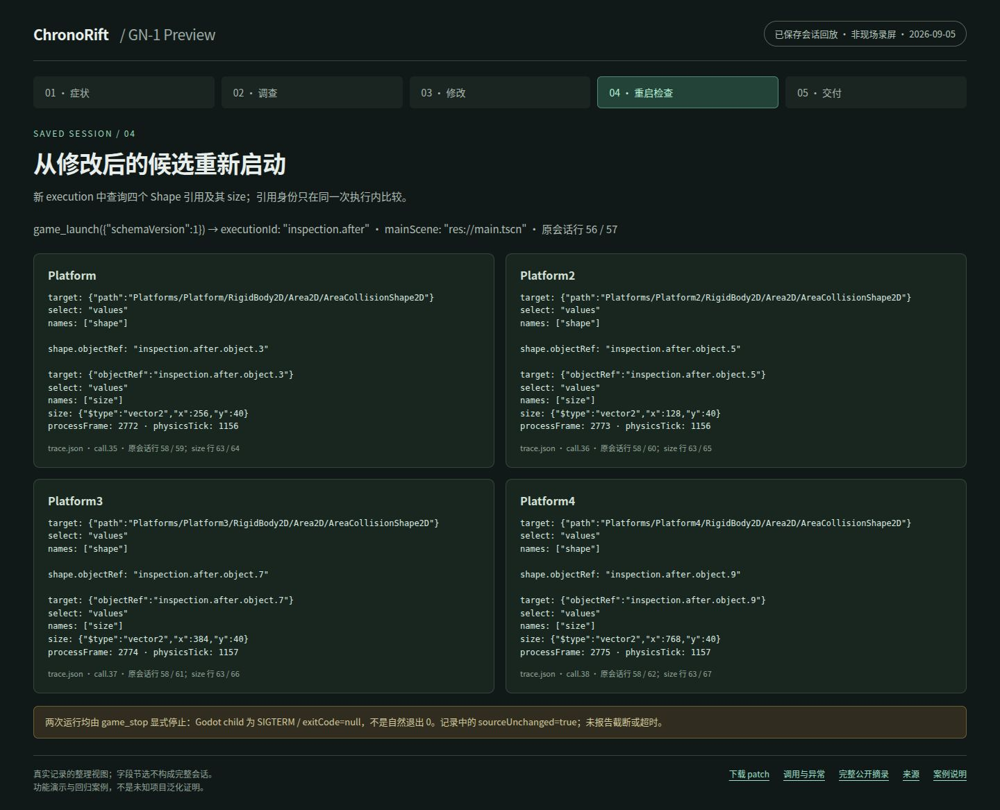

# GN-1：无 Adapter Preview 的真实调查

**功能演示与回归案例，2026-09-05，单次真实 Pi 会话。** Agent 自主查询运行时、修改一行源码并重启检查；
会话结束后的独立检查中，原始项目不满足初始几何与资源身份要求，保存的候选满足。没有重跑模型来整理本页。

## 症状与运行条件

唯一用户 prompt：

> A falling platform can activate while the player is still outside its visible width. Investigate the project, make the smallest appropriate fix, and validate the candidate. You choose the investigation, edit, and validation strategy.

- 项目：[`endlessm/moddable-platformer`](https://github.com/endlessm/moddable-platformer)，提交
  `e78b339500dec8e480b33723c4156bf9b74cd25c`；运行默认 `main.tscn`，保留 Global autoload。
- 模型：`openai-codex / gpt-5.6-luna / max`；Pi `0.83.0`、Godot `4.7.1`、SRT `0.0.74`，Linux x86_64。
  一次 fresh Session，限时 600 秒、共享工具调用上限 256；实际 CLI 用时约 279 秒，没有人工追加提示。
- ChronoRift：启动时为 `5122828d1d16f467d4bddf20a6afc3b0b1893570` **加当时未提交工作树**，后续落入
  [PR #16](https://github.com/xiangzuodalao/ChronoRift/pull/16)。不是在合并后重跑；
  [源码身份与对应关系](gn1-preview/provenance.json)记录实际文件哈希。
- Agent 得到普通 coding tools、通用 `game_launch / game_query / game_stop` 及环境说明，自己选择调查顺序。
  没有项目 Adapter 或 probe；参考补丁和独立检查器没有进入本轮 Agent 可读环境。

## 实际调查，而不是补写的故事

Agent 读取源码、找到 `Platforms` 下的四个平台并查询配置。修改前，它进一步只查询了 **Platform3 的一个**
Area Shape：`width=3`，但 `size=768×40`。共享资源是结合源码作出的推断，不能写成修改前已直接比较四个 Shape。

它在 `components/platform/platform.gd` 调整 Area 尺寸前加入：

```gdscript
_area_collision_shape.shape = _area_collision_shape.shape.duplicate()
```

重启后，Agent 查询四个平台的 Area Shape，得到同一次执行内四个不同引用，尺寸依次为
`256/128/384/768×40`。[真实 patch](gn1-preview/candidate.patch)只包含这一行，没有改场景或验收逻辑。

[关键调用与异常](gn1-preview/trace.md)及[机器可读摘录](gn1-preview/trace.json)保留原顺序、实际参数和返回值，
包括全部 20 个 game 操作、实际 edit、4 次命令失败及一次 WebSocket 错误。
43 个请求只有 42 个结果；失败 response 中多出的请求没有执行结果。摘录省略 thinking、无关读取及 Host 私有信息，
不是完整原始 Session。两次运行均显式停止：Godot child 是 `SIGTERM / exitCode=null`，不是自然退出成功。
详细状态见[修改前](gn1-preview/runtime-records/before.json)与[修改后](gn1-preview/runtime-records/after.json)。

## 候选结果：独立于 Agent 的最终回复

CLI 结束后，Host 才将[原检查器](gn1-preview/independent-check.gd)加入独立运行副本。
它加载真实主场景，在两个 process frames 后检查 sprite 数、solid/Area 尺寸和 Shape 身份；不读取 Agent 回复，
也不要求源码出现 `duplicate()`。

| 独立检查               | 原始项目                           | 保存的候选            |
| ---------------------- | ---------------------------------- | --------------------- |
| 平台宽度 / sprite 数   | 2 / 1 / 3 / 6                      | 2 / 1 / 3 / 6         |
| solid 宽度（高 128）   | 256 / 128 / 384 / 768              | 256 / 128 / 384 / 768 |
| Area 宽度（高 40）     | 768 / 768 / 768 / 768              | 256 / 128 / 384 / 768 |
| Area Shape identity 数 | 1                                  | 4                     |
| 检查结果               | exit 1：3 项尺寸错误、6 对共享引用 | exit 0：无问题        |

核对当时的[原始项目输出](gn1-preview/independent/baseline/stdout.log)、
[候选输出](gn1-preview/independent/candidate/stdout.log)和[检查状态](gn1-preview/independent/observations.json)。
两者均无报告的超时或截断，运行副本源码未变。实际 physics frame 分别为 10、9，不等同于 process frame。

### 无模型凭据，检查已保存候选

按[开发指南](../development.md#toolchain)安装依赖与 Godot，并满足
[Linux SRT 前提](../development.md#host-bound-sandbox-gates)。`--godot-bin` 指向官方 Linux x86_64 独立可执行文件；
命令只将该文件复制到私有工具目录，不复制旁边的文件或整个安装目录。
准备干净的固定版本 checkout，然后在 ChronoRift 根目录运行：

```bash
git clone https://github.com/endlessm/moddable-platformer.git /path/to/moddable-platformer
git -C /path/to/moddable-platformer checkout --detach e78b339500dec8e480b33723c4156bf9b74cd25c
corepack pnpm run check:gn1-preview \
  --project /path/to/moddable-platformer \
  --godot-bin /path/to/Godot_v4.7.1-stable_linux.x86_64
```

命令默认应用本页 patch，在临时副本分别检查原始项目和候选，不修改输入项目、不启动 Pi、不读取模型凭据，
也不自动获取源码。可用 `--candidate-patch PATH` 检查其他保存的候选。
新输出保存在独立的 `.chronorift/gn1-preview-check-*` 目录，不覆盖本页历史记录。
退出码 `0` 表示原始项目按预期不满足检查、候选满足；`1` 表示候选断言失败；`2` 表示前提不符、执行不完整或需复核。
取消也会保存检查报告并返回 `2`；沙箱不可用不会降级运行。**这是候选结果复查，不是重新进行一次模型调查。**

## 五步截图：已保存会话回放

[查看完整整理视图](gn1-preview/replay.html)，或逐张查看：
[① 用户症状](gn1-preview/screenshots/01-symptom.png) →
[② 实际调查](gn1-preview/screenshots/02-investigation.png) →
[③ 修改](gn1-preview/screenshots/03-edit.png) →
[④ 重启查询](gn1-preview/screenshots/04-restart.png) →
[⑤ patch 与独立检查](gn1-preview/screenshots/05-delivery.png)。



这些是公开记录整理视图的截图，**不是当时的现场录屏**。第④步是 Agent 的真实重启查询；
第⑤步明确区分 Agent 交付和会话结束后的独立检查。

GitHub 上的 HTML 链接显示源码；可直接查看上面的截图。要打开完整整理视图，在 ChronoRift 根目录运行：

```bash
python3 -m http.server 8765 --bind 127.0.0.1 --directory docs/case-studies
```

然后访问 <http://127.0.0.1:8765/gn1-preview/replay.html>。页面经 HTTP 读取同目录的公开记录；
只提供案例目录，不要将可能含本地运行记录的仓库根目录作为服务目录。

## 能说明什么

本次通用 Preview 工具被真实 Pi 自主使用，候选通过该项目的**初始几何与资源身份检查**。
没有模拟玩家输入、复现完整触发或下落时序，也没有证明 gameplay 因果；查询是不同时间的当前状态读取，不是原子快照。
`completed` 仅表示 Loop 结束，不代表项目通过验收。GN-1 参与过接口设计，本页不是未知项目泛化证明；
没有 coding-only 对照，不能据此声称比较优势或通用修复率。

上游源码及其片段的许可见[第三方声明](../../THIRD_PARTY_NOTICES.md)。
